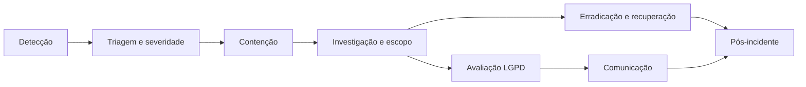

# Plano de resposta a incidentes de segurança

*Minuta operacional. Os pontos entre colchetes dependem de decisão do negócio. A parte jurídica (prazos e conteúdo das comunicações) deve ser **validada pelo jurídico/encarregado** antes de vigorar, como os demais textos legais do projeto.*

## 1. Objetivo e escopo

Orientar a resposta a qualquer evento que comprometa a confidencialidade, integridade ou disponibilidade dos dados do FinPro: vazamento entre contas ou grupos, acesso indevido, perda de dados, malware, credenciais expostas, indisponibilidade prolongada. Os dados tratados são financeiros e pessoais (nome, e-mail, CPF/CNPJ, endereço, transações, comprovantes), então **todo incidente com dados pessoais passa pela avaliação da seção 5**.

## 2. Papéis

| Papel | Quem | Responsabilidade |
|---|---|---|
| Comandante do incidente | [nome / suplente] | Decide, coordena, mantém a linha do tempo |
| Responsável técnico | [nome / suplente] | Contenção, investigação, correção, restauração |
| Encarregado (DPO) | [nome — a nomear, ver `fluxo-privacidade-lgpd.md`] | Avalia risco aos titulares, comunica ANPD e titulares |
| Comunicação/Suporte | [nome] | Mensagens a usuários, atendimento (ver `suporte-e-status.md`) |

Canal de crise: [sala/grupo privado]. Contato 24 h do comandante: [telefone]. Nada do incidente é discutido em canais públicos.

## 3. Severidade

| Nível | Critério | Meta de resposta |
|---|---|---|
| **SEV1** | Dados pessoais/financeiros acessados por quem não deveria (vazamento entre contas/grupos, banco ou backup exposto, chave vazada), ou perda de dados | Ação imediata (até 1 h para iniciar a contenção) |
| **SEV2** | Vulnerabilidade explorável confirmada sem evidência de exploração; credencial de serviço exposta; indisponibilidade > 1 h | Até 4 h |
| **SEV3** | Tentativas de ataque barradas, falha isolada sem dado exposto | Dia útil seguinte |

Na dúvida, classifique para cima e rebaixe depois.

## 4. Fluxo

### 4.1 Detecção

Fontes que já existem:

- **Alertas Prometheus** (`ops/prometheus/finpro-alerts.yml`): API fora do ar, rajada de 5xx, scheduler parado.
- **Logs** (ver [`observabilidade.md`](../tecnica/observabilidade.md)): `WARN` em 401/403, `Requisição rejeitada…`, reuso de refresh token. Pico de `403` com `X-Household-Id` de grupo alheio é sinal de varredura.
- **Relato de usuário** ou do suporte: peça o `X-Request-Id` do erro e a hora.
- **Terceiros**: aviso do provedor, pesquisador de segurança, notícia de vazamento.
- **Testes** (`HouseholdIsolationPentestIntegrationTest`): falha na CI é suspeita de regressão de isolamento — trate como SEV2 até esclarecer.

Registre de imediato: quem detectou, quando (com fuso), o quê, como.

### 4.2 Contenção (escolha o mínimo que resolve, anote cada ação e horário)

| Situação | Ação |
|---|---|
| Conta de usuário comprometida | Forçar troca de senha: a troca incrementa a versão de sessão e derruba todos os tokens da conta |
| Suspeita sobre `JWT_SECRET` | Trocar `JWT_SECRET` e reiniciar o backend invalida os tokens de acesso (15 min), mas os refresh tokens ficam no banco (`refresh_tokens`) e renovam a sessão. Para **encerrar todas as sessões** de uma vez: `UPDATE users SET session_version = session_version + 1` (invalida access e refresh tokens; todos precisarão entrar de novo) |
| Membro malicioso num grupo | O dono remove o membro: o acesso cai na requisição seguinte (o grupo ativo é verificado a cada chamada) |
| Falha de isolamento / endpoint vulnerável | Bloquear a rota no proxy (nginx) ou tirar o serviço do ar; só então corrigir |
| Chave dos anexos vazada | Ver seção 4.4 e `backup-restauracao.md` (rotação pendente: tratar como SEV1) |
| Banco/volume/backup exposto | Revogar acessos, trocar credenciais do Postgres (`POSTGRES_PASSWORD`), isolar a rede, preservar evidências antes de recriar |
| Porta de gestão (8081) ou Swagger expostos | Fechar no firewall; `SWAGGER_ENABLED=false` |
| Credencial SMTP/VAPID vazada | Revogar e emitir nova no provedor |

Se for preciso parar o serviço, publique o aviso de status (ver `suporte-e-status.md`).

### 4.3 Investigação e escopo

Objetivo: responder **quem** foi afetado, **quais dados**, **desde quando até quando**, **como**.

1. **Preserve evidências antes de limpar**: copie logs (por `requestId`/`userId`/`householdId`), faça snapshot do volume e do banco, anote horários. Não reinicie sem coletar, se o ataque estiver em curso.
2. Linha de acesso do log: `method`, `path`, `status`, `userId`, `householdId`, `requestId`. Filtre pelo período suspeito: `{app="finpro"} | json | userId="<id>"`.
3. Para vazamento entre grupos, reconstrua: quais `householdId` o `userId` do atacante consultou **sem** ser membro (devem ter dado 403) e quais com `200`.
4. Os logs **não** trazem valores, e-mails nem nomes de arquivo (por desenho); o conteúdo exposto é inferido pelos endpoints acessados.
5. Estime o número de titulares afetados e as categorias de dado.

### 4.4 Erradicação e recuperação

- Corrija a causa (patch, configuração, rotação de segredo) e **escreva um teste que reproduza o problema** (no caso de isolamento, acrescente ao `HouseholdIsolationPentestIntegrationTest`).
- Restaure de backup somente se houver perda/corrupção (`backup-restauracao.md`, seção 3.2). Lembre de reaplicar as exclusões de conta feitas após o backup.
- Monitore de perto por 7 dias.
- **Chave de anexos comprometida:** gerar chave nova e re-cifrar todos os arquivos (ferramenta de rotação pendente); considerar os comprovantes como possivelmente expostos se o volume/backup também foi acessado.

## 5. Avaliação LGPD e comunicação

O encarregado decide, com o comandante, se o incidente **pode acarretar risco ou dano relevante aos titulares** (art. 48 da LGPD). São indícios fortes: dados financeiros, documentos (CPF/CNPJ), comprovantes e grande volume/dados de várias pessoas. Se sim:

1. **ANPD**: comunicar no prazo regulamentar. A Resolução CD/ANPD nº 15/2024 fixa **3 dias úteis** a partir do conhecimento do incidente — **confirmar o prazo vigente e o formulário com o jurídico**. Conteúdo mínimo: natureza dos dados, titulares envolvidos, medidas de proteção, riscos, motivos de eventual demora, medidas tomadas.
2. **Titulares afetados**: mensagem em linguagem simples, no mesmo prazo regulatório, por e-mail da conta e aviso no app. Modelo na seção 6.
3. **Grupos compartilhados**: avise todos os membros do grupo, não só quem originou o evento.
4. **Controlador/operadores**: se a hospedagem ou outro operador estiver envolvido, acione o contrato e exija o relatório deles.
5. Guarde o **registro do incidente** (mesmo os que não foram comunicados, com a justificativa) por no mínimo [5 anos — validar].

Sem decisão do encarregado, o comandante decide pela comunicação (na dúvida, comunicar).

## 6. Modelo de aviso aos titulares

> **Assunto:** Aviso de segurança sobre a sua conta no FinPro
>
> Em [data], identificamos [descrição simples do que aconteceu]. Isso pode ter permitido o acesso a [dados: ex. nome, e-mail, descrição de transações]. [Não houve acesso a: senhas / dados de cartão.]
>
> O que já fizemos: [contenção, correção].
> O que recomendamos: [trocar a senha; desconfiar de contatos pedindo dinheiro ou dados; revisar os membros dos seus grupos].
> Riscos para você: [ex.: golpes direcionados].
>
> Dúvidas: [e-mail do encarregado]. Pedimos desculpas pelo ocorrido.

## 7. Pós-incidente (em até 5 dias úteis após o encerramento)

Reunião sem culpados e documento com: linha do tempo, causa raiz, o que funcionou, o que falhou, ações com dono e prazo (inclusive novos testes/alertas), tempo de detecção/contenção/recuperação. Atualize este plano, o `plano-resposta-incidentes` e os testes.

## 8. Preparo (rotina)

- Revisar este plano e os contatos a cada 6 meses e após cada incidente.
- **Simulado** (tabletop) uma vez por ano: cenário "membro removido continua lendo dados do grupo" e cenário "backup vazado".
- Ensaiar a restauração todo mês (`backup-restauracao.md`).
- Manter o cofre de segredos e a lista de quem tem acesso à produção atualizados.
- Executar o teste de isolamento (`HouseholdIsolationPentestIntegrationTest`) em toda alteração de segurança, grupos ou anexos (já roda na CI do backend).

## 9. Contatos (preencher)

| Quem | Contato |
|---|---|
| Comandante / suplente | |
| Responsável técnico / suplente | |
| Encarregado (DPO) | |
| Jurídico | |
| Hospedagem (suporte/segurança) | |
| ANPD (canal de comunicação de incidentes) | site oficial da ANPD |
