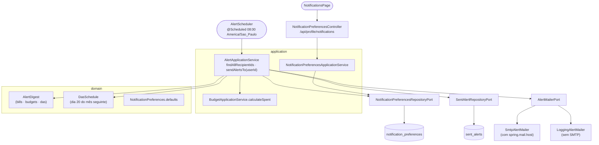
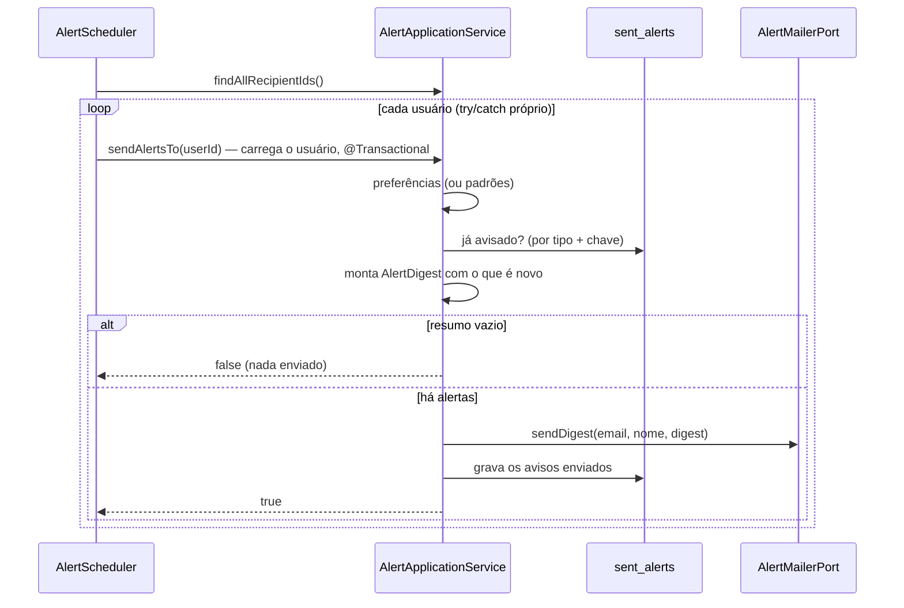

# FinPro — Fluxo de Alertas e Lembretes por E-mail

*Documentação técnica dos alertas diários por e-mail (ver [`../plano.md`](../plano.md)). Diagramas em [Mermaid](https://mermaid.js.org/) — renderizam nativamente no GitHub.*

## 1. Visão geral

Todo dia de manhã o sistema monta, para cada usuário, um **resumo de alertas** e envia um único e-mail — só quando há algo novo a avisar. São três tipos:

- **Contas a vencer**: despesas `PENDING` (sem transferências) com data entre hoje e hoje + N dias.
- **Orçamentos do mês**: orçamentos do mês atual cujo gasto passou de **80%** ou de **100%** do limite.
- **DAS**: para regime MEI ou Simples Nacional, o DAS da competência anterior, que vence no **dia 20**.

Cada aviso é enviado **uma vez só**. O que já foi avisado fica na tabela `sent_alerts` e não entra nos resumos seguintes. O usuário escolhe o que receber em **Configurações > Notificações**.

## 2. Tela

**Rota:** `/configuracoes/notificacoes` (`NotificationsPage`, dentro do `SettingsLayout`).

- Três caixas de seleção, uma por tipo de alerta, cada uma com o nome à esquerda, uma descrição curta e o controle à direita (empilhadas também no celular).
- Campo numérico "Avisar com quantos dias de antecedência" (0 a 15; vale para contas e DAS). Fica desabilitado quando contas e DAS estão desligados, já que não teria efeito.
- O botão "Salvar preferências" só fica ativo quando algo mudou.

## 3. Arquitetura (hexagonal)

## 4. Fluxo do resumo diário

## 5. Regras de negócio

- **Janela das contas**: `transactionDate` entre hoje e hoje + `billDaysBefore`, ambos inclusos. Contas já vencidas não entram. Chave: id da transação.
- **Orçamentos**: só os do mês atual, com limite maior que zero. O gasto é o mesmo da tela de orçamentos (`calculateSpent`, pagas e pendentes). Chave: id do orçamento.
  - Com gasto ≥ 100% do limite, envia o aviso de 100% e marca também o de 80%. Assim, um orçamento que estourou de uma vez não recebe depois um "passou de 80%".
  - Com gasto ≥ 80% (e o aviso de 80% ainda não enviado), envia o aviso de 80%.
  - Depois do aviso de 100%, aquele orçamento não gera mais nada.
- **DAS**: só para `TaxRegime.MEI` e `SIMPLES_NACIONAL` (regime do cadastro do usuário).
  - O vencimento é sempre o dia 20 do mês seguinte à competência, sem ajuste para fim de semana ou feriado.
  - O lembrete vai quando o dia 20 cai em [hoje, hoje + `billDaysBefore`].
  - Se houver `TaxEstimate` da competência, o valor estimado vai junto.
  - Chave: competência (`2026-08`).
- **Uma vez só**: `sent_alerts` tem UNIQUE(`user_id`, `alert_type`, `reference_key`). Os registros só são gravados **depois** do envio: se o e-mail falhar, os avisos voltam no resumo do dia seguinte, enquanto ainda estiverem na janela.
- **Isolamento**: o agendador busca só os ids e carrega cada usuário dentro do próprio try/catch e da própria transação. Assim, um cadastro ilegível (ex.: regime fora do enum gravado direto no banco) ou uma falha de envio afeta só aquele usuário.
- **Não roda na subida**: diferente do `RecurringTransactionScheduler`, para que um deploy fora de hora não dispare e-mails.
- **Preferências**: um usuário sem linha em `notification_preferences` usa `NotificationPreferences.defaults` (tudo ligado, 3 dias). O `PUT` valida `billDaysBefore` entre 0 e 15.
- **Limitação**: não há ShedLock. Com mais de uma instância rodando, o mesmo resumo poderia sair duas vezes. Hoje a aplicação roda em uma instância só.

## 6. Onde cada peça vive no repositório

| Camada | Arquivos |
|---|---|
| Domínio | `domain/model/{AlertDigest,AlertType,SentAlert,NotificationPreferences,DasSchedule}.java` |
| Ports | `domain/port/out/{AlertMailerPort,SentAlertRepositoryPort,NotificationPreferencesRepositoryPort}.java`, `UserRepositoryPort.findAllIds` |
| Aplicação | `application/alert/{AlertApplicationService,NotificationPreferencesApplicationService}.java` |
| Agendamento | `infrastructure/scheduling/AlertScheduler.java` (cron em `finpro.alerts.cron`, env `FINPRO_ALERTS_CRON`) |
| E-mail | `infrastructure/mail/{SmtpAlertMailer,LoggingAlertMailer}.java`, `infrastructure/config/{AlertConfig,AlertProperties}.java` |
| Persistência | `infrastructure/persistence/{entity,repository,adapter}/…NotificationPreferences…`, `…SentAlert…` |
| API | `infrastructure/web/controller/NotificationPreferencesController.java` (`GET/PUT /api/profile/notifications`) |
| Migration | `db/migration/V15__create_notification_preferences_and_sent_alerts.sql` |
| Frontend | `frontend/src/features/profile/components/{NotificationsPage,NotificationPreferencesForm}.tsx`, `hooks/useNotificationPreferences.ts` |
| Testes | `AlertApplicationServiceTest`, `DasScheduleTest`, `integration/alert/AlertIntegrationTest` |

**Testando localmente:** suba com `docker compose up` e `FINPRO_ALERTS_CRON="0 * * * * *"` (a cada minuto), crie uma despesa pendente para amanhã e veja o e-mail no Mailpit (http://localhost:8025).
