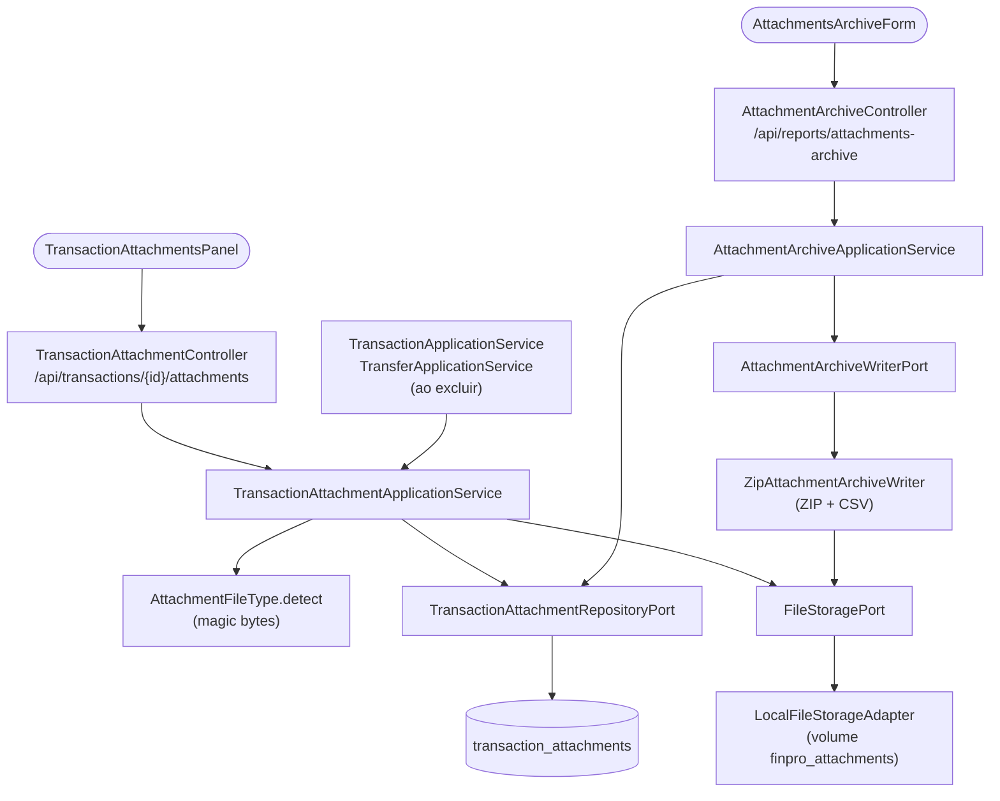

# FinPro — Fluxo de Anexos de Transação

*Documentação técnica dos anexos (comprovante de pagamento, nota fiscal, recibo) e do pacote de comprovantes do ano — ver [`../plano.md`](../plano.md). Diagramas em [Mermaid](https://mermaid.js.org/) — renderizam nativamente no GitHub.*

## 1. Visão geral

Cada transação pode ter até **10 anexos** de até **10 MB** cada, em PDF, JPG, PNG ou WEBP. Cada anexo tem um **tipo de documento**: comprovante de pagamento, nota fiscal, recibo ou outro.

Para a declaração de IR, a tela de Relatórios gera o **pacote de comprovantes do ano**: um ZIP com os arquivos em pastas por mês e um índice CSV que liga cada arquivo à transação.

O conteúdo dos arquivos fica fora do banco. Ele passa pela porta `FileStoragePort`, que hoje grava em **disco local** (um volume Docker) e pode ser trocada por S3/MinIO no deploy. No banco (`transaction_attachments`) fica só o registro.

## 2. Tela

- **Transações**: cada card tem um botão de **clipe**; quando há anexos, ele mostra a contagem e fica destacado. No celular, o card fechado mostra um clipe ao lado do valor. O botão abre o modal **"Comprovantes"** (`TransactionAttachmentsPanel`):
  - tipo de documento e arquivo; no celular, o seletor de arquivo permite usar a câmera;
  - lista dos anexos com nome, tipo, tamanho e data;
  - ações **Ver** (abre numa aba nova), **Baixar** e **Excluir**.
- **Filtro "Comprovante"** na lista de transações: todas, com comprovante ou sem comprovante. Usa o `attachmentCount` que vem na listagem.
- **Relatórios**: tipo **"Comprovantes do ano (ZIP)"** (`AttachmentsArchiveForm`), com o campo de ano. O seletor de formato PDF/CSV some para esse tipo.

## 3. Arquitetura (hexagonal)

## 4. Regras de negócio e segurança

- **Posse**: anexo de transação de outro usuário é tratado como inexistente (404). O anexo também precisa pertencer à transação indicada na URL.
- **Formato pelo conteúdo**:
  - `AttachmentFileType.detect` lê os primeiros bytes (`%PDF`, `FF D8 FF`, a assinatura PNG, `RIFF…WEBP`), sem confiar na extensão nem no `Content-Type` enviado pelo navegador. Um executável renomeado para `.pdf` é recusado com 400.
  - O arquivo é sempre servido de volta com o tipo reconhecido, com `X-Content-Type-Options: nosniff` e `Cache-Control: private, no-store`.
- **Nome no disco**:
  - O arquivo é gravado com um UUID gerado pelo sistema mais a extensão real. O nome enviado pelo usuário só serve para exibição e é saneado: sem caminho, sem caracteres reservados, com a extensão correta.
  - O `LocalFileStorageAdapter` ainda valida a chave (`[A-Za-z0-9.-]`) e exige que o caminho final fique dentro da pasta base, o que bloqueia *path traversal*.
- **Limites**:
  - 10 MB por arquivo, checado no serviço, no Spring (`spring.servlet.multipart.max-file-size`, com resposta 413 amigável) e no nginx (`client_max_body_size 11m`, que por padrão seria 1 MB).
  - 10 anexos por transação.
  - O frontend valida antes de enviar, só para dar retorno imediato.
- **Consistência arquivo/registro**: o arquivo é gravado antes do registro; se o registro falhar, o arquivo é apagado.
- **Exclusões**:
  - Excluir um anexo apaga o registro e o arquivo.
  - Excluir uma transação ou uma transferência: o banco apaga os registros em cascata (`ON DELETE CASCADE`). Antes disso, os serviços guardam as chaves (`storageKeysOf`) e, depois, apagam os arquivos do disco (`deleteStoredFiles`).
  - A falha ao apagar um arquivo só gera um aviso no log; o registro já saiu.
- **Pacote do ano** (`GET /api/reports/attachments-archive?year=AAAA`):
  - Entram os anexos das transações cuja **data** cai no ano.
  - Estrutura: `AAAA-MM/AAAA-MM-DD_<descrição-sem-acentos>_<idDoAnexo>.<ext>` e, na raiz, `comprovantes-AAAA.csv` (BOM UTF-8 e `;`, como os outros CSVs).
  - O ZIP é escrito em streaming (`StreamingResponseBody`), um arquivo por vez, sem montar o pacote inteiro na memória.
  - Ano sem anexos: 404 com mensagem, antes de começar o download.
  - Por causa do streaming, o `SecurityConfig` libera o *dispatch* `ASYNC`: a requisição já foi autenticada e autorizada no dispatch original, e sem token continua 401 (coberto por teste).

## 5. Onde cada peça vive no repositório

| Camada | Arquivos |
|---|---|
| Domínio | `domain/model/{TransactionAttachment,AttachmentDocumentType,AttachmentFileType,AttachmentArchiveData}.java`, `domain/exception/AttachmentInvalidException.java` |
| Ports | `domain/port/out/{TransactionAttachmentRepositoryPort,FileStoragePort,AttachmentArchiveWriterPort}.java` |
| Aplicação | `application/attachment/{TransactionAttachmentApplicationService,AttachmentArchiveApplicationService}.java`; limpeza em `TransactionApplicationService.delete` e `TransferApplicationService.delete` |
| Infra | `infrastructure/storage/LocalFileStorageAdapter.java`, `infrastructure/csv/ZipAttachmentArchiveWriter.java`, persistência `TransactionAttachment{JpaEntity,JpaRepository,RepositoryAdapter}` |
| API | `TransactionAttachmentController` (`GET/POST /api/transactions/{id}/attachments`, `GET …/{anexo}/content[?download=true]`, `DELETE …/{anexo}`), `AttachmentArchiveController`; `attachmentCount` em `TransactionResponse` |
| Config | `application.yml` (`finpro.attachments.storage-dir`, limites de multipart), `docker-compose.yml` (volume `finpro_attachments`), `frontend/nginx.conf` (`client_max_body_size`), `SecurityConfig` (dispatch ASYNC) |
| Migration | `V20__create_transaction_attachments.sql` |
| Frontend | `features/attachments/**` (`TransactionAttachmentsPanel`, `useTransactionAttachments`, `attachmentsApi`, `utils`), `TransactionCard`/`TransactionList` (clipe, modal, filtro), `reports/components/AttachmentsArchiveForm.tsx` |
| Testes | `AttachmentFileTypeTest`, `TransactionAttachmentApplicationServiceTest`, `AttachmentArchiveApplicationServiceTest`, `LocalFileStorageAdapterTest`, `integration/attachment/TransactionAttachmentIntegrationTest`, `features/attachments/utils.test.ts` |
