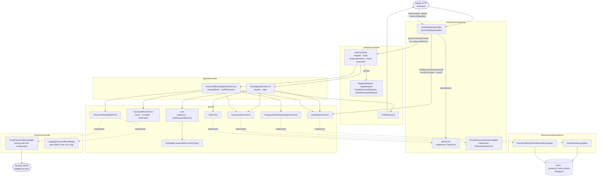
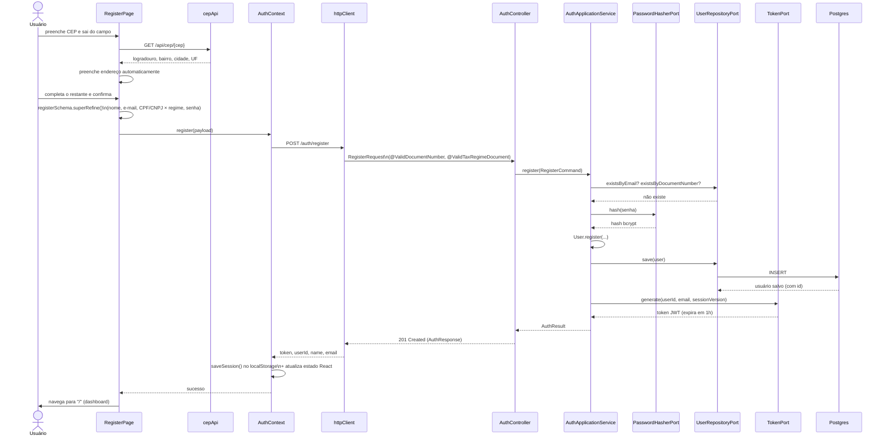
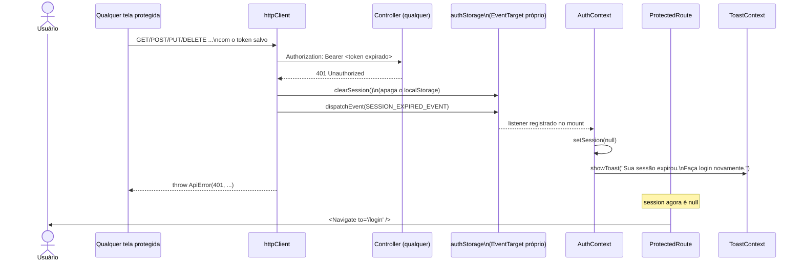
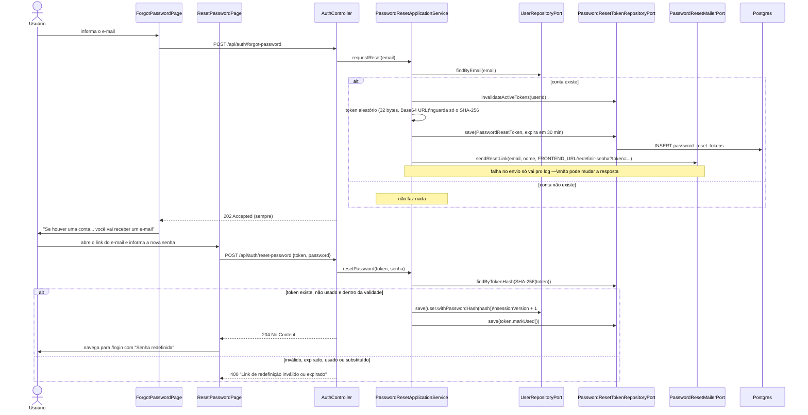

# FinPro — Fluxo de Autenticação (Cadastro, Login e Redefinição de Senha)

*Documentação técnica do módulo de autenticação. Diagramas em [Mermaid](https://mermaid.js.org/) — renderizam nativamente no GitHub.*

## 1. Visão geral

Autenticação é a porta de entrada de todo o sistema: sem ela, nenhuma outra tela é acessível. O FinPro usa **JWT** sem sessão guardada no servidor — o backend valida a assinatura do token a cada requisição e confere só um número por usuário no banco, a **versão de sessão** (`users.session_version`), que permite encerrar todas as sessões de uma vez (ver seção 6). Os casos de uso são `POST /api/auth/register` e `POST /api/auth/login` (ambos devolvem um token e os dados básicos do usuário) e o par de redefinição de senha `POST /api/auth/forgot-password` / `POST /api/auth/reset-password`.

Dois detalhes moldam o cadastro: (1) o regime tributário informado precisa ser coerente com o tipo de documento (pessoa jurídica exige CNPJ, pessoa física exige CPF) — é uma regra de negócio validada no backend, não só no formulário; e (2) o endereço é preenchido automaticamente a partir do CEP via ViaCEP, para reduzir o atrito do formulário mais longo do sistema.

## 2. Tela

### `/login` — `LoginPage`

Formulário simples: e-mail, senha, botão "Entrar". Validação client-side mínima (`loginSchema`: e-mail bem formado, senha não vazia) — a validação de verdade (credenciais corretas) é sempre do backend. Estados:

- **Enviando**: botão vira "Entrando...", desabilitado.
- **Erro**: mensagem em vermelho abaixo do formulário com a mensagem que o backend devolveu (`"E-mail ou senha inválidos"` para credenciais erradas — a mesma mensagem tanto para e-mail inexistente quanto para senha errada, de propósito, para não revelar quais e-mails estão cadastrados).
- Link **"Esqueceu sua senha?"** (abaixo do campo de senha) para `/esqueci-senha`, e link para `/registro` para quem ainda não tem conta.
- **Senha redefinida**: ao voltar da tela de redefinição, recebe `state.passwordReset` pelo roteador e mostra o aviso "Senha redefinida com sucesso".

As três telas públicas de acesso (login, esqueci a senha, redefinir senha) compartilham o layout `AuthPageShell`: logo + título dimensionados em unidades de container (`cqw`), proporcionais à largura do box, e o box do formulário abaixo.

### `/esqueci-senha` — `ForgotPasswordPage`

Um campo de e-mail (`forgotPasswordSchema`). Ao enviar, mostra sempre a mesma confirmação ("Se houver uma conta cadastrada com ..., você vai receber um e-mail") — a API também responde igual exista ou não a conta, então a tela não pode afirmar nada diferente.

### `/redefinir-senha?token=...` — `ResetPasswordPage`

Aberta pelo link do e-mail. Nova senha + confirmação (`resetPasswordSchema`: mínimo 8 caracteres, confirmação igual). Sem `token` na URL, mostra aviso de link inválido em vez do formulário. Token recusado pelo backend (expirado, já usado ou substituído por um mais novo) aparece como erro abaixo do formulário, com link para solicitar outro. Sucesso navega para `/login` com o aviso de senha redefinida.

### `/registro` — `RegisterPage`

Formulário mais longo, dividido em quatro seções:

1. **Dados pessoais** — nome completo (exige nome + sobrenome) e e-mail.
2. **Documento e regime** — select de regime tributário (`TAX_REGIME_OPTIONS`: Autônomo, MEI, Simples Nacional, Lucro Presumido, Outro); o campo de documento muda de label/máscara (CPF ↔ CNPJ) automaticamente conforme o regime escolhido (`documentTypeForTaxRegime`); telefone opcional.
3. **Endereço** — CEP com autocomplete: ao sair do campo (`onBlur`) com 8 dígitos, dispara `useCepLookup` (`GET /api/cep/{cep}`) e preenche logradouro/bairro/cidade/estado automaticamente. Enquanto a busca está pendente, esses campos ficam desabilitados (`disabled={cepLookup.isPending}`) e mostra "Buscando endereço...". Se o CEP não existir (404) ou o serviço estiver fora, mostra aviso e libera o preenchimento manual — a busca nunca bloqueia o cadastro.
4. **Segurança** — senha e confirmação (mínimo 8 caracteres), checkbox de aceite dos termos.

Estados: botão "Criando conta..." enquanto envia; erro do backend (e-mail/documento já cadastrado, documento incompatível com o regime) exibido do mesmo jeito que no login. Sucesso navega direto para `/` (dashboard) — não existe tela intermediária de confirmação, o registro já autentica.

### Expiração de sessão (comportamento global, não uma tela própria)

Qualquer tela protegida pode, a qualquer momento, receber um `401` do backend (token expirado — expira em 1h por padrão —, sessão encerrada por uma redefinição de senha, ou nunca ter tido sessão válida). Quando isso acontece: a sessão salva é limpa, um toast "Sua sessão expirou. Faça login novamente." aparece, e o roteador manda o usuário de volta pra `/login` — sem exigir recarregar a página manualmente. Ver seção 5.

## 3. Arquitetura

Backend em camadas hexagonal (`web` → `application` → `domain` → `infrastructure/persistence`), mais a peça específica de autenticação: o filtro JWT, que roda **antes** do dispatch para qualquer controller.

**Por que o filtro nunca lança erro para token inválido:** `JwtAuthenticationFilter` captura `InvalidTokenException` e só limpa o `SecurityContext`, deixando a requisição seguir sem autenticação — quem decide se isso é um problema é o `SecurityFilterChain` padrão do Spring Security (retorna 401 via `RestAuthenticationEntryPoint` se a rota exigir autenticação) ou o próprio controller (se a rota for pública). Assim o mesmo filtro serve tanto rotas públicas (`/api/auth/**`, `/api/cep/**`, Swagger, `/actuator/health`) quanto protegidas, sem duplicar lógica.

## 4. Fluxo de cadastro

Login segue a mesma cauda a partir de `Svc->>Repo`: busca por e-mail, `PasswordHasherPort.matches()` confere a senha contra o hash salvo, e se bater gera o token do mesmo jeito — sem `User.register()`, sem checagem de duplicidade.

## 5. Fluxo de expiração de sessão

Este é um comportamento que atravessa **todas** as telas protegidas, não só uma tela específica — por isso documentado como um fluxo próprio.

**Por que um `EventTarget` próprio, e não `window.dispatchEvent`:** `httpClient` é um módulo puro (sem React), então não pode chamar `setSession()` diretamente — mas também não pode depender de `window`, que não existe no ambiente de teste (Vitest roda em Node puro). Um `EventTarget` dedicado (`authEvents`, exportado por `authStorage.ts`) funciona idêntico nos dois ambientes e mantém o event bus isolado, sem poluir o namespace global de eventos do browser.

## 6. Fluxo de redefinição de senha ("esqueci minha senha")

**Envio do e-mail:** `PasswordResetConfig` escolhe o adapter — com `spring.mail.host` configurado usa `SmtpPasswordResetMailer` (e-mail em texto simples); sem SMTP (backend rodando pela IDE, testes) usa `LoggingPasswordResetMailer`, que só escreve o link no log. No `docker-compose`, o backend aponta para o **Mailpit** (`SPRING_MAIL_HOST=mailpit`), que captura todos os e-mails em http://localhost:8025 sem entregar a ninguém.

## 7. Encerramento de sessões ao trocar a senha

JWT não pode ser "apagado" depois de emitido, então cada token carrega a **versão de sessão** do usuário no momento do login (claim `sv`). `User#withPasswordHash` incrementa essa versão, e o `JwtAuthenticationFilter`, depois de validar assinatura e expiração, compara o `sv` do token com `users.session_version` (`UserRepositoryPort.findSessionVersion`, consulta só dessa coluna). Diferente — ou usuário inexistente — o filtro trata como token inválido: a requisição segue anônima e a rota protegida responde `401`, caindo no fluxo da seção 5 no frontend.

Resultado: redefinir a senha derruba **todas** as sessões abertas (outros navegadores e aparelhos) na próxima requisição de cada uma. Tokens emitidos antes da existência do claim são lidos como versão `0`, então a introdução do mecanismo não deslogou ninguém.

## 8. Regras de negócio importantes

- **Senha nunca trafega nem é salva em texto puro**: hash BCrypt (`BCryptPasswordHasherAdapter`) já na entrada, o domínio (`User`) só conhece o hash.
- **E-mail e documento são únicos**: `EmailAlreadyInUseException` / `DocumentAlreadyInUseException` (ambas `409 Conflict`) antes de qualquer tentativa de salvar.
- **Documento precisa bater com o regime tributário** (`@ValidTaxRegimeDocument`, validação de classe): MEI, Simples Nacional e Lucro Presumido exigem CNPJ; Autônomo e Outro exigem CPF (`TaxRegime.expectedDocumentType()`). Validado tanto no frontend (`registerSchema`, para feedback imediato) quanto — de forma independente e definitiva — no backend.
- **CPF/CNPJ são validados por dígito verificador** (`@ValidDocumentNumber`, mesmo algoritmo espelhado em `CpfValidator`/`CnpjValidator` no backend e `shared/validation/{cpf,cnpj}.ts` no frontend), não só por formato.
- **Login não revela qual campo errou**: e-mail inexistente e senha incorreta devolvem a mesma mensagem (`InvalidCredentialsException`, `401`) — evita enumerar e-mails cadastrados por tentativa e erro.
- **"Esqueci minha senha" também não revela quem tem conta**: `forgot-password` responde `202` exista ou não o e-mail, e uma falha no envio do e-mail não altera a resposta.
- **Token de redefinição**: aleatório (`SecureRandom`, 32 bytes), guardado só como hash SHA-256 (quem lê o banco não consegue usá-lo), válido por 30 min (`PASSWORD_RESET_TOKEN_TTL_MINUTES`), uso único, e pedir um novo invalida os anteriores. Nova senha segue a mesma regra do cadastro (mínimo 8 caracteres).
- **Trocar a senha encerra todas as sessões** (versão de sessão, ver seção 7).
- **Token expira em 1h por padrão** (`JWT_EXPIRATION_MS`, configurável por variável de ambiente) — sem refresh token: expirado, o usuário loga de novo (ver seção 5).
- **CORS explícito**: a SPA roda em origem diferente da API (`CORS_ALLOWED_ORIGINS`), então toda a configuração de CORS mora em `SecurityConfig` — sem ela, toda chamada do frontend falharia silenciosamente no navegador.

**Ainda não implementado:** limite de tentativas no `forgot-password` (hoje dá para disparar vários e-mails seguidos para o mesmo endereço) e troca de senha estando logado (tela de perfil).

## 9. Onde cada peça vive no repositório

| Camada | Arquivo(s) |
|---|---|
| Domínio | `domain/model/{User,PasswordResetToken,Address,TaxRegime,DocumentType,BrazilianState}.java`, `domain/model/{CpfValidator,CnpjValidator}.java`, `domain/exception/InvalidPasswordResetTokenException.java` |
| Ports | `domain/port/out/{UserRepositoryPort,TokenPort,TokenClaims,PasswordHasherPort,PasswordResetTokenRepositoryPort,PasswordResetMailerPort}.java` |
| Aplicação | `application/auth/{AuthApplicationService,PasswordResetApplicationService,PasswordResetSettings,RegisterCommand,LoginCommand,AddressCommand,AuthResult}.java` |
| Segurança | `infrastructure/security/{JwtService,JwtAuthenticationFilter,BCryptPasswordHasherAdapter,AuthenticatedUser}.java`, `infrastructure/config/{SecurityConfig,JwtProperties,CorsProperties,PasswordResetConfig,PasswordResetProperties}.java` |
| E-mail | `infrastructure/mail/{SmtpPasswordResetMailer,LoggingPasswordResetMailer}.java` |
| API | `infrastructure/web/controller/{AuthController,CepController}.java`, `infrastructure/web/dto/auth/*.java`, `infrastructure/web/validation/{ValidDocumentNumber,ValidTaxRegimeDocument,...}.java` |
| Persistência | `infrastructure/persistence/adapter/{UserRepositoryAdapter,PasswordResetTokenRepositoryAdapter}.java` (+ entity/mapper/repository correspondentes) |
| Migration | `db/migration/V1__init_schema.sql` (+ `V2`–`V4`: CPF/telefone, documento genérico, endereço; `V11`: `password_reset_tokens`; `V12`: `users.session_version`) |
| Frontend — telas | `features/auth/components/{LoginPage,RegisterPage,ForgotPasswordPage,ResetPasswordPage,AuthPageShell}.tsx` |
| Frontend — lógica | `features/auth/{schemas.ts,hooks/{useLogin,useRegister,useCepLookup,usePasswordReset}.ts,api/{cepApi,passwordResetApi}.ts}`, `shared/auth/{AuthContext,ProtectedRoute,authStorage,types}.tsx/.ts`, `shared/api/httpClient.ts` |
| Testes | `backend/src/test/java/.../integration/auth/{AuthIntegrationTest,PasswordResetIntegrationTest}.java`, `.../application/auth/{AuthApplicationServiceTest,PasswordResetApplicationServiceTest}.java`, `../../frontend/src/features/auth/schemas.test.ts`, `../../frontend/src/shared/api/httpClient.test.ts` |
