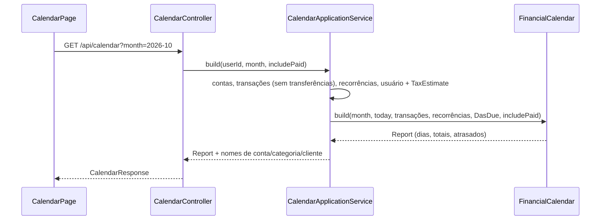

# FinPro — Fluxo do Calendário

*Documentação técnica da visão de calendário (lançamentos futuros, vencimentos e atrasados) — ver [`../plano.md`](../plano.md). Diagramas em [Mermaid](https://mermaid.js.org/) — renderizam nativamente no GitHub.*

## 1. Visão geral

O Calendário (`/calendario`) mostra, dia a dia, o que vai entrar e sair no mês escolhido. Ele não guarda nada: junta o que já existe em outras partes do sistema, e todo o cálculo fica no backend (`FinancialCalendar`). O frontend só desenha a grade e a lista do dia.

Entram no calendário:

| Tipo (`kind`) | De onde vem | Situação (`status`) |
|---|---|---|
| `TRANSACTION` | transações do mês, **sem transferências** entre contas próprias | `PENDING`, `OVERDUE` (pendente com data anterior a hoje) ou `PAID` |
| `RECURRING_FORECAST` | ocorrências ainda não lançadas das recorrências **ativas**, de hoje em diante | `FORECAST` |
| `DAS` | vencimento do DAS (dia 20) para MEI e Simples Nacional, com o valor da `TaxEstimate` da competência anterior, se houver | `FORECAST` |

As pagas só aparecem nos dias com `includePaid=true` ("Mostrar pagas e recebidas"). Os totais pagos do mês são calculados sempre.

## 2. Endpoint

`GET /api/calendar?month=AAAA-MM&includePaid=false`

- `month` é opcional (padrão: mês atual, pelo `Clock` do fuso do usuário) e pode estar a até **5 anos** do mês atual; fora disso, 400.
- `includePaid` é opcional (padrão `false`).

Resposta (`CalendarResponse`):

- `month`, `today`;
- `expectedIncome` / `expectedExpense`: o que está **em aberto** no mês (pendentes, atrasadas do mês, previstas e DAS);
- `paidIncome` / `paidExpense`: o que já foi quitado no mês;
- `days`: só os dias com algum lançamento, com `income`, `expense` e `entries` (receitas primeiro, depois do maior para o menor valor);
- `overdue`, `overdueIncome`, `overdueExpense`: pendentes com data anterior a hoje, **de qualquer mês**, da mais antiga para a mais nova.

Cada lançamento traz `kind`, `date`, `description`, `amount` (`null` só no DAS sem estimativa), `type`, `status`, `transactionId`, `recurringTransactionId`, os nomes de conta, categoria e cliente já resolvidos e, no DAS, a `competence`.

## 3. Regras

- **Previsões das recorrências**: usam `RecurringTransaction.dueOccurrenceDates(fim do mês)`, a mesma conta da projeção de fluxo de caixa. Como elas partem de `generatedOccurrences`, nada que já virou transação aparece duas vezes. Só entram datas de hoje em diante: a de hoje aparece enquanto o agendador diário (00:05) não a lançou, e as de dias passados são recuperadas por ele. Mês inteiro no passado não tem previsão. Recorrência pausada não gera previsão.
- **DAS**: o que vence no mês `M` é o da competência `M − 1` (`DasSchedule.dueDateFor`). Sem estimativa cadastrada, o lançamento aparece sem valor e com o link "Estimar imposto", e não soma nos totais. O calendário não sabe se o DAS foi pago: ele é sempre um lembrete.
- **Atrasados**: calculados sobre todas as transações pendentes do usuário, não só as do mês exibido, para que nada vencido fique escondido ao navegar entre meses.

## 4. Tela

- Navegação entre meses (anterior, próximo e "Hoje" quando fora do mês atual) e o filtro "Mostrar pagas e recebidas".
- Aviso de **atrasados** (recolhível) com o total a pagar e a receber e a lista, cada um com o botão "Marcar como paga/recebida".
- Cards: A receber no mês, A pagar no mês, Já recebido, Já pago.
- Grade do mês (domingo a sábado, `buildMonthGrid`): um marcador colorido por lançamento (verde receita, vermelho claro despesa, azul previsão/DAS, vermelho atrasada, cinza paga) e, a partir de `sm`, os totais do dia sem centavos. No celular ficam só os marcadores, para caber nas 7 colunas.
- Painel do dia selecionado (ao lado da grade em `lg`, abaixo dela nas telas menores): lançamentos do dia com situação, conta, categoria e cliente; "Marcar como paga/recebida" nas transações em aberto; "Ver recorrência" nas previsões.
- Marcar como paga usa o mesmo `PATCH /api/transactions/{id}/status` da tela de Transações, com o mesmo modal de confirmação (é definitivo). `useUpdateTransactionStatus` também invalida a consulta do calendário.

## 5. Arquivos

- Backend: `FinancialCalendar` (domínio, puro), `CalendarApplicationService`, `CalendarController`, `CalendarResponse`.
- Frontend: `features/calendar` (`CalendarPage`, `CalendarMonthGrid`, `CalendarEntryItem`, `useCalendar`, `calendarApi`, `utils.ts`).
- Testes: `FinancialCalendarTest`, `CalendarApplicationServiceTest`, `CalendarIntegrationTest`, `features/calendar/utils.test.ts`.
