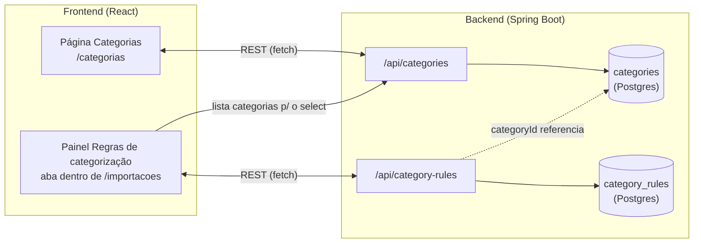
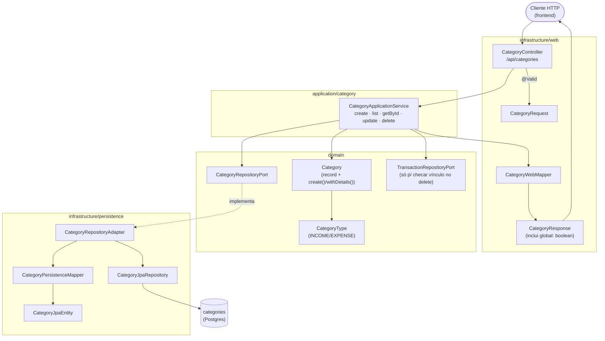
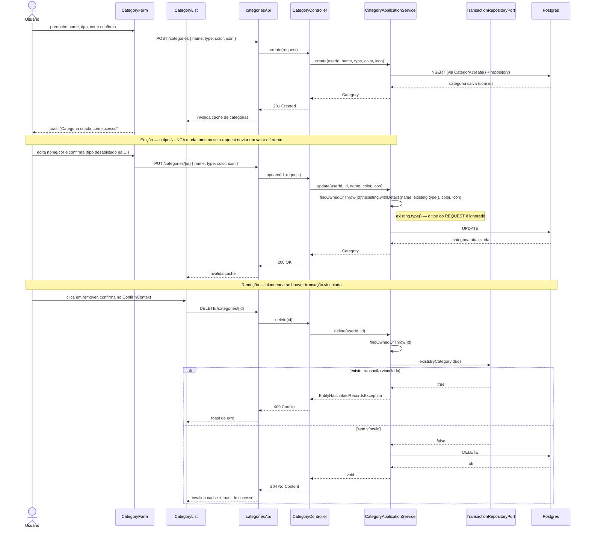
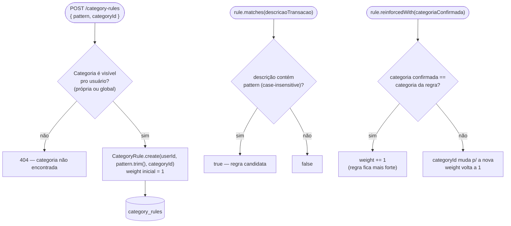

# FinPro — Fluxo de Categorias e Regras de Categorização

*Documentação técnica do módulo de categorias (ver roadmap em [`../plano.md`](../plano.md)). Diagramas em [Mermaid](https://mermaid.js.org/) — renderizam nativamente no GitHub.*

## 1. Visão geral

Categorias classificam transações em receita ou despesa (`CategoryType.INCOME`/`EXPENSE`) e alimentam o Dashboard, os Orçamentos e a importação de extrato. Existem dois "donos" possíveis:

- **Categorias globais** (`userId = null`): padrão do sistema, visíveis para todos os usuários, somente leitura via API — não podem ser editadas nem removidas por ninguém.
- **Categorias próprias**: criadas pelo usuário, só ele enxerga e só ele edita/remove.

**Regras de categorização** (`CategoryRule`) não são um CRUD independente na navegação principal: são o motor que categoriza automaticamente transações importadas de um extrato CSV, e vivem dentro da tela de **Importações**, não da tela de Categorias. Este documento cobre o CRUD de categorias e o modelo/API das regras; o fluxo completo de como uma regra nasce e é reforçada durante uma importação está em [`fluxo-importacao-extrato.md`](fluxo-importacao-extrato.md).

## 2. Tela

### 2.1 Categorias (`/categorias`)

- Botão "+" no topo abre um `Modal` com o `CategoryForm` (criação).
- `CategoryList` traz um filtro colapsável (`CollapsibleFilters`) com três campos: nome (busca por texto), tipo (Receita/Despesa/Todos) e origem (Minhas categorias/Padrão do sistema/Todas).
- Cada categoria aparece como um cartão com uma bolinha colorida (`category.color`), nome, tipo e, se for global, o rótulo "· padrão do sistema".
- Categorias globais **não mostram os botões de editar/remover** — só as próprias têm ícones de lápis (abre o mesmo `Modal`/`CategoryForm` em modo edição) e lixeira (confirma via `ConfirmContext` antes de remover).
- Estados: "Carregando categorias..." enquanto a query não resolve; "Nenhuma categoria cadastrada ainda" se a lista vier vazia; "Nenhuma categoria encontrada com os filtros aplicados" se o filtro zerar o resultado.
- No formulário de edição, o campo **Tipo fica desabilitado** (`disabled={isEditing}`) — reflete no frontend a mesma regra que o backend já impõe.

### 2.2 Regras de categorização (dentro de `/importacoes`)

- `ImportsPage` usa um componente `Tabs` com duas abas: "Importar arquivo" e "Regras de categorização" (`CategoryRulesPanel`).
- O painel tem um formulário inline (padrão + select de categoria) e uma lista abaixo mostrando padrão → categoria (com a cor da categoria) e o **peso** atual da regra.
- Cada linha tem um botão de remover, com confirmação explicando a consequência: "Transações futuras com esse descritivo deixarão de ser categorizadas automaticamente."
- Estados: "Carregando regras..." e "Nenhuma regra cadastrada ainda."

## 3. Categorias — arquitetura (hexagonal)

`Category.isGlobal()` é simplesmente `userId == null` — não existe uma flag separada no banco, a "globalidade" é inferida da ausência de dono. `isVisibleTo(userId)` (usada no `list`/`getById`) é `isGlobal() || isOwnedBy(userId)`; `isOwnedBy(userId)` (usada no `update`/`delete`) exige dono, então uma tentativa de editar/remover uma categoria global cai no mesmo 404 de "não encontrada" — o backend não distingue "não existe" de "não é sua" (mesma convenção usada em todos os módulos, evita vazar informação sobre recursos de terceiros).

## 4. Fluxo de criação, edição e remoção

**Por que o tipo é imutável:** transações já lançadas numa categoria foram validadas contra o tipo dela no momento da criação (uma despesa não pode usar categoria de receita, e vice-versa — ver [`fluxo-transacoes.md`](fluxo-transacoes.md)). Se o tipo pudesse mudar depois, transações antigas ficariam inconsistentes com o tipo atual da categoria. Essa regra foi endurecida numa auditoria de responsabilidades desta sessão: o backend ignora o campo `type` do `CategoryRequest` na atualização (`existing.withDetails(name, existing.type(), color, icon)`), e o frontend desabilita o campo no formulário de edição só por clareza de UX — quem garante a regra de verdade é o backend.

## 5. Regras de categorização (`CategoryRule`) — modelo e API

`CategoryRule` é um record de domínio puro (`matches`, `reinforcedWith`, `withDetails`) sem dependência de banco — a lógica de "aprendizado" (reforçar o peso a cada confirmação, resetar quando o usuário corrige) está inteiramente nele, testável sem Spring. `CategoryRuleApplicationService.create` só adiciona uma checagem: a categoria referenciada precisa ser visível ao usuário (própria ou global), senão é 404 — o mesmo padrão de `CategoryApplicationService`. A API expõe só `list`, `create` e `delete` — não existe `update` direto pelo usuário; o único jeito de uma regra mudar é sendo reforçada automaticamente durante a revisão de uma importação (detalhado em [`fluxo-importacao-extrato.md`](fluxo-importacao-extrato.md)).

## 6. Onde cada peça vive no repositório

| Camada | Categorias | Regras de categorização |
|---|---|---|
| Domínio | `domain/model/{Category,CategoryType}.java` | `domain/model/CategoryRule.java` |
| Port/Adapter | `domain/port/out/CategoryRepositoryPort.java` + `infrastructure/persistence/adapter/CategoryRepositoryAdapter.java` | `domain/port/out/CategoryRuleRepositoryPort.java` + `infrastructure/persistence/adapter/CategoryRuleRepositoryAdapter.java` |
| Aplicação | `application/category/CategoryApplicationService.java` | `application/categoryrule/CategoryRuleApplicationService.java` |
| API | `infrastructure/web/controller/CategoryController.java` (`/api/categories`) | `infrastructure/web/controller/CategoryRuleController.java` (`/api/category-rules`) |
| Frontend | `frontend/src/features/categories/**` (`CategoriesPage`, `CategoryForm`, `CategoryList`, hooks, `api/categoriesApi.ts`, `schemas.ts`, `types.ts`) | `frontend/src/features/categoryRules/**` (`CategoryRulesPanel`, hooks, `api/categoryRulesApi.ts`, `schemas.ts`) — renderizado dentro de `../../frontend/src/features/importBatches/components/ImportsPage.tsx` |
| Testes | `backend/src/test/java/.../integration/category/CategoryIntegrationTest.java` + `application/category/CategoryApplicationServiceTest.java` + `domain/model/CategoryTest.java` | `application/categoryrule/CategoryRuleApplicationServiceTest.java` + `domain/model/CategoryRuleTest.java` (a cobertura de integração do fluxo completo de reforço está em `ImportBatchIntegrationTest`) |
