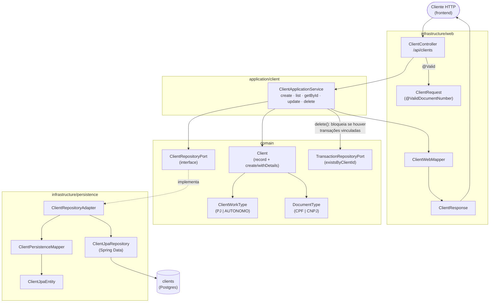
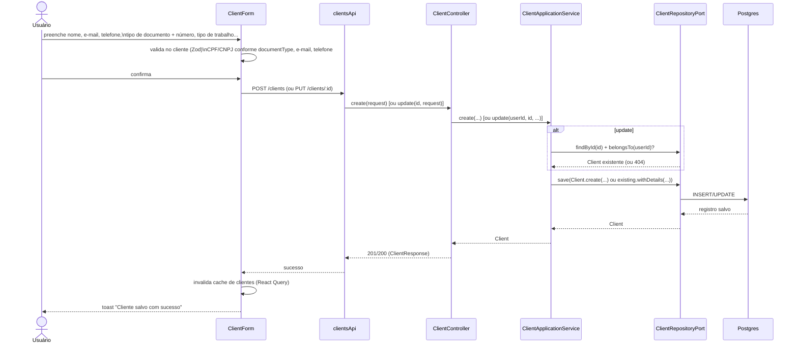

# FinPro — Fluxo de Clientes

*Documentação técnica do módulo de Clientes (ver roadmap em [`../plano.md`](../plano.md#12-roadmap-sugerido-atualizado)). Diagramas em [Mermaid](https://mermaid.js.org/) — renderizam nativamente no GitHub.*

## 1. Visão geral

`Client` representa a pessoa ou empresa para quem o freelancer/autônomo presta serviço. Um cliente pode ser vinculado a transações de receita (`Transaction.clientId`), o que alimenta o gráfico "Receita por cliente" no Dashboard e a pré-seleção de receita bruta na tela de Impostos. É um CRUD completo em arquitetura hexagonal, no mesmo padrão dos demais módulos (Account, Category, Transaction).

## 2. Tela

Rota `/clientes` (`ClientsPage`).

- **Cabeçalho**: título "Clientes" + botão "Novo cliente" (ícone `+`), que abre um `Modal` com o `ClientForm`.
- **Filtros** (`CollapsibleFilters`, recolhidos por padrão): nome (busca por texto), status (ativo/inativo), tipo de trabalho (PJ/Autônomo).
- **Lista** (`ClientList`): um card por cliente, com nome, indicador de cor, e ações de visualizar detalhes, editar e remover.
- **Detalhes** (`ClientDetails`, dentro de um `Modal`): e-mail, telefone formatado, tipo de trabalho, documento formatado (CPF ou CNPJ conforme `documentType`), status e observações.
- **Estados**: `isLoading` → "Carregando clientes..."; lista vazia → mensagem de estado vazio; erro de exclusão → toast com a mensagem do backend (`ApiError`).
- **Ações do usuário**: criar, editar, ver detalhes, remover (com confirmação via `useConfirm()`).

## 3. Arquitetura (hexagonal)

Mesma cadeia de camadas usada em todos os módulos do backend: `web` (HTTP) → `application` (regra de uso) → `domain` (modelo + regra de negócio pura) → `infrastructure/persistence` (banco).

## 4. Fluxo de criação/edição

## 5. Regras de negócio importantes

- **Validação de documento** (`@ValidDocumentNumber`, implementado por `DocumentNumberConstraintValidator`): o `documentNumber` é validado por dígito verificador conforme o `documentType` informado — `CpfValidator` para CPF, `CnpjValidator` para CNPJ. **Não há, hoje, nenhuma regra cruzando `workType` com `documentType`** (nem no backend, nem no schema Zod do frontend): um cliente `PJ` pode ter CPF e um `AUTONOMO` pode ter CNPJ — a única obrigatoriedade é que o número informado seja válido para o tipo escolhido. Isso é diferente da regra de cadastro do próprio usuário (`RegisterRequest`), que exige CNPJ para regimes de pessoa jurídica via `@ValidTaxRegimeDocument` — os dois validadores são independentes.
- **Posse**: acesso a cliente de outro usuário é tratado como 404 (`ResourceNotFoundException`), não 403 — mesmo padrão de Account/Transaction (`findOwnedOrThrow`/`belongsTo`).
- **Exclusão bloqueada com vínculo**: `delete()` verifica `transactionRepositoryPort.existsByClientId(clientId)` antes de remover; se houver qualquer transação vinculada, lança `EntityHasLinkedRecordsException` (HTTP 409) com a mensagem "Este cliente possui transações vinculadas. Exclua-as ou desvincule-as antes de remover o cliente."
- **Campo `active`**: cliente inativo continua existindo e pode ser filtrado na lista, mas não há restrição de negócio no backend impedindo lançar transações para um cliente inativo — o filtro de status é só de UI.

## 6. Onde cada peça vive no repositório

| Camada | Arquivo |
|---|---|
| Domínio | `domain/model/{Client,ClientWorkType,DocumentType}.java` |
| Validação | `infrastructure/web/validation/{HasDocument,ValidDocumentNumber,DocumentNumberConstraintValidator}.java` |
| Port/Adapter | `domain/port/out/ClientRepositoryPort.java` + `infrastructure/persistence/adapter/ClientRepositoryAdapter.java` |
| Aplicação | `application/client/ClientApplicationService.java` |
| API | `infrastructure/web/controller/ClientController.java` (`/api/clients`) |
| Migrations | `db/migration/V7__add_client_details.sql`, `V8__add_work_type_to_clients.sql` |
| Frontend | `frontend/src/features/clients/**` (`ClientsPage`, `ClientForm`, `ClientList`, `ClientDetails`, hooks, `clientsApi`, `schemas.ts`, `types.ts`) |
| Testes | `backend/src/test/java/.../integration/client/ClientIntegrationTest.java`, `application/client/ClientApplicationServiceTest.java` |
