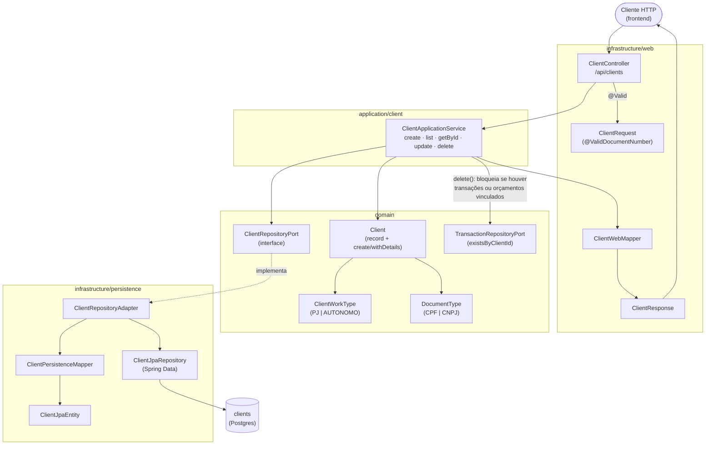
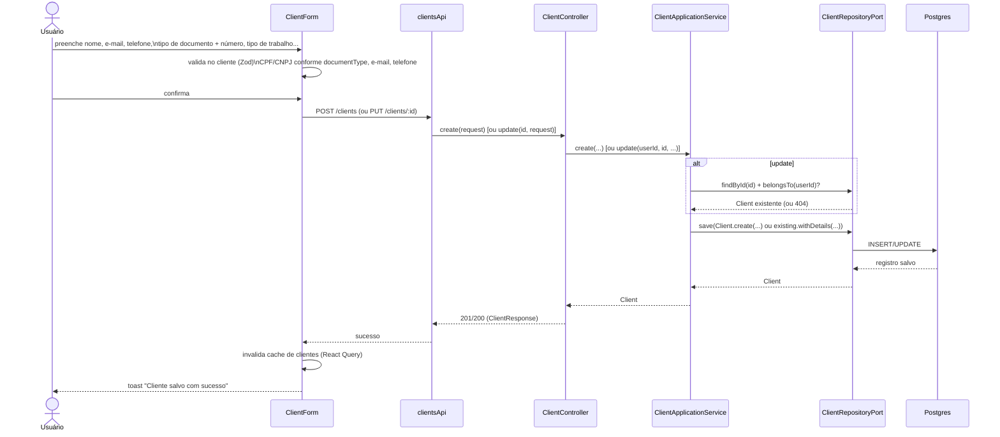

# FinPro — Fluxo de Clientes

*Documentação técnica do módulo de Clientes (ver roadmap em [`../plano.md`](../plano.md#12-roadmap-sugerido-atualizado)). Diagramas em [Mermaid](https://mermaid.js.org/) — renderizam nativamente no GitHub.*

## 1. Visão geral

`Client` representa a pessoa ou empresa para quem o freelancer/autônomo presta serviço. Um cliente pode ser vinculado a transações de receita (`Transaction.clientId`), o que alimenta o gráfico "Receita por cliente" no Dashboard e a pré-seleção de receita bruta na tela de Impostos. É um CRUD completo em arquitetura hexagonal, no mesmo padrão dos demais módulos (Account, Category, Transaction).

## 2. Tela

Rota `/clientes` (`ClientsPage`).

- **Cabeçalho**: título "Clientes" + botão "Novo cliente" (ícone `+`), que abre um `Modal` com o `ClientForm`.
- **Filtros** (`CollapsibleFilters`, recolhidos por padrão): nome (busca por texto), status (ativo/inativo), tipo de trabalho (PJ/Autônomo).
- **Lista** (`ClientList`): um card por cliente, com nome, indicador de cor, e ações de visualizar detalhes, editar e remover.
- **Detalhes** (`ClientDetails`, dentro de um `Modal`): e-mail, telefone formatado, tipo de trabalho, documento formatado (CPF ou CNPJ conforme `documentType`), status e observações.
- **Estados**: `isLoading` → "Carregando clientes..."; lista vazia → mensagem de estado vazio; erro de exclusão → toast com a mensagem do backend (`ApiError`).
- **Ações do usuário**: criar, editar, ver detalhes, remover (com confirmação via `useConfirm()`).

## 3. Arquitetura (hexagonal)

Mesma cadeia de camadas usada em todos os módulos do backend: `web` (HTTP) → `application` (regra de uso) → `domain` (modelo + regra de negócio pura) → `infrastructure/persistence` (banco).

```mermaid
flowchart TD
    HttpClient(["Cliente HTTP\n(frontend)"]) --> Controller

    subgraph web["infrastructure/web"]
        Controller["ClientController\n/api/clients"]
        ReqDTO["ClientRequest\n(@ValidDocumentNumber)"]
        RespDTO["ClientResponse"]
        WebMapper["ClientWebMapper"]
    end

    subgraph application["application/client"]
        Service["ClientApplicationService\ncreate · list · getById · update · delete"]
    end

    subgraph domain["domain"]
        Model["Client\n(record + create/withDetails)"]
        WorkType["ClientWorkType\n(PJ | AUTONOMO)"]
        DocType["DocumentType\n(CPF | CNPJ)"]
        Port["ClientRepositoryPort\n(interface)"]
        TxPort["TransactionRepositoryPort\n(existsByClientId)"]
    end

    subgraph infra["infrastructure/persistence"]
        Adapter["ClientRepositoryAdapter"]
        PMapper["ClientPersistenceMapper"]
        JpaRepo["ClientJpaRepository\n(Spring Data)"]
        Entity["ClientJpaEntity"]
    end

    DB[("clients\n(Postgres)")]

    Controller -- "@Valid" --> ReqDTO
    Controller --> Service
    Service --> Model
    Model --> WorkType
    Model --> DocType
    Service --> Port
    Service -- "delete(): bloqueia se houver
transações ou orçamentos vinculados" --> TxPort
    Port -.->|implementa| Adapter
    Adapter --> PMapper
    Adapter --> JpaRepo
    PMapper --> Entity
    JpaRepo --> DB
    Service --> WebMapper
    WebMapper --> RespDTO
    RespDTO --> HttpClient
```

## 4. Fluxo de criação/edição

```mermaid
sequenceDiagram
    actor U as Usuário
    participant Form as ClientForm
    participant API as clientsApi
    participant Ctrl as ClientController
    participant Svc as ClientApplicationService
    participant Repo as ClientRepositoryPort
    participant DB as Postgres

    U->>Form: preenche nome, e-mail, telefone,\ntipo de documento + número, tipo de trabalho...
    Form->>Form: valida no cliente (Zod)\nCPF/CNPJ conforme documentType, e-mail, telefone
    U->>Form: confirma
    Form->>API: POST /clients (ou PUT /clients/:id)
    API->>Ctrl: create(request) [ou update(id, request)]
    Ctrl->>Svc: create(...) [ou update(userId, id, ...)]
    alt update
        Svc->>Repo: findById(id) + belongsTo(userId)?
        Repo-->>Svc: Client existente (ou 404)
    end
    Svc->>Repo: save(Client.create(...) ou existing.withDetails(...))
    Repo->>DB: INSERT/UPDATE
    DB-->>Repo: registro salvo
    Repo-->>Svc: Client
    Svc-->>Ctrl: Client
    Ctrl-->>API: 201/200 (ClientResponse)
    API-->>Form: sucesso
    Form->>Form: invalida cache de clientes (React Query)
    Form-->>U: toast "Cliente salvo com sucesso"
```

## 5. Regras de negócio importantes

- **Validação de documento** (`@ValidDocumentNumber`, implementado por `DocumentNumberConstraintValidator`): o `documentNumber` é validado por dígito verificador conforme o `documentType` informado — `CpfValidator` para CPF, `CnpjValidator` para CNPJ. **Não há, hoje, nenhuma regra cruzando `workType` com `documentType`** (nem no backend, nem no schema Zod do frontend): um cliente `PJ` pode ter CPF e um `AUTONOMO` pode ter CNPJ — a única obrigatoriedade é que o número informado seja válido para o tipo escolhido. Isso é diferente da regra de cadastro do próprio usuário (`RegisterRequest`), que exige CNPJ para regimes de pessoa jurídica via `@ValidTaxRegimeDocument` — os dois validadores são independentes.
- **Posse**: acesso a cliente de outro usuário é tratado como 404 (`ResourceNotFoundException`), não 403 — mesmo padrão de Account/Transaction (`findOwnedOrThrow`/`belongsTo`).
- **Exclusão bloqueada com vínculo**: `delete()` verifica `transactionRepositoryPort.existsByClientId(clientId)` antes de remover; se houver qualquer transação vinculada, lança `EntityHasLinkedRecordsException` (HTTP 409) com a mensagem "Este cliente possui transações vinculadas. Exclua-as ou desvincule-as antes de remover o cliente."
- **Também bloqueada por orçamento vinculado**: depois de verificar as transações, `delete()` consulta `budgetRepositoryPort.existsByClientId(clientId)` (`budgets.client_id` é `ON DELETE CASCADE`, então sem a checagem a exclusão apagaria orçamentos em silêncio); havendo algum, lança `EntityHasLinkedRecordsException` (409) com "Este cliente possui orçamentos vinculados. Exclua-os antes de remover o cliente." Ver [`fluxo-orcamentos.md`](./fluxo-orcamentos.md#5-orçamento-vinculado-a-clienteprojeto).
- **Campo `active`**: cliente inativo continua existindo e pode ser filtrado na lista, mas não há restrição de negócio no backend impedindo lançar transações para um cliente inativo — o filtro de status é só de UI.

## 5.1 Análise de clientes (aba "Clientes" do Dashboard)

A análise é leitura de dados (compara todos os clientes), então mora no **Dashboard**, na aba **Clientes** (`/?aba=clientes`), e não na tela de cadastro. A tela de Clientes (`/clientes`) é só o cadastro, com o link "Ver análise de clientes". Detalhes das abas em [`fluxo-dashboard.md`](./fluxo-dashboard.md).

`GET /api/clients/analytics?months=12&onlyReceived=false` (`ClientAnalyticsController` → `ClientAnalyticsApplicationService` → `ClientAnalytics`, puro) devolve tudo de uma vez. A tela só desenha.

- **Período**: os últimos N meses, contando o atual (de 1 a 36; a tela oferece 3, 6, 12 e 24). Fora desse intervalo, a resposta é 400.
- **Transações consideradas**: todas as contas do usuário, sem transferências. Por padrão entram pagas e pendentes (competência); com `onlyReceived=true`, só as pagas.
- **Ranking**: clientes com receita ou despesa vinculada no período, do maior para o menor em receita. Cada um traz:
  - receita, despesa e líquido;
  - número de recebimentos e ticket médio (receita ÷ recebimentos);
  - participação na receita total;
  - meses com receita e último recebimento;
  - a série mensal de receita e despesa.
- **Concentração**:
  - As participações são calculadas sobre **toda** a receita do período, inclusive a sem cliente (`unassignedIncome`, mostrada à parte).
  - O percentual do maior cliente e o dos 3 maiores (este calculado a partir dos valores, não das participações arredondadas) definem o `ConcentrationRisk`: `HIGH` a partir de 50%, `MODERATE` a partir de 30%, `LOW` abaixo disso e `NONE` sem receita.
- **Gráfico** (`ClientRevenueHistoryChart`):
  - Barras empilhadas com os 5 maiores clientes com receita, mais "Outros" em cinza neutro.
  - A cor de cada cliente é a cadastrada nele; sem cor, uma da paleta categórica compartilhada (`shared/chart/palette.ts`, validada com a skill de dataviz), na ordem do ranking.
  - Legenda sempre visível; o ranking funciona como a tabela com os mesmos dados.
- **Histórico do cliente**: seção própria abaixo do ranking, com um seletor de cliente no cabeçalho (o maior, por padrão). Mostra o `MonthlyFlowChart` do Dashboard (receita e despesa por mês) e um card de resumo: receita, participação, despesas, líquido, recebimentos/ticket, meses com receita e último recebimento. Escolher um cliente no ranking rola a tela até essa seção.
- **Responsividade** (conferida em 360, 390, 768, 1024 e 1440 px, sem rolagem horizontal):
  - **Ranking**: cards (1 coluna no celular, 2 no tablet) até 1024 px. Daí em diante vira tabela: 6 colunas no desktop pequeno (com a barra lateral sobram ~720 px) e 8 em telas largas (Despesas e Último recebimento). Essas duas colunas continuam no card de resumo em qualquer largura.
  - **Indicadores**: 2 colunas no celular e 4 a partir do tablet.
  - **Histórico do cliente**: gráfico e resumo empilhados até 1024 px; depois, lado a lado (2/3 + 1/3).

## 6. Onde cada peça vive no repositório

| Camada | Arquivo |
|---|---|
| Domínio | `domain/model/{Client,ClientWorkType,DocumentType,ClientAnalytics,ConcentrationRisk}.java` |
| Validação | `infrastructure/web/validation/{HasDocument,ValidDocumentNumber,DocumentNumberConstraintValidator}.java` |
| Port/Adapter | `domain/port/out/ClientRepositoryPort.java` + `infrastructure/persistence/adapter/ClientRepositoryAdapter.java` |
| Aplicação | `application/client/{ClientApplicationService,ClientAnalyticsApplicationService}.java` |
| API | `infrastructure/web/controller/ClientController.java` (`/api/clients`), `ClientAnalyticsController.java` (`/api/clients/analytics`) |
| Migrations | `db/migration/V7__add_client_details.sql`, `V8__add_work_type_to_clients.sql` |
| Frontend | `frontend/src/features/clients/**` (`ClientsPage` — só cadastro, com link para a análise —, `ClientForm`, `ClientList`, `ClientDetails`, `ClientAnalyticsPanel`, `ClientRevenueHistoryChart`, `analytics.ts`, hooks, `clientsApi`, `schemas.ts`, `types.ts`) |
| Testes | `integration/client/{ClientIntegrationTest,ClientAnalyticsIntegrationTest}.java`, `application/client/{ClientApplicationServiceTest,ClientAnalyticsApplicationServiceTest}.java`, `domain/model/ClientAnalyticsTest.java`, `frontend/src/features/clients/analytics.test.ts` |
