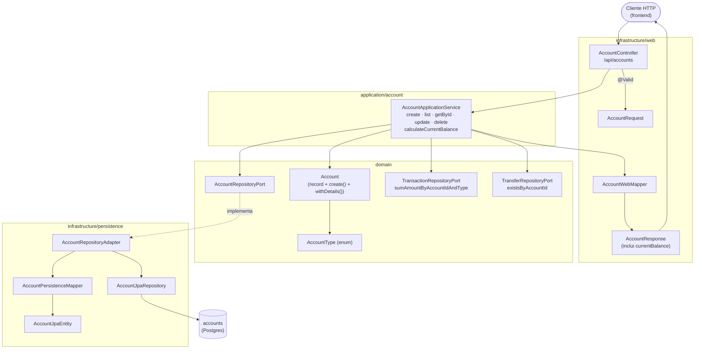
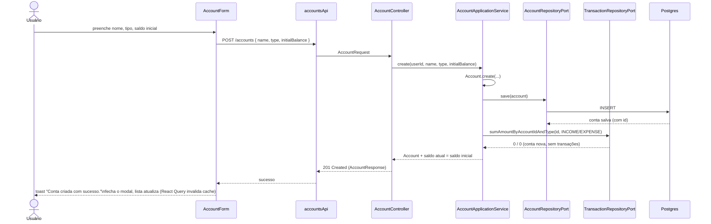
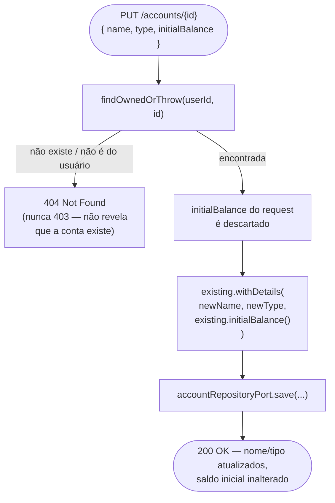
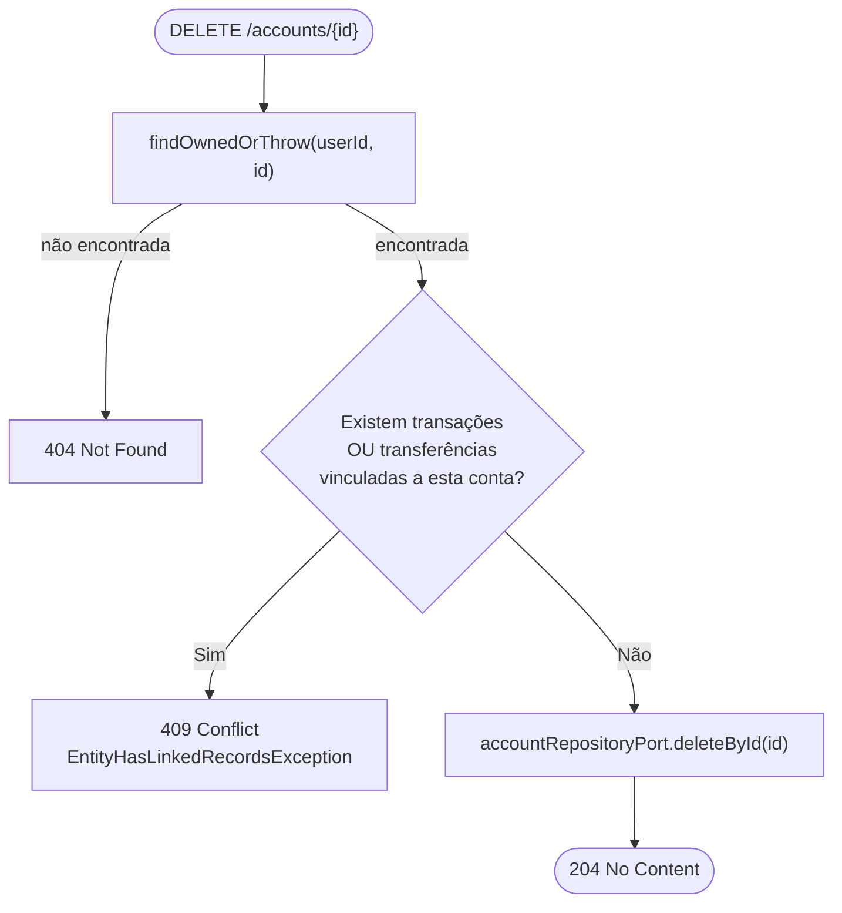
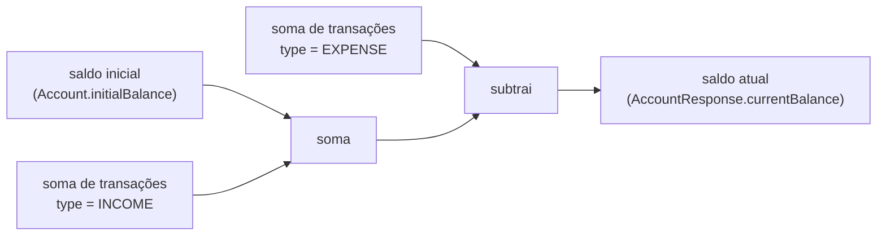

# FinPro — Fluxo de Contas (Accounts)

*Documentação técnica do módulo de contas. Diagramas em [Mermaid](https://mermaid.js.org/) — renderizam nativamente no GitHub.*

## 1. Visão geral

Contas (`Account`) são a base de tudo: toda transação e toda transferência precisa estar amarrada a uma conta. O módulo é um CRUD, mas com uma decisão de design que molda o resto do sistema — **o saldo nunca é um campo editável ou persistido diretamente**. Só o saldo inicial é salvo (na criação); o saldo atual é sempre recalculado, em tempo real, a partir da soma das transações lançadas naquela conta. Isso garante que o saldo mostrado nunca fique dessincronizado se uma transação antiga for editada ou apagada.

## 2. Tela

### `/contas` — `AccountsPage`

- Cabeçalho com título e botão "+" que abre um modal com `AccountForm` vazio (criação).
- `AccountList` abaixo, com filtros colapsáveis (nome, tipo) via `CollapsibleFilters`.
- Cada conta aparece num card com: nome, tipo (rótulo em português — "Conta corrente", "Poupança", "Carteira"), saldo inicial e **saldo atual** em destaque, e dois ícones de ação (editar, remover).
- Editar abre o mesmo `AccountForm`, agora em modo edição, num modal separado.

**Estados:**
- **Carregando**: "Carregando contas..." (texto simples, sem skeleton).
- **Vazio**: "Nenhuma conta cadastrada ainda. Adicione a primeira acima."
- **Vazio após filtro**: "Nenhuma conta encontrada com os filtros aplicados." (diferente da mensagem de lista vazia, para deixar claro que o problema é o filtro, não a ausência de dados).
- **Removendo**: confirma antes (`useConfirm`, modal de confirmação com o nome da conta) — só chama a API depois do "sim". Se a conta tiver transações/transferências vinculadas, o backend recusa (`409`) e o motivo aparece num toast.

**Particularidade do formulário**: o campo "Saldo inicial" fica **desabilitado** (`disabled={isEditing}`) quando o formulário está em modo edição — reflete a regra de negócio da seção 5. No modo edição, aparece um campo extra somente-leitura "Saldo atual", mostrando o valor calculado que já vem pronto do backend.

## 3. Arquitetura

Camadas hexagonal padrão do projeto: `web` (HTTP) → `application` (caso de uso) → `domain` (modelo + regra pura) → `infrastructure/persistence` (banco). Sem particularidades de segurança próprias — usa o mesmo `JwtAuthenticationFilter` documentado em [`fluxo-autenticacao.md`](fluxo-autenticacao.md).

**Por que `calculateCurrentBalance` vive no `AccountApplicationService`, e não no `Account` (domínio puro):** o cálculo depende de somar transações — dado que só existe via `TransactionRepositoryPort`, uma dependência de infraestrutura. Mantendo o record `Account` sem dependências, ele continua testável isoladamente; quem orquestra a soma é o caso de uso, que já tem acesso aos ports.

## 4. Fluxo de criação e listagem

## 5. Regra de negócio: saldo inicial imutável

Esta é a regra mais importante do módulo — foi corrigida durante uma auditoria de responsabilidades backend/frontend desta sessão (antes, era possível editar o saldo inicial depois de criada a conta, distorcendo todo o histórico).

O `AccountController.update()` até recebe `request.initialBalance()` no payload (o mesmo DTO usado na criação, `AccountRequest`), mas o `AccountApplicationService.update()` **nunca lê esse campo** — sempre reaproveita `existing.initialBalance()`. O frontend reforça isso desabilitando o campo no formulário (seção 2), mas a garantia real está no backend: mesmo uma chamada direta à API ignorando o frontend não consegue alterar o saldo inicial.

## 6. Regra de negócio: exclusão bloqueada por vínculos

A mensagem de erro (`"Esta conta possui transações ou transferências vinculadas. Exclua-as antes de remover a conta."`) chega ao usuário via toast na `AccountList` — a UI não impede o clique em "remover" preventivamente, deixa o backend ser a fonte da verdade e só reage ao erro.

## 7. Cálculo do saldo atual

Recalculado **a cada requisição** (`list`, `getById`, e depois de `create`/`update`) — nunca fica em cache no banco. O custo é uma agregação SQL por conta a cada leitura, aceitável para o volume de dados do sistema; o ganho é nunca precisar de uma rotina de "recalcular saldo" quando uma transação passada é editada ou apagada.

## 8. Onde cada peça vive no repositório

| Camada | Arquivo(s) |
|---|---|
| Domínio | `domain/model/{Account,AccountType}.java` |
| Ports | `domain/port/out/{AccountRepositoryPort,TransactionRepositoryPort,TransferRepositoryPort}.java` |
| Aplicação | `application/account/AccountApplicationService.java` |
| API | `infrastructure/web/controller/AccountController.java`, `infrastructure/web/dto/account/{AccountRequest,AccountResponse}.java`, `infrastructure/web/mapper/AccountWebMapper.java` |
| Persistência | `infrastructure/persistence/adapter/AccountRepositoryAdapter.java`, `infrastructure/persistence/mapper/AccountPersistenceMapper.java`, `infrastructure/persistence/entity/AccountJpaEntity.java` |
| Exceções | `domain/exception/{ResourceNotFoundException,EntityHasLinkedRecordsException}.java` |
| Migration | `db/migration/V1__init_schema.sql` |
| Frontend — tela | `features/accounts/components/{AccountsPage,AccountForm,AccountList}.tsx` |
| Frontend — lógica | `features/accounts/{types.ts,schemas.ts,api/accountsApi.ts,hooks/{useAccounts,useCreateAccount,useUpdateAccount,useDeleteAccount}.ts}` |
| Testes | `backend/src/test/java/.../integration/account/AccountIntegrationTest.java`, `.../application/account/AccountApplicationServiceTest.java`, `../../frontend/src/features/accounts/schemas.test.ts` |
