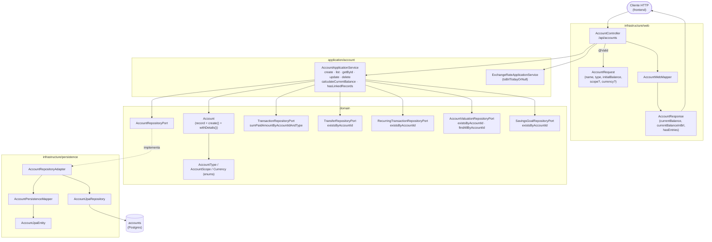
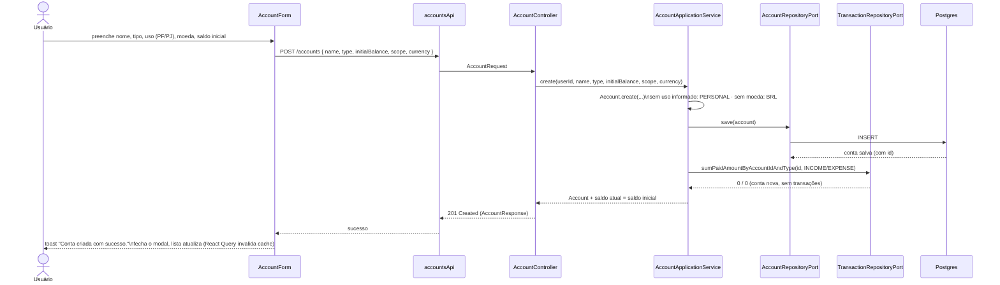
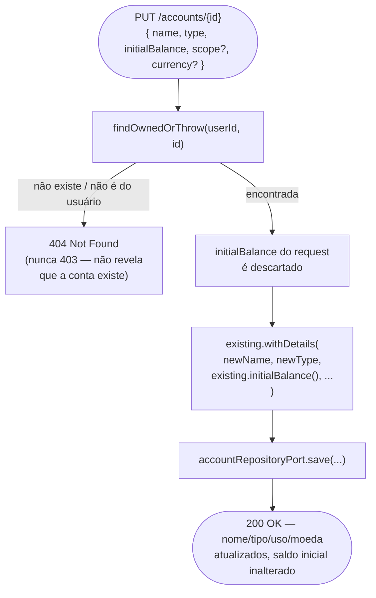
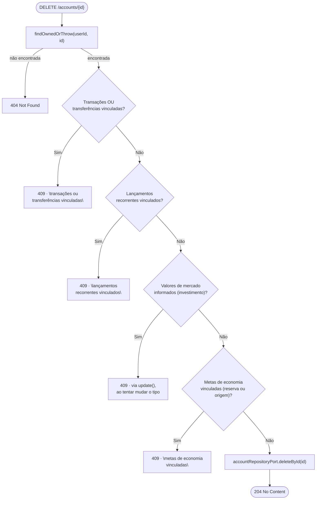
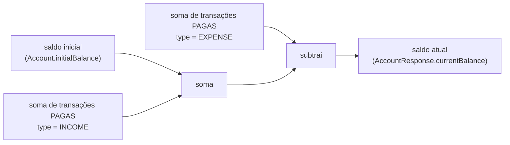

# FinPro — Fluxo de Contas (Accounts)

*Documentação técnica do módulo de contas. Diagramas em [Mermaid](https://mermaid.js.org/) — renderizam nativamente no GitHub.*

## 1. Visão geral

Contas (`Account`) são a base de tudo: toda transação e toda transferência precisa estar amarrada a uma conta. O módulo é um CRUD, mas com decisões de design que moldam o resto do sistema:

- **O saldo nunca é um campo editável ou persistido diretamente.** Só o saldo inicial é salvo (na criação); o saldo atual é sempre recalculado, em tempo real, a partir das transações pagas naquela conta. Isso garante que o saldo mostrado nunca fique dessincronizado se uma transação antiga for editada ou apagada.
- **Uso (`AccountScope`)**: toda conta é `PERSONAL` (PF) ou `BUSINESS` (PJ) — base do cálculo de pró-labore (ver [`fluxo-pro-labore.md`](./fluxo-pro-labore.md)) e do filtro PF/PJ em relatórios.
- **Moeda (`Currency`)**: `BRL`, `USD` ou `EUR`. Saldo inicial e lançamentos ficam na moeda da conta; o app converte para reais pela PTAX quando precisa consolidar (dashboard, patrimônio, relatórios). Ver [`fluxo-imposto-fluxo-caixa.md`](./fluxo-imposto-fluxo-caixa.md) e [`fluxo-patrimonio.md`](./fluxo-patrimonio.md) para onde a conversão é usada.
- **Conta de investimento** (`AccountType.INVESTMENT`): o saldo pode seguir um valor de mercado informado manualmente em vez da soma simples de transações — ver seção 7 e [`fluxo-patrimonio.md`](./fluxo-patrimonio.md).
- **Conta reserva** (`AccountType.RESERVE`): sem particularidade de saldo, mas é o único tipo aceito como conta reserva (`accountId`) de uma meta de economia — o formulário de metas só lista contas deste tipo nesse campo (ver [`fluxo-metas.md`](./fluxo-metas.md)).

## 2. Tela

### `/contas` — `AccountsPage`

- Cabeçalho com título e botão "+" que abre um modal com `AccountForm` vazio (criação).
- `AccountList` abaixo, com filtros colapsáveis (nome, tipo) via `CollapsibleFilters`.
- Cada conta aparece num card com: nome, tipo (rótulo em português — "Conta corrente", "Poupança", "Carteira", "Investimento", "Conta reserva"), uma etiqueta de uso ("Pessoal (PF)" / "Empresa (PJ)", destacada em roxo quando é PJ) e, se a moeda não for BRL, uma etiqueta com o código da moeda; saldo inicial e **saldo atual** (e o equivalente em reais, quando a moeda não é BRL); e ícones de ação — "Valor de mercado" (só para contas de investimento), editar e remover.
- Editar abre o mesmo `AccountForm`, agora em modo edição, num modal separado. "Valor de mercado" abre `AccountValuationsPanel` (ver [`fluxo-patrimonio.md`](./fluxo-patrimonio.md)).

**Estados:**
- **Carregando**: "Carregando contas..." (texto simples, sem skeleton).
- **Vazio**: "Nenhuma conta cadastrada ainda. Adicione a primeira acima."
- **Vazio após filtro**: "Nenhuma conta encontrada com os filtros aplicados." (diferente da mensagem de lista vazia, para deixar claro que o problema é o filtro, não a ausência de dados).
- **Removendo**: confirma antes (`useConfirm`, modal de confirmação com o nome da conta) — só chama a API depois do "sim". Se a conta tiver algo vinculado, o backend recusa (`409`) e o motivo aparece num toast (seção 6).

**Particularidades do formulário**:
- O campo "Saldo inicial" fica **desabilitado** (`disabled={isEditing}`) em modo edição — reflete a regra de negócio da seção 5. No modo edição, aparece um campo extra somente-leitura "Saldo atual".
- O campo "Moeda" fica **desabilitado** quando a conta já tem lançamentos (`account.hasEntries`, vindo pronto do backend) — reflete a regra da seção 6.1.
- O campo "Tipo" mostra uma dica quando `INVESTMENT` está selecionado, explicando que aplicações/resgates são transferências e o rendimento vem do valor de mercado informado.

## 3. Arquitetura

Camadas hexagonal padrão do projeto: `web` (HTTP) → `application` (caso de uso) → `domain` (modelo + regra pura) → `infrastructure/persistence` (banco). Sem particularidades de segurança próprias — usa o mesmo `JwtAuthenticationFilter` documentado em [`fluxo-autenticacao.md`](fluxo-autenticacao.md).

```mermaid
flowchart TD
    Client(["Cliente HTTP\n(frontend)"]) --> Controller

    subgraph web["infrastructure/web"]
        Controller["AccountController\n/api/accounts"]
        ReqDTO["AccountRequest\n(name, type, initialBalance,\nscope?, currency?)"]
        RespDTO["AccountResponse\n(currentBalance, currentBalanceInBrl,\nhasEntries)"]
        WebMapper["AccountWebMapper"]
    end

    subgraph application["application/account"]
        Service["AccountApplicationService\ncreate · list · getById · update · delete\ncalculateCurrentBalance · hasLinkedRecords"]
        ExRate["ExchangeRateApplicationService\n(toBrlTodayOrNull)"]
    end

    subgraph domain["domain"]
        Model["Account\n(record + create() + withDetails())"]
        AccType["AccountType / AccountScope / Currency (enums)"]
        Port["AccountRepositoryPort"]
        TxPort["TransactionRepositoryPort\nsumPaidAmountByAccountIdAndType"]
        TfPort["TransferRepositoryPort\nexistsByAccountId"]
        RecPort["RecurringTransactionRepositoryPort\nexistsByAccountId"]
        ValPort["AccountValuationRepositoryPort\nexistsByAccountId · findAllByAccountId"]
        GoalPort["SavingsGoalRepositoryPort\nexistsByAccountId"]
    end

    subgraph infra["infrastructure/persistence"]
        Adapter["AccountRepositoryAdapter"]
        PMapper["AccountPersistenceMapper"]
        JpaRepo["AccountJpaRepository"]
        Entity["AccountJpaEntity"]
    end

    DB[("accounts\n(Postgres)")]

    Controller -- "@Valid" --> ReqDTO
    Controller --> Service
    Controller --> ExRate
    Service --> Model
    Model --> AccType
    Service --> Port
    Port -.->|implementa| Adapter
    Adapter --> PMapper
    Adapter --> JpaRepo
    PMapper --> Entity
    JpaRepo --> DB
    Service --> TxPort
    Service --> TfPort
    Service --> RecPort
    Service --> ValPort
    Service --> GoalPort
    Controller --> WebMapper
    WebMapper --> RespDTO
    RespDTO --> Client
```

**Por que `calculateCurrentBalance` vive no `AccountApplicationService`, e não no `Account` (domínio puro):** o cálculo depende de somar transações — dado que só existe via `TransactionRepositoryPort`, uma dependência de infraestrutura. Mantendo o record `Account` sem dependências, ele continua testável isoladamente; quem orquestra a soma é o caso de uso, que já tem acesso aos ports.

## 4. Fluxo de criação e listagem

```mermaid
sequenceDiagram
    actor U as Usuário
    participant Form as AccountForm
    participant Api as accountsApi
    participant Ctrl as AccountController
    participant Svc as AccountApplicationService
    participant Repo as AccountRepositoryPort
    participant TxRepo as TransactionRepositoryPort
    participant DB as Postgres

    U->>Form: preenche nome, tipo, uso (PF/PJ), moeda, saldo inicial
    Form->>Api: POST /accounts { name, type, initialBalance, scope, currency }
    Api->>Ctrl: AccountRequest
    Ctrl->>Svc: create(userId, name, type, initialBalance, scope, currency)
    Svc->>Svc: Account.create(...)\nsem uso informado: PERSONAL · sem moeda: BRL
    Svc->>Repo: save(account)
    Repo->>DB: INSERT
    DB-->>Repo: conta salva (com id)
    Svc->>TxRepo: sumPaidAmountByAccountIdAndType(id, INCOME/EXPENSE)
    TxRepo-->>Svc: 0 / 0 (conta nova, sem transações)
    Svc-->>Ctrl: Account + saldo atual = saldo inicial
    Ctrl-->>Api: 201 Created (AccountResponse)
    Api-->>Form: sucesso
    Form-->>U: toast "Conta criada com sucesso."\nfecha o modal, lista atualiza (React Query invalida cache)
```

## 5. Regra de negócio: saldo inicial imutável

Esta é uma das regras mais importantes do módulo — foi corrigida numa auditoria de responsabilidades backend/frontend (antes, era possível editar o saldo inicial depois de criada a conta, distorcendo todo o histórico).

```mermaid
flowchart TD
    Start(["PUT /accounts/{id}\n{ name, type, initialBalance, scope?, currency? }"]) --> Find["findOwnedOrThrow(userId, id)"]
    Find -- "não existe / não é do usuário" --> NotFound["404 Not Found\n(nunca 403 — não revela\nque a conta existe)"]
    Find -- "encontrada" --> Ignore["initialBalance do request\né descartado"]
    Ignore --> Keep["existing.withDetails(\n  newName, newType,\n  existing.initialBalance(), ...\n)"]
    Keep --> Save["accountRepositoryPort.save(...)"]
    Save --> Done(["200 OK — nome/tipo/uso/moeda\natualizados, saldo inicial inalterado"])
```

O `AccountController.update()` até recebe `request.initialBalance()` no payload (o mesmo DTO usado na criação, `AccountRequest`), mas o `AccountApplicationService.update()` **nunca lê esse campo** — sempre reaproveita `existing.initialBalance()`. O frontend reforça isso desabilitando o campo no formulário (seção 2), mas a garantia real está no backend: mesmo uma chamada direta à API ignorando o frontend não consegue alterar o saldo inicial.

## 6. Regra de negócio: exclusão e troca de moeda bloqueadas por vínculos

```mermaid
flowchart TD
    Start(["DELETE /accounts/{id}"]) --> Find["findOwnedOrThrow(userId, id)"]
    Find -- "não encontrada" --> NotFound["404 Not Found"]
    Find -- "encontrada" --> Check1{"Transações OU\ntransferências vinculadas?"}
    Check1 -- "Sim" --> Conflict1["409 · \"transações ou\ntransferências vinculadas\""]
    Check1 -- "Não" --> Check2{"Lançamentos\nrecorrentes vinculados?"}
    Check2 -- "Sim" --> Conflict2["409 · \"lançamentos\nrecorrentes vinculados\""]
    Check2 -- "Não" --> Check3{"Valores de mercado\ninformados (investimento)?"}
    Check3 -- "Sim" --> Conflict3["409 · via update(),\nao tentar mudar o tipo"]
    Check3 -- "Não" --> Check4{"Metas de economia\nvinculadas (reserva ou origem)?"}
    Check4 -- "Sim" --> Conflict4["409 · \"metas de economia\nvinculadas\""]
    Check4 -- "Não" --> Delete["accountRepositoryPort.deleteById(id)"]
    Delete --> Done(["204 No Content"])
```

As mensagens de erro (`EntityHasLinkedRecordsException`, sempre 409) chegam ao usuário via toast na `AccountList` — a UI não impede o clique em "remover" preventivamente, deixa o backend ser a fonte da verdade e só reage ao erro. `hasLinkedRecords(accountId)` (usado também para travar a troca de moeda, seção 6.1, e exposto no `AccountResponse.hasEntries`) verifica transações, transferências, recorrências e valores de mercado — **não** inclui metas de economia, que têm sua própria checagem só na exclusão (ver [`fluxo-metas.md`](./fluxo-metas.md)).

### 6.1 Moeda só muda sem lançamentos

Trocar a moeda de uma conta que já tem transações (ou transferências, recorrências, valores de mercado) é recusado com `CurrencyChangeNotAllowedException` (409): os valores já lançados estão na moeda antiga, então misturar moedas na mesma conta quebraria os totais. `AccountResponse.hasEntries` chega pronto do backend e desabilita o seletor de moeda no formulário antes mesmo de tentar salvar.

### 6.2 Conta de investimento com valores de mercado não muda de tipo

Mudar o tipo de uma conta `INVESTMENT` que já tem valores de mercado informados (`account_valuations`) é recusado (409) — o cálculo do saldo por `AccountBalances` deixaria de fazer sentido para outro tipo de conta. É preciso excluir os valores informados antes (ver [`fluxo-patrimonio.md`](./fluxo-patrimonio.md)).

### 6.3 Conta reserva vinculada a uma meta não muda de tipo

Mudar o tipo de uma conta `RESERVE` que é `accountId` de alguma meta de economia é recusado (409, `EntityHasLinkedRecordsException`) — a meta depende do tipo `RESERVE` para existir (seção de criação em [`fluxo-metas.md`](./fluxo-metas.md)). É preciso excluir a meta antes de mudar o tipo da conta.

## 7. Cálculo do saldo atual

```mermaid
flowchart LR
    Initial["saldo inicial\n(Account.initialBalance)"] --> Sum
    Income["soma de transações PAGAS\ntype = INCOME"] --> Sum
    Expense["soma de transações PAGAS\ntype = EXPENSE"] --> Sub["subtrai"]
    Sum["soma"] --> Sub
    Sub --> Current["saldo atual\n(AccountResponse.currentBalance)"]
```

Recalculado **a cada requisição** (`list`, `getById`, e depois de `create`/`update`) — nunca fica em cache no banco. Só conta transações **pagas** (`TransactionStatus.PAID`); pendentes ficam de fora até serem confirmadas. O custo é uma agregação SQL por conta a cada leitura, aceitável para o volume de dados do sistema; o ganho é nunca precisar de uma rotina de "recalcular saldo" quando uma transação passada é editada ou apagada.

**Conta de investimento** (tipo `INVESTMENT`): quando há valor de mercado informado (`account_valuations`), o saldo atual é o **último valor informado mais as movimentações pagas posteriores a ele** (`AccountBalances.balance`), em vez da regra comum acima. Assim o resgate de tudo, rendimento incluído, não é barrado por "saldo insuficiente" na transferência. Sem valor informado, vale a regra comum. Detalhes em [`fluxo-patrimonio.md`](./fluxo-patrimonio.md).

**Moeda diferente de BRL**: `AccountResponse.currentBalanceInBrl` traz o saldo convertido pela PTAX de hoje (`ExchangeRateApplicationService.toBrlTodayOrNull`), ou `null` se a cotação estiver indisponível — usado só para exibição, nunca no cálculo do saldo na própria moeda.

## 8. Onde cada peça vive no repositório

| Camada | Arquivo(s) |
|---|---|
| Domínio | `domain/model/{Account,AccountType,AccountScope,Currency,AccountBalances}.java` |
| Ports | `domain/port/out/{AccountRepositoryPort,TransactionRepositoryPort,TransferRepositoryPort,RecurringTransactionRepositoryPort,AccountValuationRepositoryPort,SavingsGoalRepositoryPort}.java` |
| Aplicação | `application/account/AccountApplicationService.java`, `application/exchangerate/ExchangeRateApplicationService.java` |
| API | `infrastructure/web/controller/AccountController.java`, `infrastructure/web/dto/account/{AccountRequest,AccountResponse}.java`, `infrastructure/web/mapper/AccountWebMapper.java` |
| Persistência | `infrastructure/persistence/adapter/AccountRepositoryAdapter.java`, `infrastructure/persistence/mapper/AccountPersistenceMapper.java`, `infrastructure/persistence/entity/AccountJpaEntity.java` |
| Exceções | `domain/exception/{ResourceNotFoundException,EntityHasLinkedRecordsException,CurrencyChangeNotAllowedException}.java` |
| Migration | `db/migration/V1__init_schema.sql` (base), `V17__add_account_scope_and_pro_labore_settings.sql` (uso PF/PJ), `V23__add_multi_currency.sql` (moeda) |
| Frontend — tela | `features/accounts/components/{AccountsPage,AccountForm,AccountList,AccountValuationsPanel}.tsx` |
| Frontend — lógica | `features/accounts/{types.ts,schemas.ts,api/accountsApi.ts,hooks/{useAccounts,useCreateAccount,useUpdateAccount,useDeleteAccount}.ts}` |
| Testes | `backend/src/test/java/.../integration/account/AccountIntegrationTest.java`, `.../application/account/AccountApplicationServiceTest.java`, `../../frontend/src/features/accounts/schemas.test.ts` |
