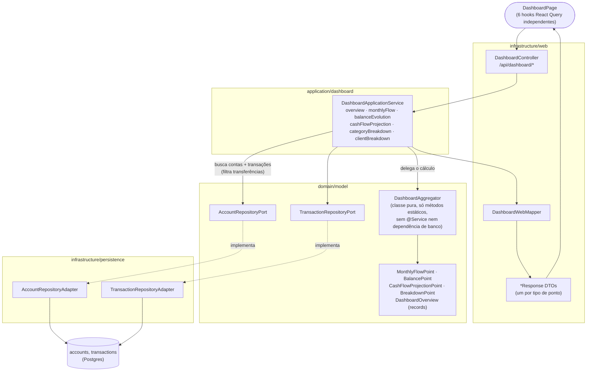
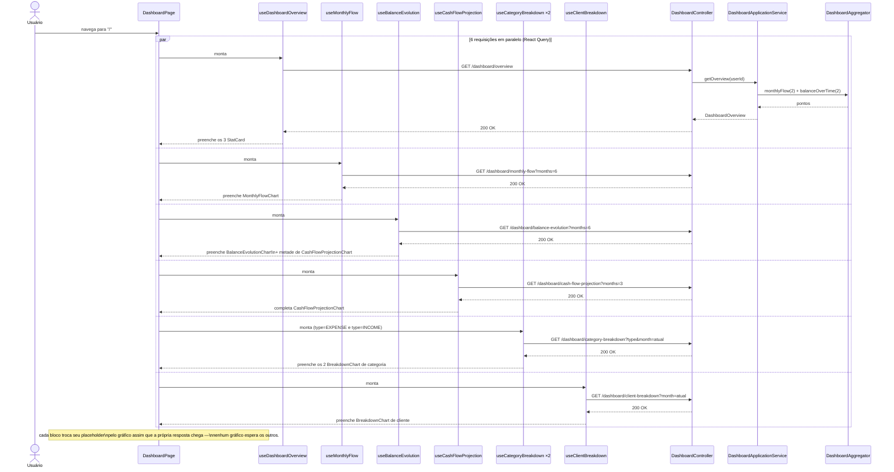
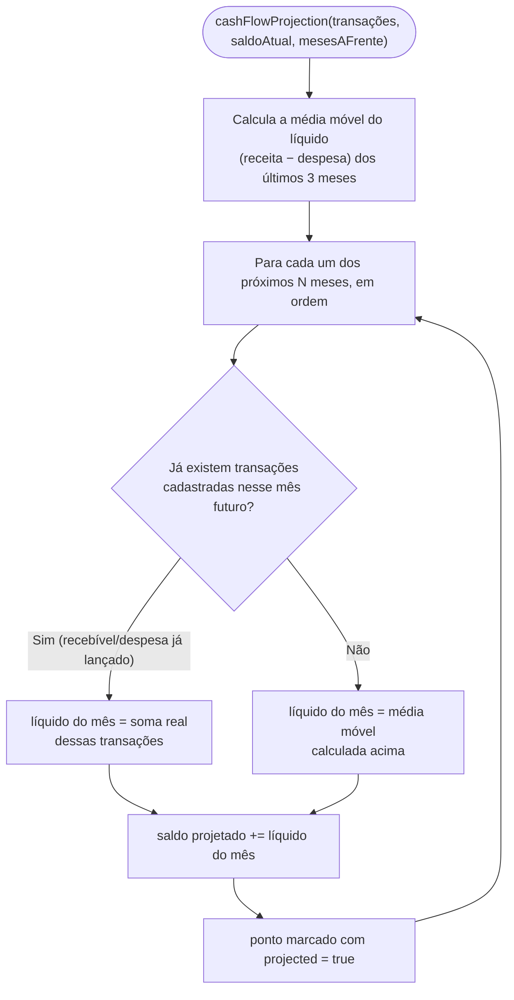

# FinPro — Fluxo do Dashboard

*Documentação técnica da tela inicial do sistema (ver roadmap em [`../plano.md`](../plano.md#12-roadmap-sugerido-atualizado)). Diagramas em [Mermaid](https://mermaid.js.org/) — renderizam nativamente no GitHub.*

## 1. Visão geral

O Dashboard é a rota raiz (`/`) da aplicação — a primeira tela que o usuário vê depois de logar. Ele responde três perguntas de cara: *quanto eu tenho, quanto entrou/saiu este mês, e como isso variou desde o mês passado*, e depois detalha isso em gráficos de série histórica, projeção futura e composição por categoria/cliente.

Toda a agregação (somar transações, calcular saldo mês a mês, projetar fluxo de caixa) acontece no **backend**, numa classe de domínio pura (`DashboardAggregator`), não no frontend. O `DashboardController` expõe **um endpoint por gráfico** (6 no total) em vez de um único endpoint "tudo junto" — de propósito, para que cada gráfico da tela busque e renderize seus próprios dados de forma independente, aparecendo assim que sua resposta chega, sem que um gráfico lento (ou uma requisição que falhe) trave a tela inteira.

## 2. Tela

**Rota:** `/` (`DashboardPage`, dentro da área autenticada).

A tela é composta por blocos empilhados verticalmente, cada um alimentado por um hook do React Query independente:

1. **Cards de resumo** (`StatCard` × 3): Saldo atual, Receita do mês, Despesa do mês — cada um com a variação percentual vs. o mês anterior (seta/cor indicando alta ou queda; para despesa a lógica de cor é invertida, já que despesa subir é "ruim").
2. **Receita x despesa por mês** (`MonthlyFlowChart`, por competência: pagas + pendentes) + **Evolução do saldo** (`BalanceEvolutionChart`, só transações pagas, assim o último ponto bate com o card "Saldo atual") lado a lado.
3. **Projeção de fluxo de caixa** (`CashFlowProjectionChart` — combina o histórico real de `BalanceEvolutionChart` com os meses futuros projetados, histórico em linha sólida e projeção em linha tracejada; a projeção parte do saldo com pagas + pendentes até o fim do mês atual, então os pendentes do mês aparecem no primeiro trecho tracejado) + **Saldo por conta** (`AccountBalanceChart`, gráfico de barras horizontais, uma barra por conta cadastrada, cores fixas por posição — nunca reordenadas pelo valor do saldo).
4. **Despesas por categoria** e **Receita por categoria** (`BreakdownChart` × 2) lado a lado, mês atual.
5. **Receita por cliente** (`BreakdownChart`), mês atual — inclui uma fatia "Sem cliente" para receitas não vinculadas a nenhum cliente.

**Estados:** cada bloco de gráfico mostra um placeholder próprio (`Carregando...`, num box tracejado) enquanto seus dados ainda não chegaram — não existe um "loading" de tela inteira. Os `BreakdownChart` também tratam o caso de mês sem nenhuma transação daquele tipo com uma mensagem vazia específica (ex: "Nenhuma despesa registrada neste mês ainda"). `AccountBalanceChart` trata separadamente o caso de nenhuma conta cadastrada.

**Interações:** a tela é somente leitura — não há filtros, seletor de mês ou edição nela; os dados refletem sempre o mês corrente (breakdown por categoria/cliente) ou os últimos 6 meses + próximos 3 (séries temporais). Para editar dados, o usuário navega para as telas de Transações, Contas, etc.

## 3. Arquitetura (hexagonal)

**Por que `DashboardAggregator` é uma classe pura:** ela não tem `@Service`, não injeta nenhum port — recebe listas de `Transaction` já carregadas e devolve os pontos prontos para cada gráfico. Isso espelha fielmente o que antes vivia em `../../frontend/src/features/dashboard/utils.ts`, migrado 1:1 para o backend numa auditoria de responsabilidade (ver seção 8 do roadmap em `../plano.md`) — o cálculo saiu do cliente para o servidor, mas continuou testável isoladamente (sem Testcontainers) por ser uma função pura.

## 4. Fluxo principal — carregamento independente por gráfico

## 5. Lógica de cada agregação (`DashboardAggregator`)

- **`monthlyFlow(transactions, monthsCount)`** — soma receita e despesa por mês, para os últimos `monthsCount` meses (incluindo o atual). Meses sem nenhuma transação entram com zero.
- **`balanceOverTime(transactions, saldoInicial, monthsCount)`** — saldo consolidado ao final de cada mês: soma o saldo inicial de todas as contas com receitas e subtrai despesas de todas as transações até (e incluindo) aquele mês.
- **`cashFlowProjection(transactions, saldoAtual, monthsAhead)`** — ver diagrama de decisão abaixo.
- **`categoryBreakdown(transactions, type, month)`** — soma por `categoryId` das transações do tipo e mês informados, ordenado do maior para o menor valor.
- **`clientBreakdown(transactions, month)`** — soma por `clientId` só das transações `INCOME` do mês informado (despesas não têm cliente associado na prática de negócio).
- **`deltaPercent(atual, anterior)`** — variação percentual entre dois períodos; devolve `null` quando o período anterior é zero (evita divisão por zero e "infinito%" na tela).

**Regra de negócio importante — transferências ficam de fora de tudo:** todo o dashboard consome `ownedNonTransferTransactions()`, que filtra `transaction.transferId() == null` antes de passar qualquer coisa para o `DashboardAggregator` (ver `DashboardApplicationService`). Uma transferência entre duas contas do próprio usuário move dinheiro de um lugar para outro, mas não é receita nem despesa — se não fosse filtrada, contaria duas vezes (uma perna de saída em EXPENSE, uma de entrada em INCOME) e infllaria tanto o gráfico de receita x despesa quanto os breakdowns por categoria/cliente.

## 6. Onde cada peça vive no repositório

| Camada | Arquivo |
|---|---|
| Domínio (cálculo puro) | `domain/model/DashboardAggregator.java` |
| Domínio (records) | `domain/model/{MonthlyFlowPoint,BalancePoint,CashFlowProjectionPoint,BreakdownPoint,DashboardOverview}.java` |
| Aplicação | `application/dashboard/DashboardApplicationService.java` |
| API | `infrastructure/web/controller/DashboardController.java` (`/api/dashboard/{overview,monthly-flow,balance-evolution,cash-flow-projection,category-breakdown,client-breakdown}`) |
| DTOs/Mapper | `infrastructure/web/dto/dashboard/*.java`, `infrastructure/web/mapper/DashboardWebMapper.java` |
| Frontend — tela | `../../frontend/src/features/dashboard/components/DashboardPage.tsx` |
| Frontend — gráficos | `frontend/src/features/dashboard/components/{MonthlyFlowChart,BalanceEvolutionChart,CashFlowProjectionChart,AccountBalanceChart,BreakdownChart}.tsx` |
| Frontend — hooks | `frontend/src/features/dashboard/hooks/{useDashboardOverview,useMonthlyFlow,useBalanceEvolution,useCashFlowProjection,useCategoryBreakdown,useClientBreakdown}.ts` |
| Frontend — API client / tipos / mappers | `frontend/src/features/dashboard/{api/dashboardApi.ts,types.ts,utils.ts}` |
| Testes | `backend/src/test/java/.../domain/model/DashboardAggregatorTest.java` (unitário, lógica pura) e `.../integration/dashboard/DashboardIntegrationTest.java` (ponta a ponta) |
