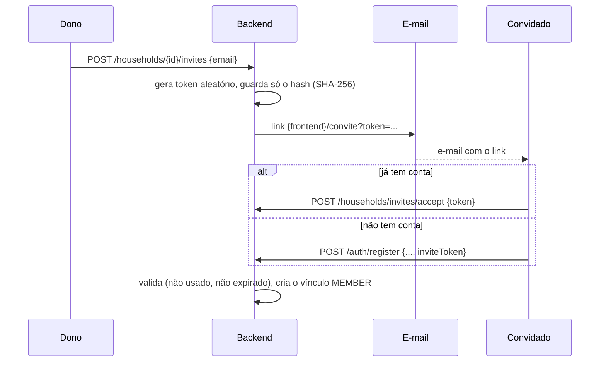

# FinPro — Fluxo de Grupos Compartilhados (Casal/Família)

*Documentação técnica do módulo de grupos. Diagramas em [Mermaid](https://mermaid.js.org/) — renderizam nativamente no GitHub.*

## 1. Visão geral

Todo dado financeiro (contas, transações, orçamentos, metas, categorias, etc.) pertence a um **grupo** (`households`), e não diretamente a um usuário. Há dois tipos:

- **`PERSONAL`** — o espaço pessoal, criado no cadastro, com um único membro (o dono). É onde ficam os dados "só meus".
- **`SHARED`** — grupo de casal ou família, com vários membros. Os dados dele são vistos e editados por todos.

Cada usuário tem exatamente um grupo pessoal e pode participar de quantos grupos compartilhados quiser. Entrar num grupo compartilhado **não move nem apaga nada**: o espaço pessoal continua intacto e separado. A tela alterna entre eles.

Papéis num grupo: **`OWNER`** (convida, remove membros e transfere a posse) e **`MEMBER`** (acesso total aos dados, sem gerir pessoas). Um grupo compartilhado tem um dono por vez; o dono não sai do grupo sem antes transferir a posse, para os dados nunca ficarem sem responsável.

## 2. Grupo ativo

O backend precisa saber, a cada requisição, de qual grupo os dados devem ser lidos e gravados. O `JwtAuthenticationFilter` resolve isso a cada chamada:

- Sem header → o **espaço pessoal** do usuário.
- Com `X-Household-Id: <id>` → aquele grupo, **se o usuário participa dele**. Caso contrário (grupo inexistente, de outra pessoa ou id inválido) a resposta é `403`, sem executar a requisição.

O grupo vale só para a requisição: o token JWT não o carrega, então remover um membro tem efeito imediato (a próxima requisição dele ao grupo recebe `403`), sem precisar encerrar sessões. O principal autenticado (`AuthenticatedUser`) expõe `userId`, `householdId` (o ativo) e `householdRole`; todos os controllers de dados passam `householdId` aos serviços. `householdId` e `userId` ficam no MDC dos logs.

Os endpoints de gestão de grupos (`/api/households/**`) **não** dependem do grupo ativo: o grupo vem explícito no caminho, já que gerenciar um grupo não exige estar vendo-o.

## 3. Endpoints

| Método e caminho | Quem pode | O que faz |
|---|---|---|
| `GET /api/households` | logado | Grupos de que participa (pessoal e compartilhados), com o seu papel |
| `POST /api/households` | logado | Cria um grupo compartilhado; quem cria é o `OWNER` |
| `GET /api/households/{id}/members` | membro | Lista membros (nome, e-mail, papel) |
| `POST /api/households/{id}/invites` | dono | Convida por e-mail (substitui convites pendentes do mesmo e-mail) |
| `GET /api/households/{id}/invites` | dono | Convites pendentes (não aceitos e não expirados) |
| `DELETE /api/households/{id}/invites/{inviteId}` | dono | Revoga um convite |
| `POST /api/households/invites/accept` | logado | Aceita o convite pelo token do link |
| `GET /api/households/invites/received` | logado | Convites pendentes endereçados ao e-mail da conta |
| `POST /api/households/invites/{id}/accept` | logado | Aceita um convite recebido, dentro do app |
| `POST /api/households/invites/{id}/decline` | logado | Recusa um convite recebido (ele é apagado) |
| `DELETE /api/households/{id}/members/{userId}` | dono | Remove um membro |
| `POST /api/households/{id}/leave` | membro | Sai do grupo (o dono não pode) |
| `PUT /api/households/{id}/owner` | dono | Transfere a posse a outro membro |
| `POST /api/households/{id}/accounts/share` | membro | Passa contas do espaço pessoal do próprio usuário para o grupo, com o histórico |
| `POST /api/households/{id}/accounts/unshare` | dono da conta | Devolve contas do grupo ao espaço pessoal de quem pede, com o histórico (ver seção 5) |

Erros de regra: `403` para quem não é membro/dono, `409` para operações que o estado do grupo não permite (convidar quem já é membro, dono sair, convidar para o espaço pessoal), `400` para convite inválido ou expirado.

## 4. Convites

- O token em claro existe **apenas no link do e-mail**; o banco guarda o hash (`household_invites.token_hash`). Uso único (`accepted_at`) e validade configurável (`finpro.household.invite-ttl-days`, padrão 7 dias).
- **Quem tem o link entra**, com qualquer e-mail: o convite não amarra o e-mail da conta. É uma escolha de produto (o casal pode se cadastrar com e-mails diferentes); em troca, o link deve ser tratado como acesso aos dados do grupo.
- No cadastro com `inviteToken`, a entrada no grupo acontece na mesma transação do cadastro: se o convite for inválido, nada é criado (nem o usuário).
- **Aceitar dentro do app:** quem já tem conta vê os convites pendentes endereçados ao e-mail da sua conta (quadro "Convites recebidos" no topo de Configurações → Grupos, `ReceivedInvitesCard`; o item "Grupos" do menu do usuário e a aba de Configurações mostram uma bolinha com a contagem, `PendingInvitesBadge`, em vez de um aviso fixo nas telas; a mesma bolinha, limitada a "9+", aparece na foto do usuário no topo, `AvatarInvitesBadge`, para ser vista de qualquer tela) e aceita ou recusa sem usar o link. **Ao aceitar**, o app já troca para o grupo (`switchTo`) e atualiza o painel e as demais telas do grupo, sem esperar a pessoa mexer no seletor. Aqui o **e-mail precisa coincidir** (sem diferenciar maiúsculas), ao contrário do link: o id do convite é sequencial e fácil de adivinhar, então sem essa checagem qualquer pessoa entraria em qualquer grupo. Convite de outro e-mail responde como inexistente (`400`), sem revelar nada. Recusar apaga o convite, e o link do e-mail deixa de funcionar. A lista nunca traz o token nem o hash.
- Se o envio do e-mail falha, o convite é desfeito e quem convidou recebe o erro. Sem SMTP configurado (`spring.mail.host`) o convite **não é enviado** (só um aviso no log, sem o link) — para testar localmente use o Mailpit do `docker-compose`.

## 5. Compartilhar contas existentes

Quem já usa o app e depois entra num grupo traz as contas que quiser, **sem perder histórico**: `POST /api/households/{id}/accounts/share` com `{ "accountIds": [...] }`. Qualquer membro pode compartilhar as suas contas (o dono controla quem entra; o que cada um traz é escolha de cada um). Só vale do **espaço pessoal para um grupo compartilhado**.

É uma **mudança de dono, não uma cópia**: depois, as contas deixam de aparecer no espaço pessoal e passam a ser vistas e editadas por todos os membros. Dá para **descompartilhar** (ver abaixo), e sair do grupo, ou ser removido dele, não leva as contas de volta: é preciso descompartilhar antes.

**Descompartilhar** (`POST /api/households/{id}/accounts/unshare`) é o inverso: devolve contas do grupo ao **espaço pessoal de quem pede**, com todo o histórico (inclusive os lançamentos de outros membros). Reaproveita a mesma mudança de dono em lote de compartilhar, com origem e destino trocados: categorias, clientes e tags são recriados no espaço pessoal, e as transferências divididas voltam a se juntar (o `findSiblingInTarget` acha a outra metade). Metas que ligam a conta a outra que fica continuam bloqueando.

**Quem pode:** o **dono da conta**, ou seja, quem a criou ou a trouxe para o grupo (`accounts.owner_user_id`, migration V37, gravado pela `AccountOwnershipPort`). Nem o dono do grupo descompartilha a conta de outra pessoa (`403`). Quando o dono é desconhecido (contas compartilhadas antes da V37), quem pode é o dono do grupo. Quem descompartilha passa a constar como dono. A resposta de contas traz `ownerUserId`, `ownerName` e `canUnshare` (a tela mostra "Trazida por ..." e o botão); o servidor é quem de fato impede.

**O que acompanha a conta** (tudo na mesma transação, em SQL em lote — `AccountSharingJdbcAdapter`):

- transações (pertencem ao grupo pela conta), importações, recorrências, anexos (a chave no armazenamento é um UUID, então nenhum arquivo é movido), valorizações;
- transferências e metas de economia **entre contas movidas** (a transferência entre uma conta movida e outra que fica tem tratamento próprio, abaixo).

**Categoria, cliente e tag são de cada grupo**, então as que as transações movidas usam são recriadas no grupo de destino, reaproveitando as que já existem com o mesmo nome (categoria: nome + tipo; cliente: nome; tag: nome), e as transações passam a apontar para elas. As categorias padrão do sistema não mudam. Ficam no espaço pessoal, sem mudança: orçamentos, impostos, dívidas e as categorias/clientes/tags originais.

**Transferência entre uma conta movida e outra que fica:** não bloqueia. A transferência é **dividida em duas**, uma por espaço: o grupo fica com a perna da conta compartilhada (por exemplo, a entrada na conta conjunta) e o espaço pessoal, com a da conta que ficou. Cada lado enxerga só o que é seu, com uma exceção deliberada: o **nome** da conta do outro lado aparece na lista de transferências (`fromAccountName` e `toAccountName` na resposta; só o nome, nenhum outro dado dela) e na descrição automática ("Transferência de Pagbank"), para dizer de onde veio o dinheiro. Como só uma perna fica em cada espaço, o saldo do dashboard de cada um conta a sua perna (ver `fluxo-dashboard.md`). Se a outra conta for compartilhada depois com o mesmo grupo, as duas metades se juntam de novo numa transferência só.

**Bloqueio (metas):** uma meta de economia liga duas contas e pertence a um grupo só. Se ela liga uma conta movida a outra que ficaria para trás, o pedido é recusado com `409` e uma mensagem que nomeia as contas ligadas; a pessoa inclui todas na seleção. Conta que não é do próprio espaço pessoal da pessoa responde `404`, sem revelar que existe.

## 6. Alertas

Os alertas por e-mail e push continuam **por usuário** (preferências e controle de envio em `notification_preferences` e `sent_alerts`), mas consideram os dados de **todos os grupos** de que a pessoa participa (contas a vencer, atrasadas, orçamentos, orçamentos recorrentes). O lembrete do DAS usa só o espaço pessoal, porque o regime tributário é da pessoa.

## 7. Modelo de dados

- `households (id, name, type, created_at)` — `type` ∈ `PERSONAL`/`SHARED`.
- `household_members (household_id, user_id, role, joined_at)` — único por `(household_id, user_id)`.
- `household_invites (household_id, email, token_hash, role, created_by, expires_at, accepted_at)`.
- `accounts.owner_user_id` (V37) — quem criou a conta ou a trouxe para o grupo; fora do modelo de domínio, lido e gravado pela `AccountOwnershipPort`. Define quem pode descompartilhar.
- Tabelas de dados têm `household_id` (obrigatório). `categories` e `category_rules` com `household_id` nulo são **globais do sistema**. `transactions` não tem a coluna: pertence ao grupo pela conta.

## 8. Autoria: só quem criou exclui

Numa conta compartilhada, **um lançamento ou uma transferência só pode ser excluído por quem o criou** (resposta `403` para os demais). O autor fica em `transactions.created_by` e `transfers.created_by` (migration V36), fora dos modelos de domínio: a coluna é lida e gravada só pela `RecordAuthorshipPort`, e o `RecordAuthorship.canDelete` guarda a regra.

- **Quem é o autor:** quem estava logado ao criar (lançamento manual, transferência, importação de extrato, aporte de meta). Os dois lados de uma transferência têm o mesmo autor, e a divisão de uma transferência ao compartilhar contas copia o autor.
- **Sem autor (`NULL`):** o que o sistema cria sozinho (ocorrências de recorrências, aportes automáticos de metas) e o que já estava em grupos antes da V36. Qualquer membro do grupo pode excluir.
- **Lançamentos que já existiam ao compartilhar** mantêm o autor: quem os criou continua sendo o único que os exclui. Na V36 os registros do espaço pessoal foram preenchidos com o dono.
- **Aportes de metas:** excluir um aporte exclui a transferência por trás dele, então vale a mesma regra.
- **Tela:** as respostas trazem `createdByUserId` e `createdByName`; o botão de excluir fica desabilitado, com o motivo, para quem não é o autor. A regra de exibição (`canDeleteRecord`) só espelha a do servidor, que é quem de fato impede.
- **Edição:** não tem trava. Todos os membros editam, o autor só controla a exclusão.

## 9. Frontend

- **Seletor de grupo** no topo (`HouseholdSwitcher`) e `HouseholdProvider`: o grupo ativo fica em `householdStorage` e vai no header `X-Household-Id` (menos em `/auth/` e `/households*`). Trocar de grupo limpa as consultas do espaço anterior e remonta a tela (`<Outlet key>`); uma `403` com o header revalida a participação.
- **Configurações → Grupos** (`HouseholdsPage`): criar grupo, membros, convites enviados e recebidos, compartilhar contas em lote (`ShareAccountsModal`).
- **Tela de Contas**: compartilhar uma conta (`ShareAccountDialog`) e descompartilhar, com "Trazida por ...".
- **Página de convite** (`/convite`), com login ou cadastro pelo link.
- **Transações**: autor em cada lançamento, exclusão desabilitada para quem não criou e as duas pernas das transferências entre espaços (ver [`fluxo-transacoes.md`](fluxo-transacoes.md)).
- Depois de compartilhar, descompartilhar ou aceitar um convite, `refreshHouseholdScopedQueries` refaz as consultas dos espaços, para o painel e as listas já mostrarem os dados novos.

## 10. Fora do escopo (próximos passos)

- **Encerrar/excluir um grupo** e visão somada (pessoal + grupo).
- **Transferir entre espaços depois de compartilhar** (hoje só existe a divisão no momento de compartilhar).
- **Notificações além do convite pendente** (por exemplo, "fulano compartilhou uma conta").
