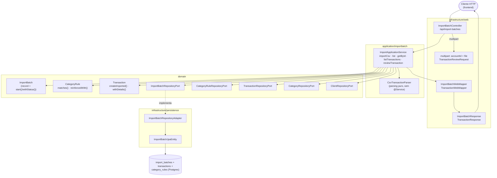
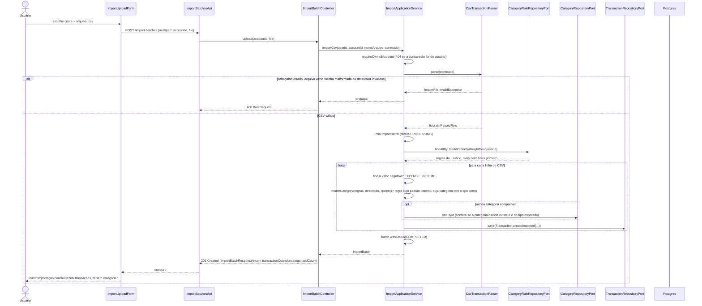

# FinPro — Fluxo de Importação de Extrato e Categorização Automática

*Documentação técnica do módulo de importação (ver roadmap em [`../plano.md`](../plano.md#12-roadmap-sugerido-atualizado)). Diagramas em [Mermaid](https://mermaid.js.org/) — renderizam nativamente no GitHub.*

## 1. Visão geral

Em vez de o usuário lançar transação por transação, ele sobe um arquivo CSV do banco e o sistema: (1) faz o parsing de cada linha, (2) tenta adivinhar a categoria de cada transação com base em regras aprendidas de importações anteriores, e (3) deixa uma tela de revisão pra ele corrigir o que o sistema não acertou — e é justamente ao corrigir que uma nova regra é criada ou uma existente é reforçada, fechando o ciclo de aprendizado.

Duas entidades de domínio sustentam esse fluxo:
- **`ImportBatch`**: um "lote" de importação — um arquivo, uma conta, um status, N transações resultantes.
- **`CategoryRule`**: um padrão de texto (ex: `"UBER"`) associado a uma categoria, com um peso que cresce a cada confirmação do usuário. É o motor de categorização automática, mas não é exclusivo da importação — qualquer transação futura cujo descritivo contenha o padrão poderia, em tese, reaproveitar a mesma regra (hoje o `matchCategory` só é chamado durante a importação).

## 2. Tela

- **Rota:** `/importacoes` (`ImportsPage`), organizada em duas abas (`Tabs`):
  - **"Importar arquivo"**: `ImportUploadForm` (seleção de conta + arquivo CSV, com uma dica fixa do formato esperado: `date,description,amount`, data `aaaa-mm-dd`, valor com ponto decimal, positivo = receita / negativo = despesa) seguido de `ImportBatchList`
  - **"Regras de categorização"**: `CategoryRulesPanel` (do módulo `categoryRules` — CRUD das regras existentes; ver [`fluxo-categorias.md`](fluxo-categorias.md) pro detalhe desse painel)
- **`ImportBatchList`**: um card recolhível por lote, mostrando nome do arquivo, um selo de status (Pendente/Processando/Concluída/Falhou), um selo de alerta "N sem categoria" quando aplicável, data, conta usada e quantidade de transações. Ao expandir, mostra a `ImportBatchReviewTable` daquele lote.
- **`ImportBatchReviewTable`**: uma linha por transação importada, com descrição, data, valor (colorido por tipo) e dois `<select>` — categoria e cliente — que disparam a revisão assim que trocados. Transações sem categoria têm a borda do select destacada em âmbar.
- **Estados:** "Carregando importações...", vazio ("Nenhuma importação realizada ainda."), ou lista populada; dentro da tabela de revisão, "Carregando transações..." e "Nenhuma transação nesta importação."
- **Ações do usuário:** subir um arquivo (bloqueia o envio no cliente se faltar conta ou arquivo), trocar a categoria/cliente de qualquer transação já importada.

## 3. Arquitetura (hexagonal)



**Por que essa separação importa aqui:** `CsvTransactionParser` é uma classe utilitária pura (construtor privado, só métodos estáticos, sem `@Service` nem dependência de banco) — ela só sabe transformar bytes de um CSV em uma lista de `ParsedRow` (data + descrição + valor com sinal), sem saber nada sobre categorização, contas ou persistência. Isso significa que trocar o formato suportado (ex: adicionar OFX, que já existe como valor do enum `ImportFormat` mas ainda não tem parser implementado) não exige tocar em `ImportApplicationService`.

## 4. Fluxo de upload e categorização automática



**Casamento de regra ↔ categoria:** `matchCategory` percorre as regras do usuário (já ordenadas por peso decrescente) e retorna a categoria da **primeira** cuja `pattern` esteja contido no descritivo (comparação case-insensitive) **e** cuja categoria tenha o mesmo `CategoryType` (INCOME/EXPENSE) da transação sendo importada. Se nenhuma regra bater — ou se a categoria referenciada por uma regra tiver sido excluída nesse meio tempo — a transação entra sem categoria (`categoryId = null`), contabilizada em `uncategorizedCount`.

## 5. Fluxo de revisão manual — onde o motor "aprende"

Esse é o ciclo que faz o sistema melhorar com o uso: cada vez que o usuário confirma manualmente uma categoria na tela de revisão, `reviewTransaction` reforça (ou cria) uma regra pra aquele descritivo exato.

```mermaid
sequenceDiagram
    actor U as Usuário
    participant Table as ImportBatchReviewTable
    participant API as importBatchesApi
    participant Ctrl as ImportBatchController
    participant Svc as ImportApplicationService
    participant TxRepo as TransactionRepositoryPort
    participant CatRepo as CategoryRepositoryPort
    participant ClientRepo as ClientRepositoryPort
    participant RuleRepo as CategoryRuleRepositoryPort
    participant DB as Postgres

    U->>Table: troca o <select> de categoria\n(ou de cliente) de uma transação
    Table->>API: PUT /import-batches/{batchId}/transactions/{id}\n{ categoryId, clientId }
    API->>Ctrl: reviewTransaction(...)
    Ctrl->>Svc: reviewTransaction(userId, batchId, txId, categoryId, clientId)

    Svc->>Svc: confere que a transação pertence\na esse lote (senão 404)
    Svc->>CatRepo: se categoryId != null, confere que a\ncategoria é visível ao usuário e bate\no tipo com a transação (senão 404/400)
    Svc->>ClientRepo: se clientId != null, confere que o\ncliente pertence ao usuário (senão 404)

    Svc->>TxRepo: save(transação atualizada)
    TxRepo->>DB: UPDATE transactions

    opt categoryId informado (não nulo)
        Svc->>RuleRepo: findByUserIdAndPattern(userId,\ndescrição.trim())
        alt já existe uma regra pra esse descritivo exato
            RuleRepo-->>Svc: CategoryRule existente
            Svc->>Svc: reinforcedWith(categoryId)\n— mesma categoria confirmada de novo?\nsim: weight + 1 · não: weight = 1 (reinicia)
        else nunca existiu regra pra esse descritivo
            Svc->>Svc: CategoryRule.create(userId, descrição, categoryId)\n— weight inicial = 1
        end
        Svc->>RuleRepo: save(regra)
        RuleRepo->>DB: INSERT/UPDATE category_rules
    end

    Svc-->>Ctrl: Transaction atualizada
    Ctrl-->>API: 200 OK (TransactionResponse)
    API-->>Table: invalida cache de transações do lote,\nde importações, de transações gerais\ne de regras de categorização
```



**Detalhe importante:** o `pattern` de uma regra criada por reforço automático é o **descritivo completo e exato** da transação (`description.trim()`), não uma palavra-chave curta como as regras cadastradas manualmente (ex: `"UBER"`, `"IFOOD"`). Isso significa que o aprendizado automático é bem específico no começo (só bate com aquele exato descritivo de novo) — regras mais genéricas continuam existindo se o usuário as criar manualmente no painel de Regras de Categorização.

## 6. Formato do CSV aceito

```mermaid
flowchart TD
    Start(["parse(arquivo)"]) --> Header{"1ª linha é exatamente\n\"date,description,amount\"\n(espaços e caixa ignorados)?"}
    Header -- não --> ErrHeader["ImportFileInvalidException\n(cabeçalho inválido)"]
    Header -- sim --> Loop["Para cada linha seguinte\n(linhas em branco são ignoradas)"]
    Loop --> Cols{"exatamente 3 colunas?"}
    Cols -- não --> ErrCols["ImportFileInvalidException\n(linha malformada, com o nº da linha)"]
    Cols -- sim --> Fields{"data ISO válida (aaaa-mm-dd),\ndescrição não vazia,\nvalor numérico e diferente de zero?"}
    Fields -- não --> ErrFields["ImportFileInvalidException\n(detalha qual campo falhou)"]
    Fields -- sim --> Row["ParsedRow(data, descrição,\nvalor com sinal original)"]
    Row --> Loop
    Loop --> Empty{"nenhuma linha de dados\nno arquivo inteiro?"}
    Empty -- sim --> ErrEmpty["ImportFileInvalidException\n(arquivo sem transações)"]
    Empty -- não --> Done(["List&lt;ParsedRow&gt;"])
```

O sinal do valor decide o `CategoryType` (negativo → `EXPENSE`, positivo → `INCOME`) e é descartado depois — `ParsedRow.signedAmount()` guarda o valor com sinal, mas a `Transaction` salva sempre um valor absoluto (`row.signedAmount().abs()`), com o tipo carregando a informação de direção.

## 7. Onde cada peça vive no repositório

| Camada | Arquivo |
|---|---|
| Domínio | `domain/model/{ImportBatch,ImportStatus,ImportFormat,CategoryRule}.java` |
| Parsing | `application/importbatch/CsvTransactionParser.java` (puro, sem dependências de framework) |
| Port/Adapter | `domain/port/out/{ImportBatchRepositoryPort,CategoryRuleRepositoryPort}.java` + `infrastructure/persistence/adapter/{ImportBatchRepositoryAdapter,CategoryRuleRepositoryAdapter}.java` |
| Aplicação | `application/importbatch/ImportApplicationService.java` |
| API | `infrastructure/web/controller/ImportBatchController.java` (`/api/import-batches`), DTOs em `infrastructure/web/dto/importbatch/`, mappers `ImportBatchWebMapper`/`TransactionWebMapper` |
| Migration | `db/migration/V9__add_import_and_rule_indexes.sql` |
| Frontend (importação) | `frontend/src/features/importBatches/**` (`ImportsPage`, `ImportUploadForm`, `ImportBatchList`, `ImportBatchReviewTable`, hooks, `importBatchesApi`, `types.ts`) |
| Frontend (regras) | `frontend/src/features/categoryRules/**` (`CategoryRulesPanel` — ver [`fluxo-categorias.md`](fluxo-categorias.md) pro CRUD detalhado) |
| Testes | `backend/src/test/java/.../integration/importbatch/ImportBatchIntegrationTest.java`, `backend/src/test/java/.../application/importbatch/{ImportApplicationServiceTest,CsvTransactionParserTest}.java`, `../../frontend/src/features/importBatches/api/importBatchesApi.test.ts` |
