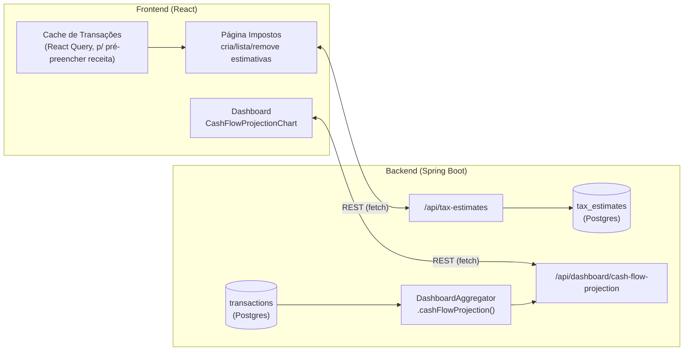
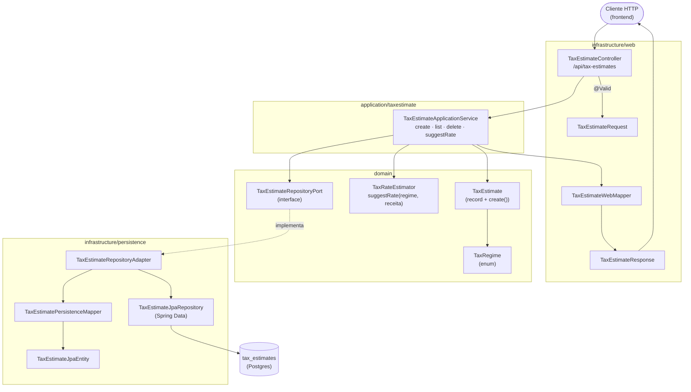
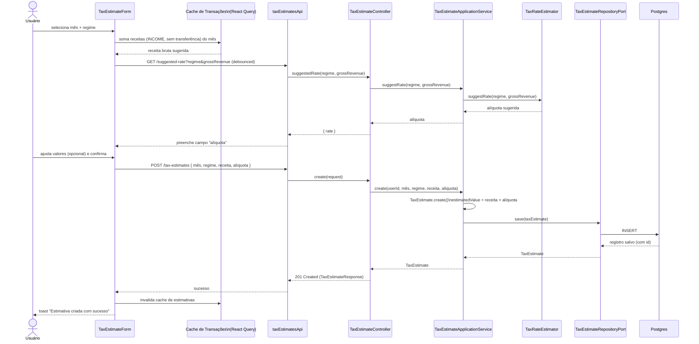
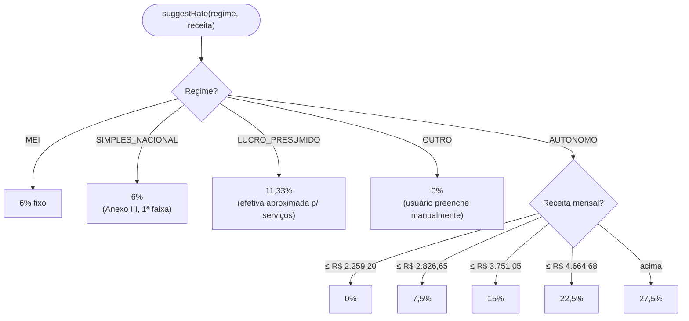
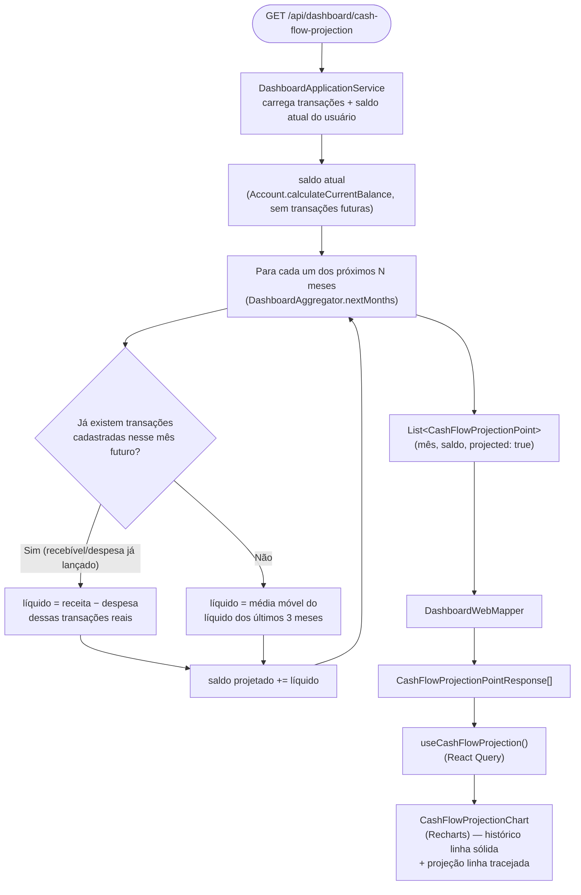

# FinPro — Fluxo de Estimativa de Imposto e Projeção de Fluxo de Caixa

*Documentação técnica da Fase 2 do módulo freelancer (ver roadmap em [`../plano.md`](../plano.md#12-roadmap-sugerido-atualizado)). Diagramas em [Mermaid](https://mermaid.js.org/) — renderizam nativamente no GitHub.*

> **Atualização:** a seção 6 deste documento originalmente descrevia a projeção de fluxo de caixa como calculada inteiramente no frontend. Isso mudou numa migração posterior (item 8 do roadmap, "Migrar as agregações do frontend para o backend") — hoje ela é calculada no backend, no mesmo `DashboardAggregator` que o resto do Dashboard. A seção 6 já reflete o estado atual; ver [`fluxo-dashboard.md`](fluxo-dashboard.md) para o Dashboard completo.

## 1. Visão geral

A Fase 2 entrega duas funcionalidades que hoje seguem a mesma convenção arquitetural do resto do sistema — toda regra de negócio e agregação vive no backend, o frontend só exibe:

- **Estimativa de imposto**: precisa ficar salva (o usuário quer comparar meses passados) — módulo de backend completo, arquitetura hexagonal igual aos demais (Account, Client, Transaction, etc.), com uma tela própria (`/impostos`).
- **Projeção de fluxo de caixa**: é uma leitura derivada dos dados que já existem (saldo + transações), sem estado próprio para persistir, mas o CÁLCULO em si (média móvel, combinação com lançamentos futuros já cadastrados) acontece no backend, em `DashboardAggregator.cashFlowProjection`, exposto pelo endpoint `/api/dashboard/cash-flow-projection` — o frontend só busca e exibe.

## 2. Tela

**Estimativa de imposto** — rota `/impostos` (`TaxEstimatesPage`): cabeçalho com título "Impostos" e botão "+" que abre um `Modal` com `TaxEstimateForm` (mês, regime tributário, receita bruta pré-preenchida a partir das transações do mês selecionado, alíquota sugerida automaticamente e editável). Abaixo, `TaxEstimateList` — lista de estimativas já criadas, cada linha com mês, regime, receita, alíquota, valor estimado e um botão de remover (com confirmação). Estados: "Carregando estimativas..." enquanto busca, "Nenhuma estimativa cadastrada ainda. Adicione a primeira acima." quando vazia.

**Projeção de fluxo de caixa** — não é uma tela própria, é o `CashFlowProjectionChart` dentro do Dashboard (`/`): um gráfico de linha combinando o histórico real (linha sólida) com a projeção dos próximos meses (linha tracejada), carregado pelo hook `useCashFlowProjection()` de forma independente dos outros cards do Dashboard — aparece assim que sua própria chamada responde, sem esperar o resto da página.

## 3. Estimativa de imposto — arquitetura (hexagonal)

Mesma cadeia de camadas usada em todos os módulos do backend: `web` (HTTP) → `application` (regra de uso) → `domain` (modelo + regra de negócio pura) → `infrastructure/persistence` (banco).

**Por que essa separação importa aqui:** `TaxRateEstimator` é uma classe de domínio pura (sem `@Service`, sem dependência de banco) — só recebe regime + receita e devolve uma alíquota. Isso permite que o mesmo cálculo seja usado tanto no endpoint de sugestão (`GET /suggested-rate`, que não persiste nada) quanto, futuramente, em qualquer outro lugar do sistema que precise da mesma regra, sem duplicar a tabela de alíquotas.

## 4. Fluxo de criação de uma estimativa

Sequência completa desde a tela até o banco, incluindo o pré-preenchimento automático de receita e a sugestão de alíquota.

**Detalhe importante de segurança:** o backend **nunca confia** no `estimatedValue` — mesmo que o frontend calcule e mostre o valor ao vivo para o usuário, `TaxEstimate.create()` sempre recalcula `receita × alíquota` no servidor antes de salvar.

## 5. Lógica de sugestão de alíquota (`TaxRateEstimator`)

Alíquotas simplificadas e educacionais — não substituem orientação contábil (aviso fixo também no formulário).

*Tabela do Autônomo espelha a faixa progressiva mensal do IRPF/carnê-leão (valores de referência 2024).*

## 6. Projeção de fluxo de caixa — cálculo (backend, `DashboardAggregator`)

Endpoint `GET /api/dashboard/cash-flow-projection?months=N`, resolvido por `DashboardApplicationService` → `DashboardAggregator.cashFlowProjection(transacoes, saldoAtual, meses)` — método estático, puro, sem dependência de banco (recebe a lista de transações do usuário já carregada pelo service).

**Por que fica no backend:** o resto do Dashboard (receita x despesa por mês, evolução do saldo, breakdown por categoria/cliente) segue essa mesma convenção desde a migração das agregações do frontend pro backend — toda a lógica de cálculo mora em `DashboardAggregator`, uma classe de domínio pura e testável isoladamente (sem precisar de `@SpringBootTest`), e o frontend só busca e exibe. Isso elimina duplicação de lógica de negócio entre cliente e servidor e garante que qualquer consumidor futuro da API (mobile, outro frontend) tenha a mesma regra de projeção sem reimplementá-la.

## 7. Onde cada peça vive no repositório

| Camada | Estimativa de imposto | Projeção de fluxo de caixa |
|---|---|---|
| Domínio | `domain/model/{TaxEstimate,TaxRegime,TaxRateEstimator}.java` | `domain/model/DashboardAggregator.java` (`cashFlowProjection`) + `domain/model/CashFlowProjectionPoint.java` |
| Port/Adapter | `domain/port/out/TaxEstimateRepositoryPort.java` + `infrastructure/persistence/adapter/TaxEstimateRepositoryAdapter.java` | — (lê `TransactionRepositoryPort`, sem persistência própria) |
| Aplicação | `application/taxestimate/TaxEstimateApplicationService.java` | `application/dashboard/DashboardApplicationService.java` |
| API | `infrastructure/web/controller/TaxEstimateController.java` (`/api/tax-estimates`) | `infrastructure/web/controller/DashboardController.java` (`/api/dashboard/cash-flow-projection`) |
| Migration | `db/migration/V10__add_regime_to_tax_estimates.sql` | — |
| Frontend | `frontend/src/features/taxEstimates/**` (`TaxEstimatesPage`, `TaxEstimateForm`, `TaxEstimateList`, hooks, api, schemas) | `../../frontend/src/features/dashboard/hooks/useCashFlowProjection.ts` + `components/CashFlowProjectionChart.tsx` |
| Testes | `backend/src/test/java/.../integration/taxestimate/TaxEstimateIntegrationTest.java` | `backend/src/test/java/.../domain/model/DashboardAggregatorTest.java` + `integration/dashboard/DashboardIntegrationTest.java` |
