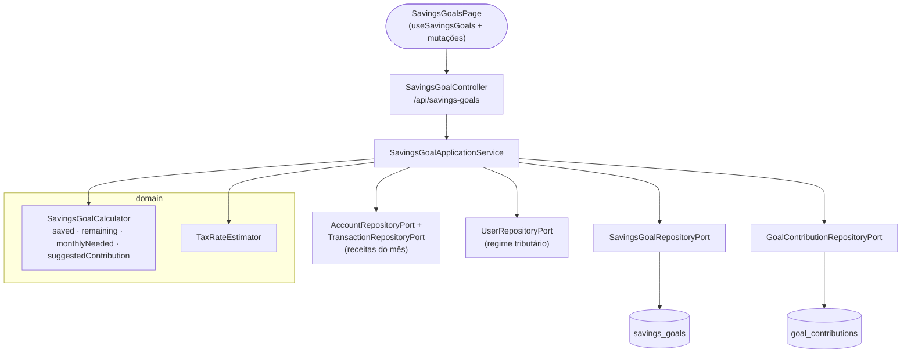
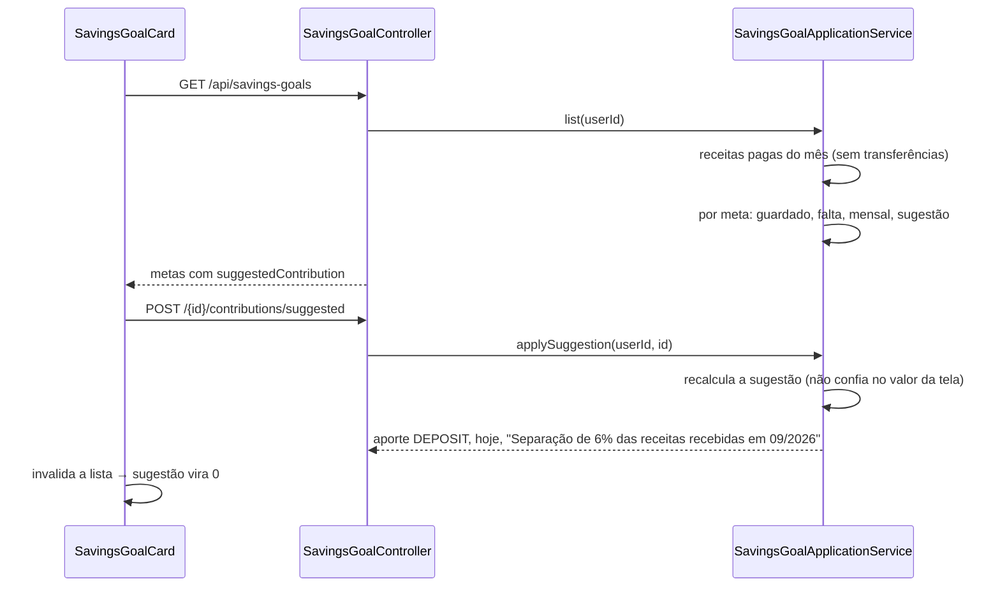

# FinPro — Fluxo de Metas de Economia

*Documentação técnica das metas de economia ("caixinhas") — ver [`../plano.md`](../plano.md). Diagramas em [Mermaid](https://mermaid.js.org/) — renderizam nativamente no GitHub.*

## 1. Visão geral

Uma **meta de economia** é uma caixinha com valor-alvo, prazo opcional e, se o usuário quiser, um **percentual das receitas** a separar. Tipos: reserva de emergência, caixinha do imposto, férias ou outra meta.

Os **aportes e resgates são virtuais**: registram quanto o usuário separou, mas não geram transação nem mexem no saldo das contas.

A ideia central é responder à pergunta "quanto devo guardar pra imposto?". Com um percentual definido, a meta mostra quanto separar das receitas já recebidas no mês, e um botão lança esse valor como aporte. Nada é separado sem o usuário confirmar.

## 2. Tela

**Rota:** `/metas` (`SavingsGoalsPage`), item "Metas" na seção Financeiro do menu.

- **Cards em grade** (1 coluna no celular, 2 no tablet, 3 no desktop). Cada card mostra:
  - nome e tipo;
  - barra de progresso com o valor guardado, o alvo e o %;
  - quanto falta, o prazo e o "guarde R$ X/mês";
  - o bloco de sugestão, quando a meta tem percentual.
- **Bloco de sugestão**: "Você recebeu R$ X este mês. Separe 6%: R$ Y", com o botão **Separar R$ Y**. Se já foi separado, ou se ainda não entrou receita, aparece uma mensagem explicando.
- **Modais**: criar/editar meta (`SavingsGoalForm`), aporte/resgate (`ContributionForm`) e histórico com exclusão (`ContributionHistory`).
- **Caixinha do imposto**: o campo de percentual vazio vem preenchido com a alíquota de referência do regime do usuário.

## 3. Arquitetura (hexagonal)

## 4. Fluxo "separar com 1 clique"

## 5. Regras de negócio

- **Guardado**: soma dos aportes menos os resgates. Não é persistido; é recalculado a cada leitura.
- **Quanto falta**: alvo − guardado, nunca negativo.
- **Guardar por mês**: quanto falta ÷ meses de hoje até o prazo, contando o mês atual e o do prazo, com arredondamento para cima nos centavos.
  - Sem prazo ou com a meta atingida: `null`.
  - Com o prazo vencido: o total que falta.
- **Sugestão do mês**: `incomeRate` × receitas **pagas** do mês atual (sem transferências), menos os **aportes** da meta no mês, limitada ao que falta e nunca negativa.
  - Resgates não aumentam a sugestão.
  - Sem percentual (ou com 0%): `null`, e a tela não mostra o bloco.
- **Separar com 1 clique**: o backend recalcula a sugestão na hora. Se não houver nada a separar, responde 400.
- **Resgate**: não pode passar do valor guardado (400).
- **Excluir um aporte**: também é recusado se deixaria a meta negativa (por causa de resgates já feitos).
- **Percentual sugerido para o imposto**: `TaxRateEstimator.suggestRate(regime do usuário, receita média dos 3 meses anteriores)`, considerando todas as receitas, pagas e pendentes. O mês atual fica de fora por estar incompleto. Usuário sem regime: 0.
- **Isolamento entre usuários**: meta de outro usuário é tratada como inexistente (404). Excluir a meta remove os aportes (FK `ON DELETE CASCADE`).

## 6. Onde cada peça vive no repositório

| Camada | Arquivos |
|---|---|
| Domínio | `domain/model/{SavingsGoal,SavingsGoalType,GoalContribution,ContributionType,SavingsGoalCalculator}.java` |
| Ports | `domain/port/out/{SavingsGoalRepositoryPort,GoalContributionRepositoryPort}.java` |
| Aplicação | `application/savingsgoal/{SavingsGoalApplicationService,SavingsGoalSummary,SavingsGoalCommand}.java` |
| Persistência | `infrastructure/persistence/{entity,repository,adapter}/…SavingsGoal…`, `…GoalContribution…` |
| API | `infrastructure/web/controller/SavingsGoalController.java`, `infrastructure/web/dto/savingsgoal/*` |
| Migration | `db/migration/V16__create_savings_goals.sql` |
| Frontend | `frontend/src/features/savings-goals/` (`SavingsGoalsPage`, `SavingsGoalCard`, `SavingsGoalForm`, `ContributionForm`, `ContributionHistory`, `useSavingsGoals`) |
| Testes | `SavingsGoalCalculatorTest`, `SavingsGoalApplicationServiceTest`, `integration/savingsgoal/SavingsGoalIntegrationTest`, `features/savings-goals/utils.test.ts` |
