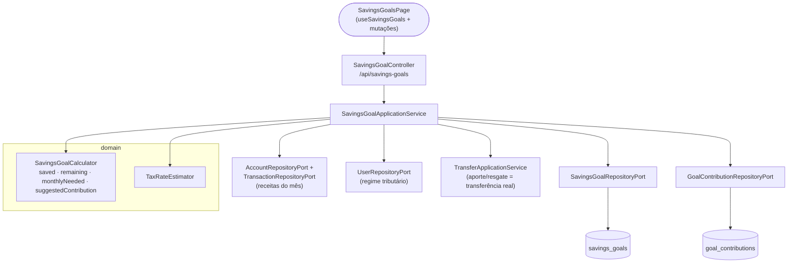
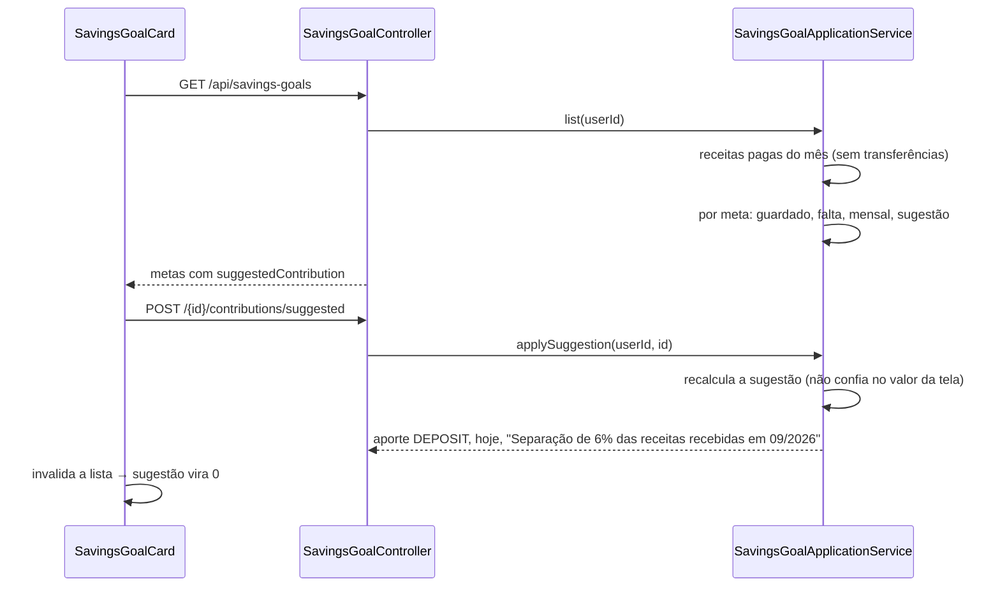
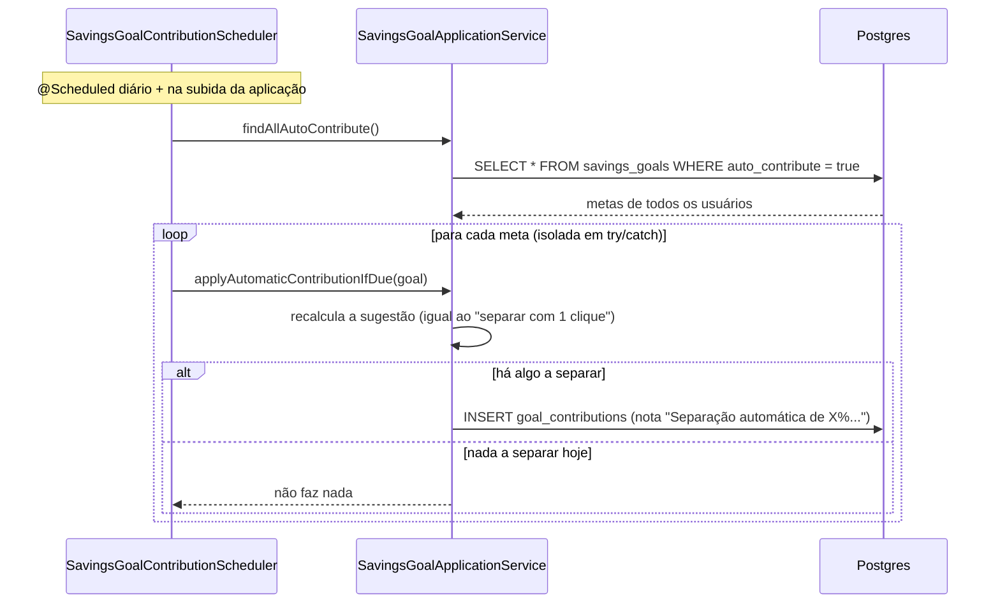

# FinPro — Fluxo de Metas de Economia

*Documentação técnica das metas de economia ("caixinhas") — ver [`../plano.md`](../plano.md). Diagramas em [Mermaid](https://mermaid.js.org/) — renderizam nativamente no GitHub.*

## 1. Visão geral

Uma **meta de economia** é uma caixinha com valor-alvo, prazo opcional e, se o usuário quiser, um **percentual das receitas** a separar. Tipos: reserva de emergência, caixinha do imposto, férias ou outra meta.

Cada meta é vinculada a duas contas, fixas desde a criação: uma **conta reserva** (`accountId`), onde o dinheiro guardado fica de fato — várias metas podem compartilhar a mesma conta reserva —, e uma **conta de origem** (`fundingAccountId`), de onde o aporte sai (e para onde o resgate volta). **Aporte e resgate são transferências reais** entre essas duas contas (reaproveitando `TransferApplicationService`): saldo muda de verdade e a movimentação aparece em Transferências/Extrato, não é só um registro dentro da meta.

A ideia central é responder à pergunta "quanto devo guardar pra imposto?". Com um percentual definido, a meta mostra quanto separar das receitas já recebidas no mês, e um botão lança esse valor como aporte. Nada é separado sem o usuário confirmar — a menos que ele ligue o **aporte automático** (seção 7), que aplica essa mesma sugestão sozinho, uma vez por dia.

## 2. Tela

**Rota:** `/metas` (`SavingsGoalsPage`), item "Metas" na seção Financeiro do menu.

- **Cards em grade** (1 coluna no celular, 2 no tablet/desktop). Cada card mostra:
  - nome e tipo;
  - barra de progresso com o valor guardado, o alvo e o %;
  - quanto falta, o prazo e o "guarde R$ X/mês";
  - o bloco de sugestão, quando a meta tem percentual.
- **Bloco de sugestão**: "Você recebeu R$ X este mês. Separe 6%: R$ Y", com o botão **Separar R$ Y**. Se já foi separado, ou se ainda não entrou receita, aparece uma mensagem explicando. Com o aporte automático ligado, o texto avisa que a separação já acontece sozinha, mas o botão continua disponível pra quem quiser adiantar.
- **Modais**: criar/editar meta (`SavingsGoalForm`), aporte/resgate (`ContributionForm`) e histórico com exclusão (`ContributionHistory`).
- **Aporte automático**: checkbox no formulário (exige percentual definido — validado no schema do frontend e de novo no backend); quando ligado, o subtítulo do card ganha "· aporte automático".
- **Caixinha do imposto**: o campo de percentual vazio vem preenchido com a alíquota de referência do regime do usuário.
- **Conta reserva e conta de origem**: dois seletores na criação; na edição aparecem como somente leitura, já que não podem mudar depois. O seletor de conta reserva só lista contas do tipo `RESERVE` (`AccountType.RESERVE`) — exige ao menos uma conta desse tipo e outra conta qualquer (a de origem) cadastradas.

## 3. Arquitetura (hexagonal)

## 4. Fluxo "separar com 1 clique"

## 5. Regras de negócio

- **Guardado**: soma dos aportes menos os resgates. Não é persistido; é recalculado a cada leitura.
- **Quanto falta**: alvo − guardado, nunca negativo.
- **Guardar por mês**: quanto falta ÷ meses de hoje até o prazo, contando o mês atual e o do prazo, com arredondamento para cima nos centavos.
  - Sem prazo ou com a meta atingida: `null`.
  - Com o prazo vencido: o total que falta.
- **Sugestão do mês**: `incomeRate` × receitas **pagas** do mês atual (sem transferências), menos os **aportes** da meta no mês, limitada ao que falta e nunca negativa.
  - Resgates não aumentam a sugestão.
  - Sem percentual (ou com 0%): `null`, e a tela não mostra o bloco.
- **Separar com 1 clique**: o backend recalcula a sugestão na hora. Se não houver nada a separar, responde 400.
- **Resgate**: não pode passar do valor guardado na meta (400) — checagem própria da meta, antes (e independente) da checagem de saldo real que a transferência faz na conta reserva.
- **Excluir um aporte**: também é recusado se deixaria a meta negativa (por causa de resgates já feitos); a exclusão desfaz a transferência real por trás dele (`TransferApplicationService.delete`), e a linha de `goal_contributions` some sozinha (FK `ON DELETE CASCADE` em `transfer_id`).
- **Conta reserva e conta de origem**: obrigatórias, fixas desde a criação, precisam pertencer ao usuário, ser diferentes entre si (`SameAccountTransferException`, 400) e ter a **mesma moeda** (400) — decisão deliberada para não trazer conversão PTAX pro fluxo de metas.
- **Excluir a meta é bloqueado com saldo guardado** (409, mesmo `EntityHasLinkedRecordsException` de Conta/Categoria): como o dinheiro é real, só dá pra excluir depois do resgate total. As transferências já feitas nunca são desfeitas pela exclusão da meta — continuam em Transferências/Extrato, só deixam de estar rotuladas como de uma meta.
- **Percentual sugerido para o imposto**: `TaxRateEstimator.suggestRate(regime do usuário, receita média dos 3 meses anteriores)`, considerando todas as receitas, pagas e pendentes. O mês atual fica de fora por estar incompleto. Usuário sem regime: 0.
- **Isolamento entre usuários**: meta de outro usuário é tratada como inexistente (404).
- **Aporte automático exige percentual**: ligar `autoContribute` sem `incomeRate` definido (ou zero) é recusado (400) — senão a meta ficaria "automática" sem nunca ter o que aplicar, silenciosamente, e o usuário não entenderia por quê. Se a conta de origem não tiver saldo suficiente no dia, a execução automática daquela meta é pulada silenciosamente (fica pra um próximo dia), sem afetar as outras metas.
- **Excluir uma conta** com metas vinculadas (como reserva ou como origem) é bloqueado (409) — mesmo padrão de transações/transferências/recorrências.
- **Limitação aceita**: nada impede lançar uma despesa comum diretamente na conta reserva pelo fluxo normal de Transações, o que reduziria o saldo real abaixo do total "guardado" nas metas daquela conta — a conta não é travada para uso exclusivo de metas.

## 6. Onde cada peça vive no repositório

| Camada | Arquivos |
|---|---|
| Domínio | `domain/model/{SavingsGoal,SavingsGoalType,GoalContribution,ContributionType,SavingsGoalCalculator}.java` |
| Ports | `domain/port/out/{SavingsGoalRepositoryPort,GoalContributionRepositoryPort}.java` |
| Aplicação | `application/savingsgoal/{SavingsGoalApplicationService,SavingsGoalSummary,SavingsGoalCommand}.java`, `application/transfer/TransferApplicationService.java` (aporte/resgate) |
| Scheduler | `infrastructure/scheduling/SavingsGoalContributionScheduler.java` |
| Persistência | `infrastructure/persistence/{entity,repository,adapter}/…SavingsGoal…`, `…GoalContribution…` |
| API | `infrastructure/web/controller/SavingsGoalController.java`, `infrastructure/web/dto/savingsgoal/{SavingsGoalRequest,SavingsGoalUpdateRequest,SavingsGoalResponse,GoalContributionRequest,GoalContributionResponse,SuggestedTaxRateResponse}.java` |
| Migration | `db/migration/V16__create_savings_goals.sql`, `V26__add_auto_contribute_to_savings_goals.sql`, `V28__link_savings_goals_to_accounts.sql` (conta reserva/origem + `transfer_id`) |
| Frontend | `frontend/src/features/savings-goals/` (`SavingsGoalsPage`, `SavingsGoalCard`, `SavingsGoalForm`, `ContributionForm`, `ContributionHistory`, `useSavingsGoals`) |
| Testes | `SavingsGoalCalculatorTest`, `SavingsGoalApplicationServiceTest`, `integration/savingsgoal/SavingsGoalIntegrationTest`, `features/savings-goals/utils.test.ts` |

## 7. Aporte automático (`autoContribute`)

Mesmo padrão de scheduler já usado nos orçamentos recorrentes (`RecurringBudgetScheduler`, ver [`fluxo-orcamentos.md`](fluxo-orcamentos.md#6-orçamentos-recorrentes-recurringbudget)): um `@Scheduled` diário (`finpro.savings-goal.cron`, padrão `0 20 0 * * *`) que também roda na subida da aplicação. A diferença é que aqui não existe um "mês vencido" para lançar — a sugestão é **recalculada do zero a cada execução** (percentual sobre a receita já paga no mês, menos o que já foi aportado nele), então rodar todo dia só vai capturando, incrementalmente, a fração de cada receita nova que chega. Nunca duplica: se não houver nada a separar (a maioria dos dias), `applyAutomaticContributionIfDue` não faz nada, silenciosamente — diferente de `applySuggestion` (clique manual), que responde 400 nesse caso, porque ali é o usuário pedindo uma ação, não uma varredura automática.

O aporte gerado automaticamente é indistinguível de um aporte manual na lista de contribuições, exceto pela nota (`"Separação automática de X% das receitas recebidas em MM/yyyy"` vs. `"Separação de X%..."` no clique manual) — não há um campo `origin` separado, ao contrário de `Transaction`/`RecurringTransaction`.
