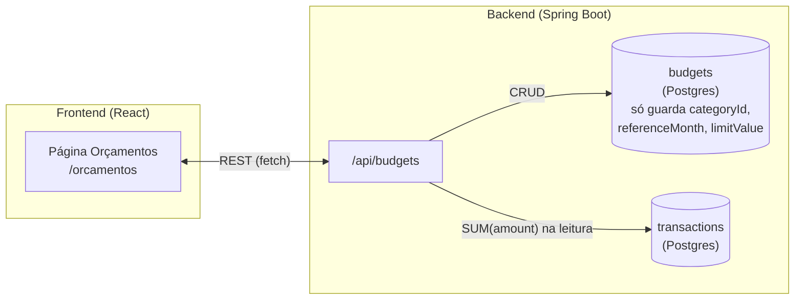
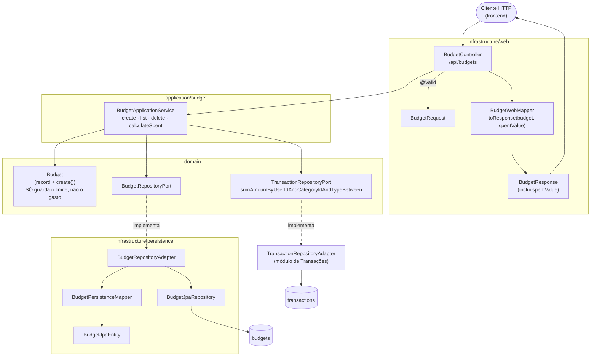
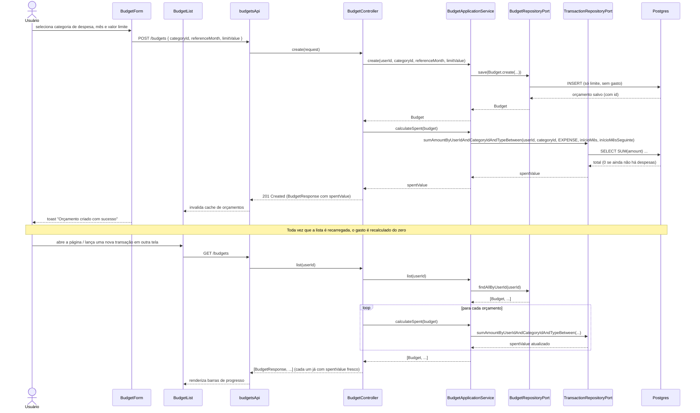

# FinPro — Fluxo de Orçamentos (Metas de Gasto por Categoria)

*Documentação técnica do módulo de orçamentos (ver roadmap em [`../plano.md`](../plano.md)). Diagramas em [Mermaid](https://mermaid.js.org/) — renderizam nativamente no GitHub.*

## 1. Visão geral

Um orçamento é uma meta de gasto (`limitValue`) para uma categoria de despesa num mês específico (`referenceMonth`). O usuário cria o orçamento uma vez; o "quanto já gastei" (`spentValue`) nunca é digitado nem armazenado — é **recalculado no backend a cada leitura**, a partir das transações de despesa já lançadas naquela categoria e naquele mês. É a mesma convenção já usada pelo saldo de conta (`Account.calculateCurrentBalance`, sempre derivado das transações, nunca um campo editável) — o objetivo é o mesmo: nunca deixar um valor "espelho" dessincronizar do dado real.

## 2. Tela (`/orcamentos`)

- Botão "+" no topo abre um `Modal` com o `BudgetForm`: select de categoria (só mostra categorias do tipo **despesa** — `categories.filter(c => c.type === 'EXPENSE')`), campo de mês (`<input type="month">`, pré-preenchido com o mês atual) e valor limite.
- `BudgetList` mostra um cartão por orçamento, ordenado do mês mais recente pro mais antigo, cada um com:
  - nome da categoria + mês por extenso (`formatMonthLabel`);
  - uma barra de progresso (`gasto / limite`, capada em 100% de largura visual mesmo se o gasto ultrapassar);
  - o texto "R$ gasto de R$ limite";
  - **se o gasto ultrapassar o limite**, a barra fica vermelha e o texto ganha o sufixo "· limite ultrapassado", em negrito vermelho — é o único módulo do sistema com esse tipo de alerta visual de estouro.
- Botão de remover com confirmação (`ConfirmContext`).
- Estados: "Carregando orçamentos..." e "Nenhum orçamento cadastrado ainda. Adicione o primeiro acima."
- Não existe edição de orçamento — só criar e remover (o `BudgetRequest`/`BudgetController` não expõe `PUT`; pra "editar" o usuário remove e cria de novo).

## 3. Arquitetura (hexagonal)

**Detalhe de arquitetura:** o `Budget` (domínio) tem só quatro campos próprios (`userId`, `categoryId`, `referenceMonth`, `limitValue`) — não existe campo `spentValue` no registro nem na tabela `budgets`. `BudgetController.toResponse` é quem junta as duas fontes numa única resposta: chama `budgetApplicationService.calculateSpent(budget)` pra cada item da lista antes de montar o `BudgetResponse`. Isso significa que listar orçamentos dispara uma query agregada de soma por orçamento — aceitável no volume atual (poucos orçamentos ativos por usuário), mas é o tipo de decisão que precisaria revisão se a lista crescesse muito.

## 4. Fluxo de criação e leitura

**Por que isso importa:** se o usuário lançar, editar ou remover uma transação de despesa naquela categoria/mês em qualquer outra tela (Transações, Importação, etc.), a barra de progresso do orçamento reflete isso automaticamente na próxima vez que a tela de Orçamentos for aberta — não existe nenhum lugar do código que precise "lembrar" de atualizar um contador. O intervalo usado na soma é `[referenceMonth.atDay(1), referenceMonth.plusMonths(1).atDay(1))` — início do mês inclusive, início do mês seguinte exclusive, então cobre o mês inteiro independentemente de quantos dias ele tem.

## 5. Onde cada peça vive no repositório

| Camada | Arquivo |
|---|---|
| Domínio | `domain/model/Budget.java` |
| Port/Adapter | `domain/port/out/BudgetRepositoryPort.java` + `infrastructure/persistence/adapter/BudgetRepositoryAdapter.java` |
| Aplicação | `application/budget/BudgetApplicationService.java` (`calculateSpent` é o método-chave) |
| API | `infrastructure/web/controller/BudgetController.java` (`/api/budgets`), `infrastructure/web/mapper/BudgetWebMapper.java` |
| Migration | `db/migration/` (tabela `budgets`, ver `V*__*.sql` correspondente) |
| Frontend | `frontend/src/features/budgets/**` (`BudgetsPage`, `BudgetForm`, `BudgetList`, `hooks/{useBudgets,useCreateBudget,useDeleteBudget}.ts`, `api/budgetsApi.ts`, `schemas.ts`, `types.ts`) |
| Testes | `backend/src/test/java/.../integration/budget/BudgetIntegrationTest.java` + `application/budget/BudgetApplicationServiceTest.java` |
