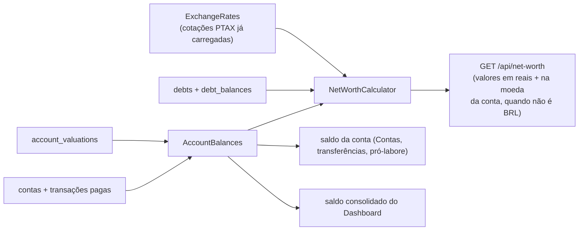

# FinPro — Fluxo de Patrimônio (investimentos e dívidas)

*Documentação técnica do patrimônio líquido, das contas de investimento com valor de mercado e das dívidas — ver [`../plano.md`](../plano.md). Diagramas em [Mermaid](https://mermaid.js.org/) — renderizam nativamente no GitHub.*

## 1. Visão geral

**Patrimônio líquido = contas + investimentos − dívidas**, hoje e no fim de cada mês. Nada disso é persistido como saldo: tudo é recalculado a cada leitura a partir das transações, dos valores de mercado e dos saldos devedores informados. O cálculo é puro, no domínio (`AccountBalances` e `NetWorthCalculator`); o frontend só exibe.

- **Investimento** é uma conta do tipo `INVESTMENT`. Aplicar e resgatar são **transferências** comuns entre contas. De tempos em tempos o usuário informa o **valor de mercado** (ex.: o saldo do extrato da corretora), e a diferença para o que foi aplicado é o **rendimento**. Nenhuma receita "fictícia" é criada, então imposto, DRE, orçamentos e relatórios não são afetados.
- **Dívida** é um cadastro à parte (`Debt`) com o histórico do **saldo devedor** (`DebtBalance`). As parcelas continuam sendo despesas comuns; o patrimônio usa o último saldo devedor informado.

## 2. Regras

### Saldo da conta de investimento (`AccountBalances`)

- Sem valor de mercado informado: saldo contábil, como qualquer conta (saldo inicial + receitas − despesas **pagas**, transferências inclusive).
- Com valor informado até a data: **último valor + movimentações pagas posteriores a ele**.
- O valor informado num dia inclui tudo o que foi lançado **até então** com data até aquele dia. No mesmo dia, o que foi lançado **depois** de informar o valor conta à parte (compara `createdAt` da transação com o do valor). Assim, conferir o extrato e em seguida resgatar tudo zera o saldo, como esperado. Informar de novo a mesma data substitui o valor e atualiza esse momento.
- `AccountApplicationService.calculateCurrentBalance` usa essa regra para contas de investimento: a tela de Contas, a validação de saldo das transferências e o pró-labore (contas PJ) enxergam o valor de mercado. O resgate de tudo, rendimento incluído, não é barrado por "saldo insuficiente".
- **Rendimento** = valor atual − aplicado, onde aplicado = saldo contábil (saldo inicial + entradas − saídas). Percentual = rendimento ÷ aplicado (nulo se o aplicado não é positivo).
- Valor de mercado só em conta de investimento (400), nunca com data futura (400), nunca negativo. Uma conta com valores informados não pode mudar de tipo (409); é preciso excluí-los antes. Excluir a conta apaga os valores (`ON DELETE CASCADE`), mas a exclusão já é bloqueada enquanto houver transações.

### Dívidas (`DebtApplicationService`)

- A dívida nasce com o saldo devedor atual e a data dele. Saldos seguintes podem ser informados a qualquer momento; um por dia (a mesma data substitui).
- O saldo numa data é o último informado até ela; antes do primeiro, zero. **Saldo zero = quitada**.
- Datas futuras são recusadas (400). A dívida precisa manter pelo menos um saldo: excluir o único é recusado (400) — para quitar, informa-se zero.
- Dívida de outro usuário é tratada como inexistente (404). Excluir a dívida apaga o histórico de saldos; as parcelas já lançadas como despesa continuam.

### Patrimônio no tempo (`NetWorthCalculator`)

- Para cada mês: contas (não investimento) e investimentos pela regra acima no último dia do mês; dívidas pelo último saldo até esse dia.
- O **mês atual** usa os valores de agora, com a mesma regra da tela de Contas (todas as transações pagas, qualquer que seja a data), para o último ponto bater com os cards.
- O saldo inicial das contas não tem data: ele vale para todo o histórico, como na evolução do saldo do Dashboard.
- Transferências entram (movem dinheiro entre contas e para os investimentos); no total se anulam.

### Dashboard

O saldo consolidado do Dashboard (card "Saldo atual", "Evolução do saldo" e ponto de partida da projeção) soma o rendimento ainda não resgatado das contas de investimento (`AccountBalances.valuationGain`), para bater com a soma dos saldos da tela de Contas.

### Multi-moeda

Contas e investimentos em `USD`/`EUR` entram no patrimônio pelo **equivalente em reais**: `NetWorthCalculator` recebe uma `ExchangeRates` (tabela de cotações já carregada, `rates.toBrl(moeda, valor, data)`) e converte cada valor de conta/investimento pela **cotação do fim de cada mês** do histórico; no mês atual (e nos valores "agora" dos cards) usa a cotação de hoje. Sem cotação, `none()` some com qualquer conversão (equivalente a 1:1, só usado onde não há moeda estrangeira). Isso faz a **variação cambial** aparecer no patrimônio mês a mês, sem precisar de nenhum lançamento manual.

`NetWorthResponse.AccountRow`/`InvestmentRow` trazem o valor **na moeda da conta** (`balance`/`currentValue`) **e** o equivalente em reais (`balanceInBrl`/`currentValueInBrl`, e `gainInBrl` pro rendimento) — os totais consolidados (`current`, `history`) já vêm só em reais. O `NetWorthPage` mostra as duas linhas quando a moeda não é BRL ("≈ R$ X pela última cotação").

## 3. Endpoints

| Método | Caminho | O quê |
|---|---|---|
| GET | `/api/net-worth?months=12` | Patrimônio atual, variação sobre o mês anterior, rendimento total, histórico (1 a 60 meses) e composição (contas, investimentos, dívidas) |
| GET/POST | `/api/accounts/{id}/valuations` | Lista (mais recentes primeiro) / informa o valor de mercado (`valuationDate`, `value`) |
| DELETE | `/api/accounts/{id}/valuations/{valuationId}` | Exclui um valor informado |
| GET/POST | `/api/debts` | Lista com o saldo atual / cria (`name`, `type`, `creditor`, `balance`, `balanceDate`) |
| PUT/DELETE | `/api/debts/{id}` | Edita nome, tipo e credor / exclui |
| GET/POST | `/api/debts/{id}/balances` | Lista / informa o saldo devedor (`balanceDate`, `balance`) |
| DELETE | `/api/debts/{id}/balances/{balanceId}` | Exclui um saldo (não o único) |

## 4. Telas

- **Patrimônio** (`/patrimonio`, `NetWorthPage`): período (6, 12, 24 ou 36 meses); cards Patrimônio líquido (com a variação desde o fim do mês passado), Contas, Investimentos (com o rendimento total) e Dívidas; gráfico "Evolução do patrimônio" (`NetWorthChart`: quatro linhas no mesmo eixo em R$ — patrimônio, contas, investimentos, dívidas —, legenda, tooltip com os quatro valores, rótulo só no último patrimônio e botão "Ver tabela" com os mesmos dados); cards Investimentos (aplicado, valor atual, rendimento em R$ e %, data do último valor e botão "Atualizar valor") e Dívidas (tipo, credor, saldo devedor, data, botões para atualizar o saldo, editar e excluir; botão "+" para nova dívida); card Contas com o saldo de cada conta.
- **Contas**: tipo "Investimento" no formulário (com dica de como funciona) e botão "Valor de mercado" no card das contas de investimento. O painel (`AccountValuationsPanel`) é o mesmo da tela de Patrimônio.
- **Dashboard**: atalho "Patrimônio líquido" abaixo dos cards, só quando há investimento ou dívida.

## 5. Arquivos

- Backend: `AccountType.INVESTMENT`, `AccountValuation`, `Debt`, `DebtType`, `DebtBalance`, `AccountBalances`, `NetWorthCalculator`, `ExchangeRates`/`ExchangeRate` (domínio); `AccountValuationApplicationService`, `DebtApplicationService`, `NetWorthApplicationService`, `ExchangeRateApplicationService`; `AccountValuationController`, `DebtController`, `NetWorthController`; migration `V22__create_net_worth.sql` (+ `V23__add_multi_currency.sql` para moeda das contas).
- Frontend: `features/net-worth` (`NetWorthPage`, `NetWorthChart`, `DebtForm`, `DebtBalancesPanel`, `useNetWorth`, `netWorthApi`, `schemas.ts`, `utils.ts`); `features/accounts` (`AccountValuationsPanel`, `useAccountValuations`).
- Testes: `AccountBalancesTest`, `NetWorthCalculatorTest`, `AccountValuationApplicationServiceTest`, `DebtApplicationServiceTest`, casos novos em `AccountApplicationServiceTest`, `NetWorthIntegrationTest`; no frontend, `net-worth/schemas.test.ts` e `net-worth/utils.test.ts`.
