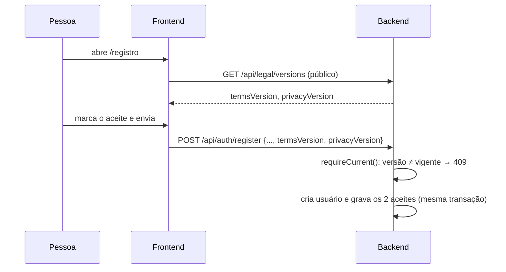
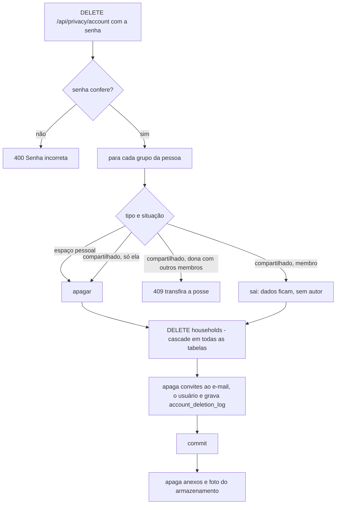

# FinPro — Fluxo de Privacidade (LGPD)

*Documentação técnica de termos, consentimento, exportação e exclusão de conta. Diagramas em [Mermaid](https://mermaid.js.org/) — renderizam nativamente no GitHub.*

## 1. Visão geral

A LGPD (Lei 13.709/2018) dá ao titular, entre outros, o direito de **levar seus dados** (art. 18, V) e de **eliminá-los** (art. 18, VI), e exige **informação clara** sobre o tratamento e **prova do consentimento**. O módulo cobre:

| Necessidade | Como o FinPro atende |
|---|---|
| Informar o titular | Páginas públicas `/termos` e `/privacidade` |
| Provar o aceite | Tabela `user_consents` (documento, versão, data) |
| Reaceite quando o texto muda | `ConsentGate`: tela bloqueante até aceitar a versão vigente |
| Portabilidade | `GET /api/privacy/export` → ZIP |
| Eliminação | `DELETE /api/privacy/account` (com senha) |

> **Os textos são uma minuta.** `TermsPage.tsx` e `PrivacyPage.tsx` trazem lacunas entre colchetes (razão social/CNPJ, encarregado, foro, prazos de retenção, provedores e região de hospedagem) em `frontend/src/features/legal/legalEntity.ts`, e um aviso de "minuta em revisão" enquanto `LEGAL_DRAFT = true`. Revisão jurídica antes de publicar.

## 2. Versões dos documentos e consentimento

As versões vigentes são constantes do backend (`LegalDocuments.TERMS_VERSION` e `PRIVACY_VERSION`, formato `AAAA-MM-DD`). **Ao alterar o texto de um documento, mude a versão**: todos os usuários voltam a ver a tela de aceite no próximo acesso.

- **Endpoints:** `GET /api/legal/versions` (público), `GET /api/consents` (situação), `POST /api/consents` (aceita; recusa versão que não é a vigente com `409`). Aceitar a mesma versão duas vezes não duplica nem muda a data (`ON CONFLICT DO NOTHING`).
- **Prova do aceite:** `user_consents (user_id, document_type TERMS|PRIVACY, version, accepted_at)`, único por `(user, documento, versão)`. Não guarda IP nem user agent, de propósito (minimização).
- **Quem já tinha conta** não tem linhas em `user_consents` e cai no aceite obrigatório.
- **`ConsentGate`** (`shared/auth/ProtectedRoute.tsx`): com `pending`, mostra a tela de aceite no lugar do app. Fica liberada só `/configuracoes/privacidade` (`consentGate.ts`), para a pessoa poder baixar os dados e excluir a conta sem aceitar. Se a consulta falhar, o app abre (não trancamos ninguém por falha de rede).
- **Limite conhecido:** o bloqueio é do frontend; o backend registra o aceite mas não recusa chamadas de quem não aceitou.

## 3. Exportação dos dados (portabilidade)

`GET /api/privacy/export` devolve `finpro-meus-dados-AAAA-MM-DD.zip`, escrito em streaming (padrão do pacote de comprovantes):

| Entrada | Conteúdo |
|---|---|
| `dados.json` | cadastro (sem `password_hash`, `session_version`, `photo_key`), preferências de notificação, aparelhos com push (só a data), consentimentos e, por grupo, as tabelas de dados |
| `anexos/grupo-<id>/<id>-<nome>` | os comprovantes (cada linha de `transaction_attachments` traz `arquivo_no_zip`) |
| `foto-perfil.<ext>` | foto de perfil, se houver |
| `LEIA-ME.txt` | explica o pacote; lista arquivos que sumiram do disco, se houver |

- **Whitelist de tabelas:** `PersonalDataExportJdbcAdapter.HOUSEHOLD_QUERIES` lista as tabelas de dados do grupo. O teste `PersonalDataExportCoverageTest` compara com o esquema do banco: **tabela nova obriga a decidir** se entra na exportação.
- **Fora do pacote:** hashes de senha, tokens de sessão e de convite, chaves de push, categorias e regras globais do sistema.
- **Grupos compartilhados** entram completos (a pessoa já os vê); dos outros membros, só nome, papel e data de entrada.
- **Datas** saem como `LocalDate/LocalDateTime` (hora local, sem fuso), sem o deslocamento para UTC que o Jackson faria com `java.sql.Timestamp`.
- Limite de 5 exportações por usuário a cada 10 minutos (`PrivacyRateLimiter`).

## 4. Exclusão da conta

- **`GET /api/privacy/account-deletion-preview`**: o que será apagado, de que grupos a pessoa sai (com quantas contas trouxe) e os bloqueios. A janela de exclusão mostra isso antes de pedir a senha e a palavra `EXCLUIR`.
- **Cascata:** todas as tabelas de dados têm `ON DELETE CASCADE` a partir de `households`; as chaves de autoria (`transactions.created_by`, `transfers.created_by`, `accounts.owner_user_id`) são `SET NULL`, então o que fica num grupo compartilhado passa a não ter autor. Sessões, push, preferências e consentimentos caem com o usuário.
- **Arquivos:** só são apagados **depois do commit** (`TransactionSynchronization.afterCommit`): se o banco falhar, nenhum arquivo se perde. Arquivo que falhar ao apagar fica registrado no log (`LocalFileStorageAdapter`).
- **Sessão:** o token deixa de valer sozinho (`JwtAuthenticationFilter` recusa usuário inexistente); a resposta `204` limpa o cookie de refresh e o frontend faz o logout local.
- **Reuso:** e-mail e CPF/CNPJ ficam livres para um novo cadastro.
- **Registro mínimo:** `account_deletion_log (user_id, deleted_at)`, sem FK e sem dado pessoal.
- Limite de 5 tentativas por usuário a cada 15 minutos (a senha é conferida aqui).

## 5. Onde cada peça vive

**Backend**
- `application/legal`: `LegalDocuments`, `ConsentApplicationService`, `ConsentStatus`
- `application/privacy`: `DataExportApplicationService`, `AccountDeletionApplicationService`, `AccountDeletionPreview`
- Portas: `UserConsentRepositoryPort`, `PersonalDataExportPort`, `PersonalDataArchiveWriterPort`, `AccountErasurePort`
- Adaptadores: `UserConsentJdbcAdapter`, `PersonalDataExportJdbcAdapter`, `AccountErasureJdbcAdapter`, `ZipPersonalDataArchiveWriter`
- Controllers: `LegalController`, `ConsentController`, `PrivacyController`
- Migration: `V38__create_user_consents_and_deletion_log.sql`

**Frontend**
- `features/legal`: páginas de Termos e Política, `ConsentGate`, hooks e API
- `features/privacy`: `PrivacyDataPage` (rota `/configuracoes/privacidade`), `DeleteAccountModal`
- `shared/layout/Footer.tsx`: links para os documentos

## 5.1 Aviso fiscal

As estimativas de imposto e o pró-labore não substituem contador. Isso consta nos Termos (seção 4, âncora `#aviso-fiscal`, que também limita a responsabilidade por multas e diferenças de tributo) e num aviso fixo, sem botão de dispensar, nas telas Impostos e Pró-labore (`features/legal/components/FiscalNotice.tsx`, com link para a seção). Ao mudar o texto da seção, mude `TERMS_VERSION`.

## 6. Pendências fora do código

- Revisão jurídica dos textos e preenchimento de `legalEntity.ts` (depois, `LEGAL_DRAFT = false`).
- Nomear o encarregado (DPO) e manter o canal de contato.
- Registro das operações de tratamento (ROPA) e contratos com operadores (hospedagem, e-mail).
- Prazo de retenção de backups e de logs, e a rotina que os expira (a Política cita os prazos).
- Se houver hospedagem fora do Brasil, base da transferência internacional (arts. 33 a 36).
- Plano de resposta a incidentes (aviso à ANPD e aos titulares).
