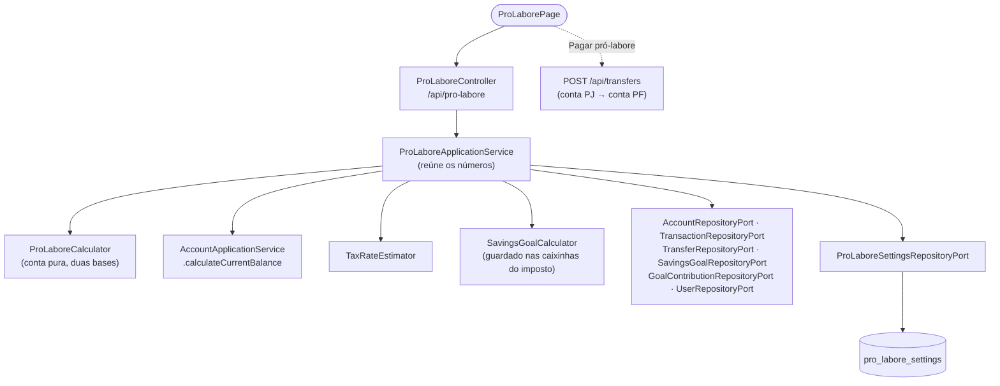

# FinPro — Fluxo de Separação PF/PJ e Pró-labore

*Documentação técnica da separação entre contas pessoais e da empresa e do cálculo de pró-labore — ver [`../plano.md`](../plano.md). Diagramas em [Mermaid](https://mermaid.js.org/) — renderizam nativamente no GitHub.*

## 1. Visão geral

Cada conta tem um **uso**: pessoal (PF, `PERSONAL`) ou da empresa (PJ, `BUSINESS`). As contas criadas antes dessa separação ficam como pessoais.

A tela **Pró-labore** responde "quanto posso me pagar este mês?". O cálculo é **configurável** por usuário:
- **base**: receitas do mês ou saldo atual;
- **imposto**: automático ou manual;
- **reserva da empresa**, **colchão de caixa** e **pró-labore fixo** opcional.

O pagamento em si é uma **transferência de conta PJ para conta PF**, usando as transferências que já existem. Nenhuma entidade nova de "retirada" foi criada.

## 2. Tela

**Rota:** `/pro-labore` (`ProLaborePage`), item "Pró-labore" na seção Freelancer do menu.

- **Sem conta PJ**: um aviso com link para Contas, explicando como marcar o uso "Empresa (PJ)".
- **Card "Você pode se pagar este mês"**: o valor disponível e o já retirado no mês. Pode trazer também:
  - o bloco do **pró-labore fixo** (quanto falta pagar e se o disponível cobre);
  - o aviso de que o valor foi limitado pelo saldo.

  O botão **Pagar R$ X** abre o `TransferForm` pré-preenchido: conta PJ com mais saldo → primeira conta PF, com `suggestedPayment` e a descrição "Pró-labore MM/aaaa". Ele fica desabilitado sem valor a pagar ou sem conta PF.
- **Card "Como o valor é calculado"**: as parcelas da base escolhida, cada uma com uma explicação curta.
- **Card "Configuração do cálculo"** (`ProLaboreSettingsForm`), no topo da tela e em largura total, **recolhido por padrão** (o título mostra um resumo: base, imposto e valor fixo). Fechar só esconde o formulário, sem perder o que foi digitado. Campos: base, reserva (%) ou colchão (meses), conforme a base; modo do imposto e alíquota manual; encargos; pró-labore fixo. Abaixo dele, os demais cards ficam em duas colunas a partir de `lg`: disponível e cálculo, depois retiradas e despesas PJ.
- **Card "Retiradas deste mês"**: transferências PJ → PF do mês.
- **Card "Despesas PJ do mês"** (abaixo das retiradas): as transações de despesa das contas PJ que compõem `monthBusinessExpenses` — pagas no mês e pendentes até o fim dele, inclusive as atrasadas —, com data, conta, categoria e situação (Paga, A pagar, Atrasada), da mais recente para a mais antiga. A lista (`businessExpenses` na resposta de `GET /api/pro-labore`) é montada no backend a partir das mesmas transações somadas no cálculo, então o total sempre bate com a linha "Despesas PJ do mês". É só leitura: um pagamento feito pela conta PJ é custo da empresa e já reduz o disponível como despesa. Ele **não** é retirada; contá-lo também como retirada o descontaria duas vezes.
- **Tela de Contas**: campo "Uso" no formulário e etiqueta PF/PJ em cada card.

## 3. Arquitetura (hexagonal)



## 4. Cálculo (`ProLaboreCalculator`)

A conta tem duas etapas: o **orçamento do mês** e depois os **encargos**.

### 4.1 Orçamento do pró-labore no mês
É quanto a empresa pode gastar com o sócio no mês: o bruto mais o INSS patronal. O pró-labore já retirado no mês faz parte dele.

**Base "receitas do mês"** (padrão):
```
calculado = receitas PJ pagas no mês
          − despesas PJ do mês          (pagas no mês + pendentes até o fim dele, inclusive atrasadas)
          − imposto                     (alíquota × receitas do mês)
          − reserva da empresa          (reserveRate × receitas do mês, padrão 10%)
teto      = max(0, saldo PJ − contas a pagar − imposto + já retirado no mês)
orçamento = max(0, min(calculado, teto))   → cappedByBalance quando o teto cortou o valor
```

**Base "saldo atual"**:
```
orçamento = max(0, saldo PJ − contas a pagar − imposto a reservar − colchão + já retirado no mês)
imposto a reservar = max(alíquota × receitas do mês, guardado nas caixinhas do imposto)
colchão            = despesa média PJ dos 3 meses anteriores × cashCushionMonths
```
O "+ já retirado" existe porque essas transferências já saíram do saldo, mas pertencem ao pró-labore do mês. Na etapa seguinte elas são descontadas uma única vez. O imposto usa o maior dos dois valores porque a caixinha é virtual: o dinheiro dela continua no saldo.

**Alíquota do imposto da empresa**: no modo `MANUAL`, a informada. No `AUTOMATIC`, a da caixinha do imposto (`SavingsGoal` do tipo `TAX_RESERVE` com percentual) ou, sem ela, `TaxRateEstimator.suggestRate(regime, receita PJ do mês)`.

### 4.2 Encargos (`PayrollTaxCalculator`, valores de referência de 2026)
- **Retenção**: `ProLaboreWithholdingMode.AUTOMATIC` liga para `SIMPLES_NACIONAL` e `LUCRO_PRESUMIDO`; `ENABLED` e `DISABLED` forçam.
- **INSS patronal** (`employerInssRate`): o informado ou, no automático, 20% no Lucro Presumido e 0% nos demais. Sem retenção, é zero.
- **Bruto máximo** = orçamento ÷ (1 + patronal), arredondado para baixo. O **bruto planejado** é o fixo (limitado ao máximo) ou o máximo.
- **INSS do sócio** = 11% × min(bruto, teto R$ 8.475,55).
- **IRRF**: tabela progressiva mensal sobre `bruto − max(INSS, desconto simplificado R$ 607,20)`. Depois vem o redutor da Lei 15.270/2025, que dá imposto zero para bruto até R$ 5.000 e desconta `978,62 − 0,133145 × bruto` entre R$ 5.000,01 e R$ 7.350.
- **Líquido** = bruto − INSS − IRRF. As **guias** (INSS + IRRF + patronal) ficam na conta PJ.

### 4.3 Disponível e pró-labore fixo
- `availableToWithdraw = max(0, líquido máximo − já retirado)`. As retiradas PJ → PF são valores líquidos.
- `suggestedPayment = max(0, líquido planejado − já retirado)`. É o valor pré-preenchido no botão "Pagar".
- Com fixo:
  - `fixedRemaining = max(0, líquido do fixo − já retirado)`;
  - `fixedCovered = fixo ≤ bruto máximo`.
- Sem retenção, bruto = líquido = orçamento, e a conta fica igual à versão sem encargos.

**O que fica de fora**: transações de transferência (`transferId`) não entram em receitas, despesas nem na média, como no Dashboard. Receitas PJ pendentes também não entram, porque dinheiro ainda não recebido não pode ser retirado.

## 5. Regras de negócio

- **Uso da conta**: sem uso informado, a criação faz uma conta pessoal e a edição mantém o uso atual.
- **Não há bloqueio**: o sistema não impede transferir mais que o disponível. O número é uma orientação.
- **Configuração**:
  - Sem linha em `pro_labore_settings`, valem os padrões de `ProLaboreSettings.defaults`: receitas do mês, reserva de 10%, imposto automático, 1 mês de colchão e sem valor fixo.
  - O `PUT /api/pro-labore/settings` recebe a configuração completa e devolve o resumo recalculado.
  - Validações: colchão de 0 a 12 meses; reserva e alíquota de 0 a 100%; modo manual exige alíquota (400); fixo ≤ 0 é tratado como "sem fixo".
- **Alíquota manual preservada**: ela fica guardada mesmo com o modo automático ativo, para não se perder ao alternar.
- **Valores de referência**: os valores fiscais (teto do INSS, tabela e redutor do IRRF) ficam em constantes do `PayrollTaxCalculator` e precisam ser revistos a cada ano. É uma estimativa para planejamento, não a folha do contador.
- **Fora do escopo por enquanto**: filtro PF/PJ no Dashboard; dependentes no IRRF; piso de um salário mínimo para o pró-labore.

## 6. Onde cada peça vive no repositório

| Camada | Arquivos |
|---|---|
| Domínio | `domain/model/{AccountScope,ProLaboreCalculator,PayrollTaxCalculator,ProLaboreSettings,ProLaboreCalculationBase,ProLaboreTaxMode,ProLaboreWithholdingMode}.java`, `Account.scope` |
| Ports | `domain/port/out/ProLaboreSettingsRepositoryPort.java` |
| Aplicação | `application/prolabore/{ProLaboreApplicationService,ProLaboreSummary}.java`, `AccountApplicationService.create/update` (uso) |
| Persistência | `ProLaboreSettingsJpaEntity`/`Repository`/`Adapter`, coluna `scope` em `AccountJpaEntity` |
| API | `infrastructure/web/controller/ProLaboreController.java`, `infrastructure/web/dto/prolabore/*` |
| Migrations | `V17__add_account_scope_and_pro_labore_settings.sql`, `V18__add_pro_labore_configuration.sql`, `V19__add_pro_labore_withholding.sql` |
| Frontend | `frontend/src/features/pro-labore/` (`ProLaborePage`, `ProLaboreSettingsForm`, `schemas`, `useProLabore`), `features/accounts` (campo Uso), `TransferForm.initialValues` |
| Testes | `PayrollTaxCalculatorTest`, `ProLaboreCalculatorTest`, `ProLaboreApplicationServiceTest`, `integration/prolabore/ProLaboreIntegrationTest`, `features/pro-labore/schemas.test.ts` |
