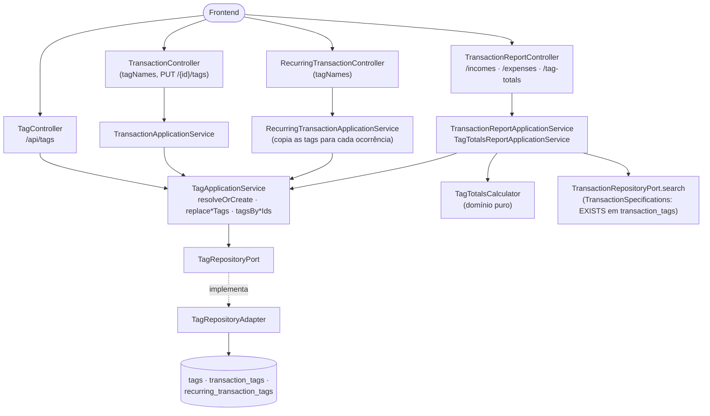

# FinPro — Fluxo de Tags

*Documentação técnica das tags (classificação livre das transações) e do relatório de totais por tag — ver [`../plano.md`](../plano.md). Diagramas em [Mermaid](https://mermaid.js.org/) — renderizam nativamente no GitHub.*

## 1. Visão geral

A **categoria** diz o que é um lançamento, e cada transação tem uma só. A **tag** é transversal: uma transação pode ter várias (até **10**), de qualquer categoria. Exemplos de uso:

- **projeto**: `#site-acme` no recebimento, na hospedagem e no domínio daquele trabalho;
- **IR**: `#dedutível` em tudo que entra na declaração.

A tag pertence ao usuário e tem nome e cor opcional. O nome é gravado **normalizado**: sem o "#", em minúsculas e com espaços trocados por "-". Assim "#Site Acme", "site acme" e "SITE-ACME" são sempre a mesma `site-acme`. O "#" é só de exibição (`Tag.label()`).

As telas nunca mandam ids de tag para gravar: mandam **nomes**. O backend normaliza cada nome e reaproveita a tag existente ou cria uma nova (`TagApplicationService.resolveOrCreate`). A regra de "encontrar ou criar" fica, portanto, toda no backend.

## 2. Telas

- **Nova transação** (`TransactionForm`): campo **Tags (opcional)** (`TagInput`). As tags escolhidas viram etiquetas, e ao digitar aparecem as existentes que combinam.
  - A primeira opção é sempre "Criar #o-que-digitou"; Enter ou vírgula adicionam, e Backspace com o campo vazio tira a última.
  - As tags vão junto no `POST /api/transactions` (`tagNames`).
- **Lista de transações**:
  - as tags aparecem como etiquetas (`TagBadge`) nos cards;
  - o botão de etiqueta abre o modal "Tags" (`TransactionTagsEditor` → `PUT /api/transactions/{id}/tags`);
  - o filtro **Tags (qualquer uma)** usa o mesmo campo, sem criar tag (`allowCreate={false}`).
- **Lançamentos recorrentes**: campo de tags na criação e na edição, e etiquetas na lista.
- **Revisão da importação** (`ImportBatchReviewTable`): uma linha de tags por transação (`ImportReviewTags`), que salva a cada alteração, como os seletores de categoria e cliente.
- **Categorias e tags** (`/categorias?aba=tags`, `TagsManager`):
  - lista das tags com quantas transações usam cada uma;
  - criar direto, renomear e trocar a cor (modal) e excluir (com confirmação que diz de quantas transações a tag sai).
- **Relatórios**:
  - filtro **Tags (qualquer uma)** em Receitas/Despesas (com filtros);
  - tipo novo **Totais por tag** (`TagTotalsReportForm`).

## 3. Arquitetura (hexagonal)

As tags não entram no record `Transaction`. Os vínculos ficam em tabelas próprias, e as respostas da API buscam as tags de uma lista inteira numa consulta só (`tagsByTransactionIds`), como a contagem de anexos.

## 4. Regras de negócio

- **Nome**:
  - normalizado por `Tag.normalizeName`;
  - aceita letras (com acento), números, "-" e "_", com até 40 caracteres;
  - é único por usuário (índice `uq_tags_user_name`).
  - Nome inválido: `InvalidTagException` (400). Nome já usado, ao criar ou renomear: `TagAlreadyExistsException` (409).
- **Cor**: opcional, formato `#RRGGBB` (guardada em minúsculas).
- **Limite**: até 10 tags por transação ou recorrência. Nomes repetidos na mesma requisição, mesmo escritos diferente, contam uma vez.
- **Atomicidade**: criar ou editar uma transação com tags roda numa transação de banco só. Uma tag inválida desfaz o lançamento inteiro.
- **Editar tags é sempre permitido**, inclusive em transação paga, importada ou de transferência. Tag é classificação e não mexe em valor nem em saldo, por isso a trava de "paga é definitivo" não se aplica.
- **Recorrência**:
  - as tags do modelo são gravadas antes de gerar as ocorrências vencidas, para as transações já nascerem com elas;
  - cada ocorrência gerada depois (pelo agendador) também recebe as tags;
  - mudar as tags da recorrência vale só para as próximas ocorrências.
- **Excluir tag**: os vínculos saem em cascata no banco. As transações e recorrências continuam, só sem a tag.
- **Posse**: tag de outro usuário é tratada como inexistente (404), nos endpoints de tag e nos filtros de relatório.
- **Filtro "qualquer uma"**: `tagIds` repetido na URL (`?tagIds=3&tagIds=7`) vira um `EXISTS` na subconsulta de `transaction_tags`. Diferente de um `JOIN`, ele não duplica a transação que tem duas das tags escolhidas.

## 5. Relatório "Totais por tag"

`GET /api/reports/tag-totals?startDate&endDate&accountScope&status&tagIds&format=PDF|CSV`, todos os parâmetros opcionais.

- Uma linha por tag, em ordem alfabética: lançamentos, receitas, despesas e **resultado** (receita − despesa). As receitas e despesas entram por competência (pagas e pendentes), a menos que a situação seja filtrada; transferências ficam de fora.
- **Sem filtro de tag**: entram as tags com movimento no período, mais a linha **"Sem tag"**.
- **Com filtro de tag**: entram só as tags escolhidas, mesmo zeradas, e não há linha "Sem tag", porque a busca já exclui as transações sem tag.
- Não há linha de total: uma transação com duas tags entra no total das duas. O PDF traz uma nota explicando isso.

O cálculo é puro e fica no domínio (`TagTotalsCalculator`).

Nos outros relatórios, as tags aparecem assim:

- **Receitas/Despesas (CSV)**: coluna **Tags** no fim, depois do valor.
- **Exportação de transações (CSV)**: coluna **Tags** no fim.
- **Índice do ZIP de comprovantes**: coluna **Tags** no fim.
- **PDF de Receitas/Despesas e da Exportação**: as tags vão logo abaixo da descrição, em fonte menor, para não espremer mais uma coluna.

## 6. Onde cada peça vive no repositório

| Camada | Arquivo |
|---|---|
| Migration | `db/migration/V21__create_tags.sql` |
| Domínio | `domain/model/{Tag,TagTotalsCalculator,TagTotalsReportData}.java`, `domain/exception/{InvalidTagException,TagAlreadyExistsException}.java` |
| Port/Adapter | `domain/port/out/TagRepositoryPort.java` + `infrastructure/persistence/adapter/TagRepositoryAdapter.java` (entidades `TagJpaEntity`, `TransactionTagJpaEntity`, `RecurringTransactionTagJpaEntity`) |
| Aplicação | `application/tag/TagApplicationService.java`, `application/report/TagTotalsReportApplicationService.java` |
| API | `TagController` (`/api/tags`), `TransactionController` (`PUT /{id}/tags`), `TransactionReportController` (`/tag-totals`) |
| Frontend | `frontend/src/features/tags/**` (`TagInput`, `TagBadge`, `TagsManager`, `useTags`, `utils`), `transactions/components/TransactionTagsEditor.tsx`, `importBatches/components/ImportReviewTags.tsx`, `reports/components/TagTotalsReportForm.tsx` |
| Testes | `TagTest`, `TagTotalsCalculatorTest`, `TagApplicationServiceTest`, `integration/tag/TagIntegrationTest`, `features/tags/utils.test.ts` |
