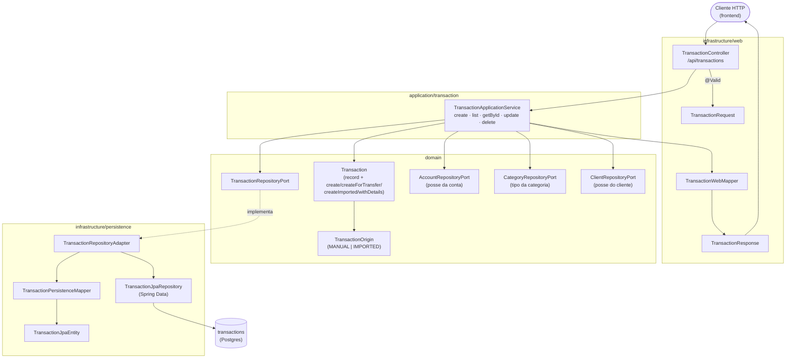
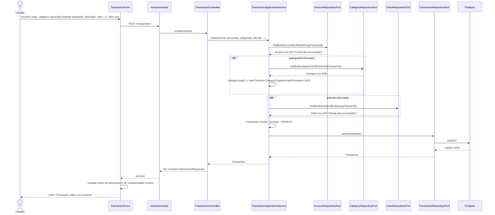

# FinPro — Fluxo de Transações

*Documentação técnica do módulo de Transações (ver roadmap em [`../plano.md`](../plano.md#12-roadmap-sugerido-atualizado)). Diagramas em [Mermaid](https://mermaid.js.org/) — renderizam nativamente no GitHub.*

## 1. Visão geral

`Transaction` é o registro central do sistema: todo lançamento de receita ou despesa, seja manual, gerado por uma transferência entre contas próprias, ou importado de um extrato CSV, é uma linha nessa tabela. É o dado-fonte de tudo o resto — saldo de conta (`Account.calculateCurrentBalance`), Dashboard, orçamentos (`Budget.spentValue`) e pré-preenchimento de receita bruta em Impostos.

Uma transação tem uma `origin` (`MANUAL` ou `IMPORTED`) e pode opcionalmente ter `transferId` (se foi criada automaticamente por uma transferência) ou `importBatchId` (se veio de uma importação de extrato) — esses dois campos mudam o que o usuário pode fazer com ela na tela.

## 2. Tela

Rota `/transacoes` (`TransactionsPage`).

- **Cabeçalho**: título "Transações" + botão "Nova transação" (ícone `+`), que abre um `Modal` com o `TransactionForm` (conta, categoria, cliente, descrição, valor, data, tipo).
- **Filtros** (`CollapsibleFilters`, recolhidos por padrão): conta, categoria, tipo (receita/despesa), intervalo de datas (início/fim).
- **Lista** (`TransactionList` → `TransactionCard` por item): descrição, valor (verde para receita, vermelho para despesa, com sinal `+`/`-`), conta e categoria na linha de meta-informação, e uma etiqueta "Transferência" quando `transferId` está preenchido. No mobile, o card é expansível (`ChevronDownIcon`) para mostrar a descrição completa e a ação de remover.
- **Estados**: `isLoading` → "Carregando transações..."; erro de exclusão → toast com a mensagem do backend.
- **Ações do usuário**: criar e remover. **Não há edição pela tela de Transações** — embora o backend exponha `PUT /api/transactions/{id}` (`TransactionApplicationService.update`), o frontend não tem formulário de edição nem hook `useUpdateTransaction` conectados a essa rota; hoje o endpoint de update só é exercitado por teste de integração, não pela UI.
- **Transação de transferência**: o botão de remover fica desabilitado com uma dica ("Esta transação faz parte de uma transferência. Exclua-a na tela de Transferências.") — a exclusão de fato acontece na tela de Transferências, que remove as duas pernas de uma vez.

## 3. Arquitetura (hexagonal)

## 4. Fluxo de criação

## 5. Regras de negócio importantes

- **Valor sempre positivo**: `@DecimalMin(value = "0.01")` em `TransactionRequest.amount` — o sinal (receita soma, despesa subtrai) vem do campo `type`, nunca de um valor negativo. Essa validação de sinal foi uma correção de uma auditoria de responsabilidades feita nesta mesma base de código (antes o backend aceitava valor zero/negativo).
- **Conta é imutável após a criação**: `update()` não recebe `accountId` — uma transação não pode ser movida de conta, só editada em categoria/cliente/descrição/valor/data/tipo (e, como já dito, isso não está exposto na UI hoje).
- **Categoria precisa bater o tipo**: se `categoryId` for informado, `category.type()` tem que ser igual ao `type` da transação (não dá pra lançar uma despesa numa categoria de receita) — violação lança `CategoryTypeMismatchException` (400).
- **Categoria/cliente precisam ser visíveis/pertencer ao usuário**: categoria pode ser global ou do próprio usuário (`isVisibleTo`); cliente tem que pertencer ao usuário (`belongsTo`) — qualquer um fora disso é 404, nunca 403 (mesmo padrão de todo o sistema: existência de outro usuário é tratada como inexistência).
- **`origin` nunca vem do cliente**: é sempre definido pelo backend — `MANUAL` para `create()`, `IMPORTED` para transações vindas do motor de importação (`Transaction.createImported`), e as duas pernas de uma transferência usam `createForTransfer` (também `MANUAL`, mas com `transferId` preenchido).
- **Transação de transferência não pode ser excluída isoladamente**: `delete()` verifica `existing.transferId() != null` e lança `TransactionLinkedToTransferException` (400) com a mensagem "Esta transação faz parte de uma transferência. Exclua a transferência inteira na tela de Transferências." — ver [`fluxo-transferencias.md`](fluxo-transferencias.md).
- **Posse da transação é verificada via posse da conta**: `findOwnedOrThrow` busca a transação por id e depois valida que a *conta* dela pertence ao usuário atual (`requireOwnedAccount`) — não existe `userId` direto na tabela `transactions`.

## 6. Onde cada peça vive no repositório

| Camada | Arquivo |
|---|---|
| Domínio | `domain/model/{Transaction,TransactionOrigin}.java` |
| Port/Adapter | `domain/port/out/TransactionRepositoryPort.java` + `infrastructure/persistence/adapter/TransactionRepositoryAdapter.java` |
| Aplicação | `application/transaction/TransactionApplicationService.java` |
| API | `infrastructure/web/controller/TransactionController.java` (`/api/transactions`) |
| Frontend | `frontend/src/features/transactions/**` (`TransactionsPage`, `TransactionForm`, `TransactionList`, `TransactionCard`, hooks `useTransactions`/`useCreateTransaction`/`useDeleteTransaction`, `transactionsApi`, `schemas.ts`, `types.ts`) |
| Testes | `backend/src/test/java/.../integration/transaction/TransactionIntegrationTest.java`, `application/transaction/TransactionApplicationServiceTest.java` |
