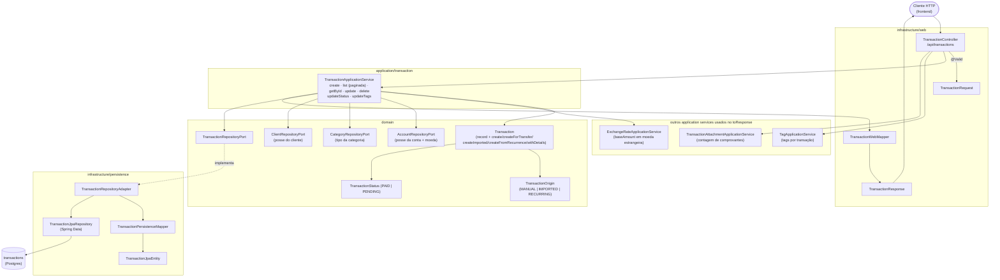
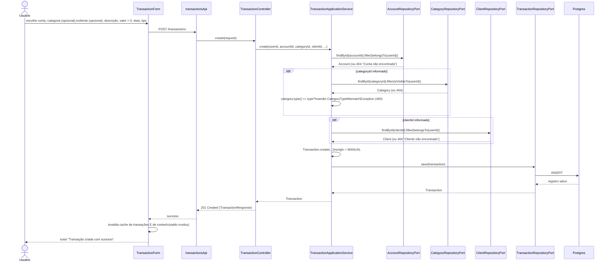

# FinPro — Fluxo de Transações

*Documentação técnica do módulo de Transações (ver roadmap em [`../plano.md`](../plano.md#12-roadmap-sugerido-atualizado)). Diagramas em [Mermaid](https://mermaid.js.org/) — renderizam nativamente no GitHub.*

## 1. Visão geral

`Transaction` é o registro central do sistema: todo lançamento de receita ou despesa, seja manual, gerado por uma transferência entre contas próprias, importado de um extrato (CSV/OFX) ou lançado por uma recorrência, é uma linha nessa tabela. É o dado-fonte de tudo o resto — saldo de conta (`Account.calculateCurrentBalance`), Dashboard, orçamentos (`Budget.spentValue`) e pré-preenchimento de receita bruta em Impostos.

Uma transação tem uma `origin` (`MANUAL` · `IMPORTED` · `RECURRING`) e pode opcionalmente ter `transferId` (se foi criada automaticamente por uma transferência), `importBatchId` (se veio de uma importação de extrato) ou `recurringTransactionId` (se foi gerada por um `RecurringTransaction` — módulo "Recorrentes", `/recorrentes`, sem `fluxo-*.md` próprio ainda; ver a seção "Lançamentos recorrentes" em [`../plano.md`](../plano.md)) — esses campos mudam o que o usuário pode fazer com ela na tela.

Também carrega **situação** (`TransactionStatus`: `PAID`/`PENDING`, seção 5) e, quando a conta não é em reais, o **valor original** na moeda da operação (`originalCurrency`/`originalAmount`) além do **valor em reais** (`baseAmount`, usado em todo total que junta contas — dashboard, relatórios, orçamentos).

## 2. Tela

Rota `/transacoes` (`TransactionsPage`).

- **Cabeçalho**: título "Transações" + botão "Nova transação" (ícone `+`), que abre um `Modal` com o `TransactionForm` (conta, categoria, cliente, descrição, valor, data, tipo).
- **Filtros** (`CollapsibleFilters`, recolhidos por padrão): conta, categoria, cliente, tipo (receita/despesa), situação (paga/pendente), comprovante (com/sem), tags (qualquer uma) e intervalo de datas (início/fim). Todos são **resolvidos no banco**: viram parâmetros de `GET /api/transactions`, e qualquer mudança de filtro volta para a primeira página.
- **Paginação**: 20 transações por página, da mais recente para a mais antiga, com "Anterior"/"Próxima" e o resumo "Página X de Y · N transações" (`Pagination`). A página anterior fica na tela, esmaecida, enquanto a nova carrega; se a página atual deixar de existir (ex.: excluiu o último item da última página), a tela volta para a última que existe.
- **Lista** (`TransactionList` → `TransactionCard` por item): descrição, valor (verde para receita, vermelho para despesa, com sinal `+`/`-`, na moeda da conta — com o valor original entre parênteses quando a operação foi em outra moeda), conta e categoria na linha de meta-informação, etiquetas de tags, contador de comprovantes, e etiquetas "Transferência" (quando `transferId` está preenchido) / "Recorrente" (quando `recurringTransactionId` está preenchido) / "A receber" ou "A pagar" (quando `status = PENDING`). No mobile, o card é expansível (`ChevronDownIcon`) para mostrar a descrição completa e a ação de remover.
- **Estados**: `isLoading` → "Carregando transações..."; erro de exclusão → toast com a mensagem do backend.
- **Ações do usuário**: criar, remover, marcar uma pendente como paga/recebida (modal de confirmação, ver seção 5), trocar tags (ver [`fluxo-tags.md`](fluxo-tags.md)) e gerenciar comprovantes (ver [`fluxo-anexos.md`](fluxo-anexos.md)). **Não há edição completa pela tela de Transações** — embora o backend exponha `PUT /api/transactions/{id}` (`TransactionApplicationService.update`), o frontend não tem formulário de edição de todos os campos nem hook `useUpdateTransaction` conectados a essa rota; hoje o endpoint de update só é exercitado por teste de integração, não pela UI. Situação e tags são as únicas edições possíveis pela tela, cada uma com seu próprio endpoint (`PATCH /{id}/status`, `PUT /{id}/tags`).
- **Tags**:
  - campo "Tags" no formulário de lançamento;
  - etiquetas no card, e um botão de etiqueta que abre o modal para trocá-las (inclusive em transação paga ou de transferência);
  - filtro "Tags (qualquer uma)" na lista.
  - Detalhes em [`fluxo-tags.md`](fluxo-tags.md).
- **Transação de transferência**: o botão de remover fica desabilitado com uma dica ("Esta transação faz parte de uma transferência. Exclua-a na tela de Transferências.") — a exclusão de fato acontece na tela de Transferências, que remove as duas pernas de uma vez.
- **Perna de outro espaço (grupos)**: quem participa de uma conta pessoal e de uma do grupo, ligadas por uma transferência entre espaços, criada na tela de Transferências ou dividida ao compartilhar (ver [`fluxo-grupos.md`](fluxo-grupos.md) e [`fluxo-transferencias.md`](fluxo-transferencias.md)), vê as **duas pernas** na lista, em qualquer um dos dois espaços. A perna que está no outro espaço vem com `linkedAccountName` (só o nome da conta, nada além) e o card a mostra como somente leitura: sem botão de tags nem de comprovantes, e com a exclusão já bloqueada por ser transferência. Quem está só no grupo não vê a perna da conta pessoal de outro membro.

## 3. Arquitetura (hexagonal)

```mermaid
flowchart TD
    HttpClient(["Cliente HTTP\n(frontend)"]) --> Controller

    subgraph web["infrastructure/web"]
        Controller["TransactionController\n/api/transactions"]
        ReqDTO["TransactionRequest"]
        RespDTO["TransactionResponse"]
        WebMapper["TransactionWebMapper"]
    end

    subgraph application["application/transaction"]
        Service["TransactionApplicationService\ncreate · list (paginada) · getById · update · delete\nupdateStatus · updateTags"]
    end

    subgraph domain["domain"]
        Model["Transaction\n(record + create/createForTransfer/\ncreateImported/createFromRecurrence/withDetails)"]
        Origin["TransactionOrigin\n(MANUAL | IMPORTED | RECURRING)"]
        Status["TransactionStatus (PAID | PENDING)"]
        Port["TransactionRepositoryPort"]
        AccPort["AccountRepositoryPort\n(posse da conta + moeda)"]
        CatPort["CategoryRepositoryPort\n(tipo da categoria)"]
        CliPort["ClientRepositoryPort\n(posse do cliente)"]
    end

    subgraph infra["infrastructure/persistence"]
        Adapter["TransactionRepositoryAdapter"]
        PMapper["TransactionPersistenceMapper"]
        JpaRepo["TransactionJpaRepository\n(Spring Data)"]
        Entity["TransactionJpaEntity"]
    end

    subgraph outros["outros application services usados no toResponse"]
        TagSvc["TagApplicationService\n(tags por transação)"]
        AttSvc["TransactionAttachmentApplicationService\n(contagem de comprovantes)"]
        ExRate["ExchangeRateApplicationService\n(baseAmount em moeda estrangeira)"]
    end

    DB[("transactions\n(Postgres)")]

    Controller -- "@Valid" --> ReqDTO
    Controller --> Service
    Controller --> TagSvc
    Controller --> AttSvc
    Service --> Model
    Model --> Origin
    Model --> Status
    Service --> ExRate
    Service --> AccPort
    Service --> CatPort
    Service --> CliPort
    Service --> Port
    Port -.->|implementa| Adapter
    Adapter --> PMapper
    Adapter --> JpaRepo
    PMapper --> Entity
    JpaRepo --> DB
    Service --> WebMapper
    WebMapper --> RespDTO
    RespDTO --> HttpClient
```

## 4. Fluxo de criação

```mermaid
sequenceDiagram
    actor U as Usuário
    participant Form as TransactionForm
    participant API as transactionsApi
    participant Ctrl as TransactionController
    participant Svc as TransactionApplicationService
    participant AccPort as AccountRepositoryPort
    participant CatPort as CategoryRepositoryPort
    participant CliPort as ClientRepositoryPort
    participant Repo as TransactionRepositoryPort
    participant DB as Postgres

    U->>Form: escolhe conta, categoria (opcional),\ncliente (opcional), descrição, valor > 0, data, tipo
    Form->>API: POST /transactions
    API->>Ctrl: create(request)
    Ctrl->>Svc: create(userId, accountId, categoryId, clientId, ...)
    Svc->>AccPort: findById(accountId).filter(belongsTo(userId))
    AccPort-->>Svc: Account (ou 404 "Conta não encontrada")
    opt categoryId informado
        Svc->>CatPort: findById(categoryId).filter(isVisibleTo(userId))
        CatPort-->>Svc: Category (ou 404)
        Svc->>Svc: category.type() == type?\nsenão CategoryTypeMismatchException (400)
    end
    opt clientId informado
        Svc->>CliPort: findById(clientId).filter(belongsTo(userId))
        CliPort-->>Svc: Client (ou 404 "Cliente não encontrado")
    end
    Svc->>Svc: Transaction.create(...)\norigin = MANUAL
    Svc->>Repo: save(transaction)
    Repo->>DB: INSERT
    DB-->>Repo: registro salvo
    Repo-->>Svc: Transaction
    Svc-->>Ctrl: Transaction
    Ctrl-->>API: 201 Created (TransactionResponse)
    API-->>Form: sucesso
    Form->>Form: invalida cache de transações E de contas\n(saldo mudou)
    Form-->>U: toast "Transação criada com sucesso"
```

## 5. Regras de negócio importantes

- **Valor sempre positivo**: `@DecimalMin(value = "0.01")` em `TransactionRequest.amount` — o sinal (receita soma, despesa subtrai) vem do campo `type`, nunca de um valor negativo. Essa validação de sinal foi uma correção de uma auditoria de responsabilidades feita nesta mesma base de código (antes o backend aceitava valor zero/negativo).
- **Conta é imutável após a criação**: `update()` não recebe `accountId` — uma transação não pode ser movida de conta, só editada em categoria/cliente/descrição/valor/data/tipo (e, como já dito, isso não está exposto na UI hoje).
- **Marcar como paga é definitivo**: uma transação `PAID` não volta a `PENDING`. A regra fica em `requireStatusChangeAllowed` e vale para o `PATCH /{id}/status` e para o `update()`. A tentativa lança `PaidTransactionLockedException` (400), e transferência nunca fica pendente (`TransactionLinkedToTransferException`). Na tela, o botão "Marcar como paga/recebida" só aparece nas transações pendentes e pede confirmação num modal que avisa que a ação não pode ser desfeita; quem marcou por engano exclui e lança de novo.
- **Categoria precisa bater o tipo**: se `categoryId` for informado, `category.type()` tem que ser igual ao `type` da transação (não dá pra lançar uma despesa numa categoria de receita) — violação lança `CategoryTypeMismatchException` (400).
- **Categoria/cliente precisam ser visíveis/pertencer ao usuário**: categoria pode ser global ou do próprio usuário (`isVisibleTo`); cliente tem que pertencer ao usuário (`belongsTo`) — qualquer um fora disso é 404, nunca 403 (mesmo padrão de todo o sistema: existência de outro usuário é tratada como inexistência).
- **`origin` nunca vem do cliente**: é sempre definido pelo backend — `MANUAL` para `create()`, `IMPORTED` para transações vindas do motor de importação (`Transaction.createImported`), `RECURRING` para ocorrências geradas por um `RecurringTransaction` (`Transaction.createFromRecurrence`, nascem `PENDING`), e as duas pernas de uma transferência usam `createForTransfer` (também `MANUAL`, mas com `transferId` preenchido).
- **Situação padrão (`TransactionStatus.defaultFor`)**: lançamento manual sem situação informada vira `PENDING` se a data for futura (relativa ao `Clock` do usuário), `PAID` caso contrário; importadas e as duas pernas de transferência sempre nascem `PAID`; ocorrências recorrentes sempre nascem `PENDING`.
- **Multi-moeda**: quando a conta não é em reais, a transação pode registrar o valor na moeda original da operação (`originalCurrency`/`originalAmount`, ex.: compra de US$ 20 no cartão em reais) além do valor na moeda da conta (`amount`, o que mexe no saldo). Todo total que junta contas usa `baseAmount` — igual a `amount` em contas em reais, e a conversão pela PTAX do dia da transação nas demais (recalculada se o valor ou a data mudarem).
- **Transação de transferência não pode ser excluída isoladamente**: `delete()` verifica `existing.transferId() != null` e lança `TransactionLinkedToTransferException` (400) com a mensagem "Esta transação faz parte de uma transferência. Exclua a transferência inteira na tela de Transferências." — ver [`fluxo-transferencias.md`](fluxo-transferencias.md).
- **Posse da transação é verificada via posse da conta**: `findOwnedOrThrow` busca a transação por id e depois valida que a *conta* dela pertence ao usuário atual (`requireOwnedAccount`) — não existe `userId` direto na tabela `transactions`.
- **Listagem paginada e filtrada no backend**: `GET /api/transactions?page=&size=&accountId=&categoryId=&clientId=&type=&status=&hasAttachment=&tagNames=&startDate=&endDate=` devolve `{ content, page, size, totalElements, totalPages }`. `page` começa em 0; `size` padrão 20 e máximo 100 (valores fora disso são ajustados, não geram erro). A consulta reaproveita `TransactionSearchCriteria`/`TransactionSpecifications` (as mesmas dos relatórios), que já restringem ao usuário; a ordem é fixa: data e id decrescentes. `tagNames` repetido casa com **qualquer** das tags (nome normalizado; tag que o usuário não tem não casa com nada, e se nenhuma existir a página vem vazia). Tags e `attachmentCount` são resolvidos só para os itens da página.
- **Pernas de outro espaço só na listagem**: o controller passa o `userId` a `list(...)`, que preenche `includeLinkedTransferLegsOfUserId` no `TransactionSearchCriteria`; `TransactionSpecifications.linkedTransferLeg` então também aceita a transação com `transferId` cuja transferência tem uma ponta numa conta do espaço atual e cuja conta está num espaço de que o usuário participa. Com filtro por conta o ramo não entra. Relatórios, dashboard e demais consumidores usam o critério sem esse campo, para não contar a perna duas vezes. `TransactionApplicationService.namesOfAccountsOutside` resolve o nome das contas de fora (`linkedAccountName` na resposta).
- **Tags e comprovantes têm rota própria**: `PUT /{id}/tags` (`TagApplicationService`, até 10 tags por transação, vale mesmo para transação paga ou de transferência) e o CRUD de anexos por `TransactionAttachmentApplicationService` — ver [`fluxo-tags.md`](fluxo-tags.md) e [`fluxo-anexos.md`](fluxo-anexos.md). `TransactionResponse` já vem com `tags` e `attachmentCount` prontos, resolvidos no controller.

## 6. Onde cada peça vive no repositório

| Camada | Arquivo |
|---|---|
| Domínio | `domain/model/{Transaction,TransactionOrigin,TransactionStatus}.java` |
| Port/Adapter | `domain/port/out/TransactionRepositoryPort.java` + `infrastructure/persistence/adapter/TransactionRepositoryAdapter.java` |
| Aplicação | `application/transaction/TransactionApplicationService.java` (+ `application/exchangerate/ExchangeRateApplicationService`, `application/tag/TagApplicationService`, `application/attachment/TransactionAttachmentApplicationService` usados no controller) |
| API | `infrastructure/web/controller/TransactionController.java` (`/api/transactions`, `PATCH /{id}/status`, `PUT /{id}/tags`) |
| Frontend | `frontend/src/features/transactions/**` (`TransactionsPage`, `TransactionForm`, `TransactionList`, `TransactionCard`, hooks `useTransactions` (recebe página e filtros)/`useCreateTransaction`/`useDeleteTransaction`/`useUpdateTransactionStatus`/`useUpdateTransactionTags`, `transactionsApi`, `schemas.ts`, `types.ts`) |
| Testes | `backend/src/test/java/.../integration/transaction/TransactionIntegrationTest.java`, `application/transaction/TransactionApplicationServiceTest.java` |
