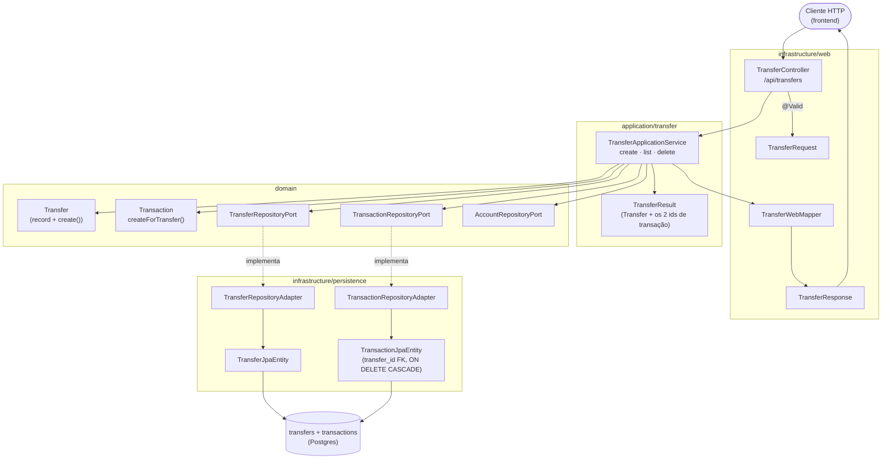
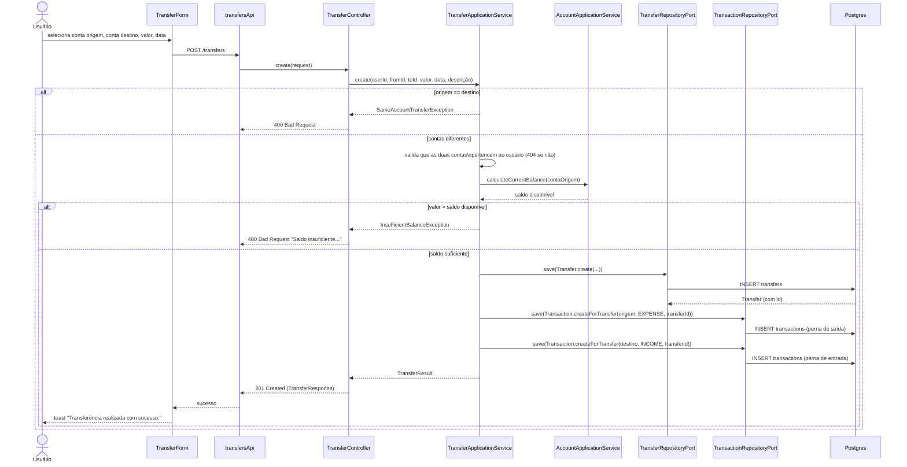
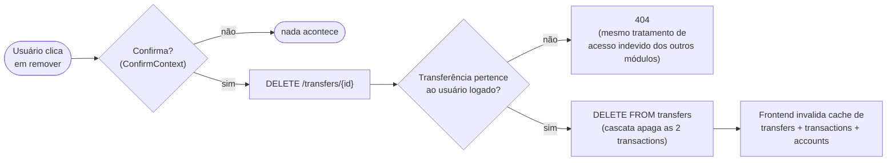
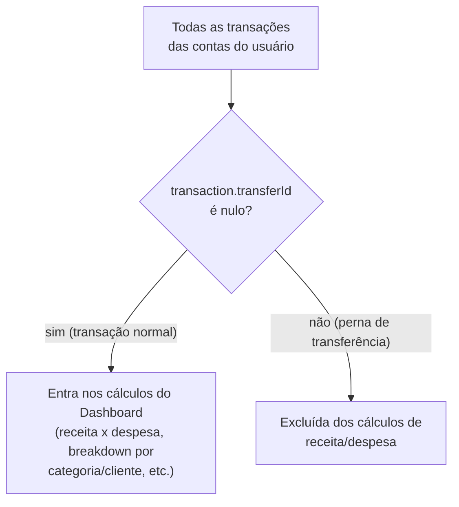

# FinPro — Fluxo de Transferências entre Contas

*Documentação técnica do módulo de transferências (ver roadmap em [`../plano.md`](../plano.md#12-roadmap-sugerido-atualizado)). Diagramas em [Mermaid](https://mermaid.js.org/) — renderizam nativamente no GitHub.*

## 1. Visão geral

Transferência é a movimentação de dinheiro entre duas contas do **mesmo usuário** (ex: da Conta Corrente pra Poupança). Ela não é uma entidade isolada no fluxo de caixa: toda transferência criada gera **duas transações reais** — uma `EXPENSE` na conta de origem, uma `INCOME` na conta de destino — ligadas pelo mesmo `transferId`. Isso é o que faz o saldo de cada conta (calculado como `saldo inicial + soma das transações`) refletir a movimentação sem precisar de um campo de saldo mutável.

Por serem transações "espelhadas" (uma saída = uma entrada, sem gerar receita ou despesa real), transferências são **excluídas** dos cálculos de receita/despesa do Dashboard — ver seção 4.

## 2. Tela

- **Rota:** `/transferencias` (`TransfersPage`)
- **Elementos principais:**
  - Botão "Nova transferência" (ícone `+`) abre um `Modal` com o `TransferForm`
  - `TransferList`: lista de transferências já feitas, com filtros recolhíveis (`CollapsibleFilters`) por conta e por intervalo de datas
  - Cada item (`TransferCard`) mostra "Conta origem → Conta destino", valor, data e descrição; em telas pequenas o card é expansível (mostra só o essencial, um toque revela os detalhes)
- **Estados:** "Carregando transferências...", vazio ("Nenhuma transferência registrada ainda." / "Nenhuma transferência encontrada com os filtros aplicados."), ou lista populada
- **Ações do usuário:** criar transferência, remover transferência (com confirmação via `ConfirmContext`, mostra toast de sucesso/erro)
- **Regra de formulário (client-side):** o `TransferForm` só aparece funcional se o usuário já tiver ao menos duas contas cadastradas — senão mostra um aviso pra cadastrar contas primeiro. O schema Zod (`transferSchema`) já bloqueia no cliente selecionar a mesma conta como origem e destino, mas o backend também valida isso (nunca confia só na validação do formulário).

## 3. Arquitetura (hexagonal)

**Por que essa separação importa aqui:** `TransferApplicationService` orquestra três ports diferentes (`TransferRepositoryPort`, `TransactionRepositoryPort`, `AccountRepositoryPort`) porque criar uma transferência é, na prática, uma transação de negócio que toca duas entidades distintas (`Transfer` e duas `Transaction`) — mas a validação de saldo é delegada a `AccountApplicationService.calculateCurrentBalance`, reaproveitando exatamente a mesma regra que calcula o saldo exibido na tela de Contas, então não existem dois lugares diferentes calculando "quanto tem na conta".

## 4. Fluxo de criação de uma transferência

**Descrição das pernas:** se o usuário não informar uma descrição customizada, o backend gera uma padrão — `"Transferência para <conta destino>"` na perna de saída e `"Transferência de <conta origem>"` na perna de entrada. Se o usuário informar uma descrição, ela é usada nas duas pernas.

## 5. Exclusão de uma transferência

Excluir a transferência remove as duas transações junto — não existe fluxo pra excluir só uma perna. Isso é garantido no nível do banco: `transactions.transfer_id` tem `ON DELETE CASCADE` pra `transfers.id`, então `TransferRepositoryAdapter.deleteById` só precisa apagar a linha de `transfers`; o Postgres cuida do resto.

Do lado da tela de **Transações**, uma perna individual de transferência (`transaction.transferId != null`) não pode ser editada nem excluída isoladamente — a UI/API bloqueia essa ação e direciona o usuário a excluir a transferência inteira aqui (ver [`fluxo-transacoes.md`](fluxo-transacoes.md)).

## 6. Por que transferências não contam como receita/despesa

Sem esse filtro, mover R$ 1.000 da Conta Corrente pra Poupança apareceria simultaneamente como R$ 1.000 de despesa (na origem) e R$ 1.000 de receita (no destino) nos gráficos do Dashboard — inflando artificialmente tanto a receita quanto a despesa do mês, mesmo sem nenhum dinheiro novo entrando ou saindo do usuário.

Esse filtro vive em `DashboardApplicationService.ownedNonTransferTransactions()` (`transaction.transferId() == null`), usado por todos os métodos de agregação do Dashboard. O saldo consolidado das contas, por outro lado, continua correto mesmo incluindo as pernas de transferência — afinal elas realmente movem dinheiro entre contas, só não devem ser contadas como "ganho" ou "gasto" na visão de fluxo de caixa.

## 7. Onde cada peça vive no repositório

| Camada | Arquivo |
|---|---|
| Domínio | `domain/model/Transfer.java` (usa `Transaction.createForTransfer()` de `domain/model/Transaction.java`) |
| Port/Adapter | `domain/port/out/TransferRepositoryPort.java` + `infrastructure/persistence/adapter/TransferRepositoryAdapter.java` |
| Aplicação | `application/transfer/{TransferApplicationService,TransferResult}.java` |
| API | `infrastructure/web/controller/TransferController.java` (`/api/transfers`), DTOs em `infrastructure/web/dto/transfer/`, `infrastructure/web/mapper/TransferWebMapper.java` |
| Exceções de domínio | `domain/exception/{SameAccountTransferException,InsufficientBalanceException}.java` |
| Frontend | `frontend/src/features/transfers/**` (`TransfersPage`, `TransferForm`, `TransferList`, `TransferCard`, hooks, `transfersApi`, `schemas.ts`, `types.ts`) |
| Filtro no Dashboard | `application/dashboard/DashboardApplicationService.java` (`ownedNonTransferTransactions`) |
| Testes | `backend/src/test/java/.../integration/transfer/TransferIntegrationTest.java`, `backend/src/test/java/.../application/transfer/TransferApplicationServiceTest.java`, `../../frontend/src/features/transfers/schemas.test.ts` |
