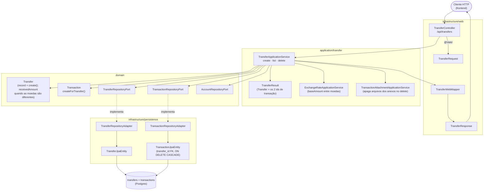
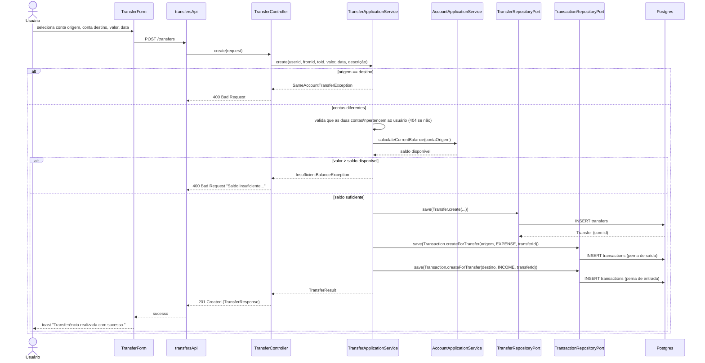
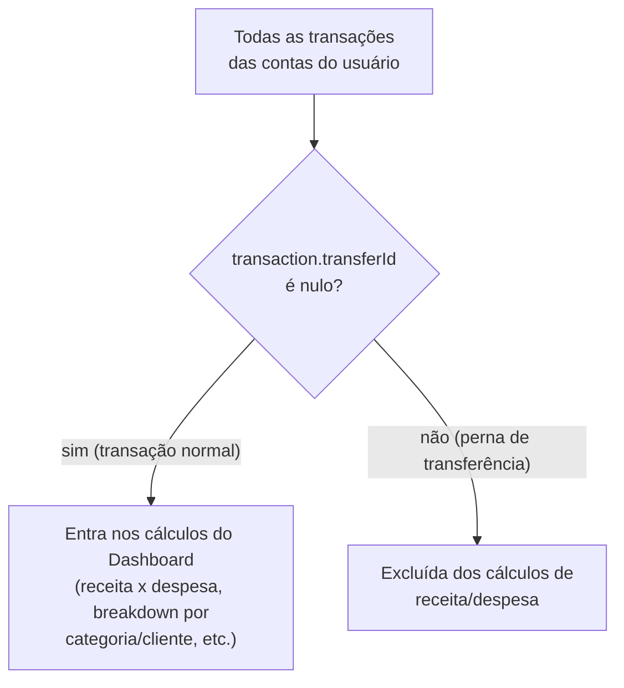

# FinPro — Fluxo de Transferências entre Contas

*Documentação técnica do módulo de transferências (ver roadmap em [`../plano.md`](../plano.md#12-roadmap-sugerido-atualizado)). Diagramas em [Mermaid](https://mermaid.js.org/) — renderizam nativamente no GitHub.*

## 1. Visão geral

Transferência é a movimentação de dinheiro entre duas contas do **mesmo usuário** (ex: da Conta Corrente pra Poupança). Ela não é uma entidade isolada no fluxo de caixa: toda transferência criada gera **duas transações reais** — uma `EXPENSE` na conta de origem, uma `INCOME` na conta de destino — ligadas pelo mesmo `transferId`. Isso é o que faz o saldo de cada conta (calculado como `saldo inicial + soma das transações`) refletir a movimentação sem precisar de um campo de saldo mutável.

Por serem transações "espelhadas" (uma saída = uma entrada, sem gerar receita ou despesa real), transferências são **excluídas** dos cálculos de receita/despesa do Dashboard — ver seção 4.

## 2. Tela

- **Rota:** `/transferencias` (`TransfersPage`)
- **Elementos principais:**
  - Botão "Nova transferência" (ícone `+`) abre um `Modal` com o `TransferForm`
  - `TransferList`: lista de transferências já feitas, com filtros recolhíveis (`CollapsibleFilters`) por conta e por intervalo de datas
  - Cada item (`TransferCard`) mostra "Conta origem → Conta destino", valor, data e descrição; em telas pequenas o card é expansível (mostra só o essencial, um toque revela os detalhes)
- **Estados:** "Carregando transferências...", vazio ("Nenhuma transferência registrada ainda." / "Nenhuma transferência encontrada com os filtros aplicados."), ou lista populada
- **Ações do usuário:** criar transferência, remover transferência (com confirmação via `ConfirmContext`, mostra toast de sucesso/erro)
- **Regra de formulário (client-side):** o `TransferForm` só aparece funcional se o usuário já tiver ao menos duas contas cadastradas — senão mostra um aviso pra cadastrar contas primeiro. O schema Zod (`transferSchema`) já bloqueia no cliente selecionar a mesma conta como origem e destino, mas o backend também valida isso (nunca confia só na validação do formulário).
- **Entre contas de moedas diferentes**: o campo "Valor" mostra a moeda de origem e um segundo campo "Valor recebido" aparece, pré-preenchido pela cotação PTAX do dia (editável, pra registrar o câmbio efetivo com spread/taxas da remessa) — ver seção 4.1.

## 3. Arquitetura (hexagonal)

```mermaid
flowchart TD
    Client(["Cliente HTTP\n(frontend)"]) --> Controller

    subgraph web["infrastructure/web"]
        Controller["TransferController\n/api/transfers"]
        ReqDTO["TransferRequest"]
        RespDTO["TransferResponse"]
        WebMapper["TransferWebMapper"]
    end

    subgraph application["application/transfer"]
        Service["TransferApplicationService\ncreate · list · delete"]
        Result["TransferResult\n(Transfer + os 2 ids de transação)"]
        ExRate["ExchangeRateApplicationService\n(baseAmount entre moedas)"]
        AttSvc["TransactionAttachmentApplicationService\n(apaga arquivos dos anexos no delete)"]
    end

    subgraph domain["domain"]
        Model["Transfer\n(record + create(); receivedAmount\nquando as moedas são diferentes)"]
        Tx["Transaction\ncreateForTransfer()"]
        PortT["TransferRepositoryPort"]
        PortTx["TransactionRepositoryPort"]
        PortAcc["AccountRepositoryPort"]
    end

    subgraph infra["infrastructure/persistence"]
        AdapterT["TransferRepositoryAdapter"]
        AdapterTx["TransactionRepositoryAdapter"]
        EntityT["TransferJpaEntity"]
        EntityTx["TransactionJpaEntity\n(transfer_id FK, ON DELETE CASCADE)"]
    end

    DB[("transfers + transactions\n(Postgres)")]

    Controller -- "@Valid" --> ReqDTO
    Controller --> Service
    Service --> Model
    Service --> Tx
    Service --> PortT
    Service --> PortTx
    Service --> PortAcc
    Service --> ExRate
    Service --> AttSvc
    Service --> Result
    PortT -.->|implementa| AdapterT
    PortTx -.->|implementa| AdapterTx
    AdapterT --> EntityT
    AdapterTx --> EntityTx
    EntityT --> DB
    EntityTx --> DB
    Service --> WebMapper
    WebMapper --> RespDTO
    RespDTO --> Client
```

**Por que essa separação importa aqui:** `TransferApplicationService` orquestra três ports diferentes (`TransferRepositoryPort`, `TransactionRepositoryPort`, `AccountRepositoryPort`) porque criar uma transferência é, na prática, uma transação de negócio que toca duas entidades distintas (`Transfer` e duas `Transaction`) — mas a validação de saldo é delegada a `AccountApplicationService.calculateCurrentBalance`, reaproveitando exatamente a mesma regra que calcula o saldo exibido na tela de Contas, então não existem dois lugares diferentes calculando "quanto tem na conta".

## 4. Fluxo de criação de uma transferência

```mermaid
sequenceDiagram
    actor U as Usuário
    participant Form as TransferForm
    participant API as transfersApi
    participant Ctrl as TransferController
    participant Svc as TransferApplicationService
    participant AccSvc as AccountApplicationService
    participant Repo as TransferRepositoryPort
    participant TxRepo as TransactionRepositoryPort
    participant DB as Postgres

    U->>Form: seleciona conta origem, conta destino, valor, data
    Form->>API: POST /transfers
    API->>Ctrl: create(request)
    Ctrl->>Svc: create(userId, fromId, toId, valor, data, descrição)

    alt origem == destino
        Svc-->>Ctrl: SameAccountTransferException
        Ctrl-->>API: 400 Bad Request
    else contas diferentes
        Svc->>Svc: valida que as duas contas\npertencem ao usuário (404 se não)
        Svc->>AccSvc: calculateCurrentBalance(contaOrigem)
        AccSvc-->>Svc: saldo disponível

        alt valor > saldo disponível
            Svc-->>Ctrl: InsufficientBalanceException
            Ctrl-->>API: 400 Bad Request "Saldo insuficiente..."
        else saldo suficiente
            Svc->>Repo: save(Transfer.create(...))
            Repo->>DB: INSERT transfers
            DB-->>Repo: Transfer (com id)

            Svc->>TxRepo: save(Transaction.createForTransfer(origem, EXPENSE, transferId))
            TxRepo->>DB: INSERT transactions (perna de saída)
            Svc->>TxRepo: save(Transaction.createForTransfer(destino, INCOME, transferId))
            TxRepo->>DB: INSERT transactions (perna de entrada)

            Svc-->>Ctrl: TransferResult
            Ctrl-->>API: 201 Created (TransferResponse)
            API-->>Form: sucesso
            Form-->>U: toast "Transferência realizada com sucesso."
        end
    end
```

**Descrição das pernas:** se o usuário não informar uma descrição customizada, o backend gera uma padrão — `"Transferência para <conta destino>"` na perna de saída e `"Transferência de <conta origem>"` na perna de entrada. Se o usuário informar uma descrição, ela é usada nas duas pernas.

### 4.1 Transferência entre moedas diferentes

Quando a conta de origem e a de destino têm moedas diferentes, `amount` (validado contra o saldo da origem) é o valor que sai, na moeda dela, e o request precisa informar também `receivedAmount` — o valor que entra no destino, na moeda dele; sem ele, `TransferApplicationService.create` recusa com `IllegalArgumentException` (400). As duas pernas recebem o **mesmo** `baseAmount` (o valor em reais, convertido pela PTAX do dia via `ExchangeRateApplicationService` quando nenhuma das duas contas é em reais, ou o próprio valor na moeda quando uma delas é BRL), pra continuarem se anulando no saldo consolidado do Dashboard. O frontend sugere `receivedAmount` pela PTAX do dia (editável, é o câmbio efetivo com spread/taxas da remessa) — ver `useConversion` em `TransferForm.tsx`.

## 5. Exclusão de uma transferência

Excluir a transferência remove as duas transações junto — não existe fluxo pra excluir só uma perna. As duas `Transaction` saem em cascata no banco (`transactions.transfer_id` com `ON DELETE CASCADE` pra `transfers.id`, junto com os registros de anexos vinculados a elas), mas os **arquivos** dos anexos não — `TransferApplicationService.delete()` busca as chaves de armazenamento das duas pernas (`TransactionAttachmentApplicationService.storageKeysOf`) *antes* de apagar a transferência, e só depois do `deleteById` apaga os arquivos do disco (`deleteStoredFiles`) — ver [`fluxo-anexos.md`](fluxo-anexos.md).

```mermaid
flowchart LR
    U(["Usuário clica\nem remover"]) --> Confirm{"Confirma?\n(ConfirmContext)"}
    Confirm -- não --> Fim(["nada acontece"])
    Confirm -- sim --> Del["DELETE /transfers/{id}"]
    Del --> Check{"Transferência pertence\nao usuário logado?"}
    Check -- não --> NotFound["404\n(mesmo tratamento de\nacesso indevido dos outros módulos)"]
    Check -- sim --> Keys["Busca as chaves de armazenamento\ndos anexos das 2 transações"]
    Keys --> Cascade["DELETE FROM transfers\n(cascata apaga as 2 transactions\n+ registros de anexos)"]
    Cascade --> Files["Apaga os arquivos dos anexos\ndo disco (as chaves já foram lidas)"]
    Files --> Invalidate["Frontend invalida cache de\ntransfers + transactions + accounts"]
```

Do lado da tela de **Transações**, uma perna individual de transferência (`transaction.transferId != null`) não pode ser editada nem excluída isoladamente — a UI/API bloqueia essa ação e direciona o usuário a excluir a transferência inteira aqui (ver [`fluxo-transacoes.md`](fluxo-transacoes.md)).

## 5.1 Transferência entre espaços (grupos)

Uma transferência pertence a um espaço só. Ao compartilhar uma conta que tem transferência com uma conta que fica, a transferência é dividida em duas (uma por espaço) e volta a ser uma só quando as duas contas estão no mesmo espaço de novo (ver [`fluxo-grupos.md`](fluxo-grupos.md), seção 5). Depois da divisão, **não é possível criar** novas transferências entre uma conta pessoal e uma do grupo pela API: a origem e o destino têm de ser do espaço em exibição. Na tela de Transações as duas pernas aparecem para quem participa das duas contas (ver [`fluxo-transacoes.md`](fluxo-transacoes.md)).

## 6. Por que transferências não contam como receita/despesa

Sem esse filtro, mover R$ 1.000 da Conta Corrente pra Poupança apareceria simultaneamente como R$ 1.000 de despesa (na origem) e R$ 1.000 de receita (no destino) nos gráficos do Dashboard — inflando artificialmente tanto a receita quanto a despesa do mês, mesmo sem nenhum dinheiro novo entrando ou saindo do usuário.

```mermaid
flowchart TD
    All["Todas as transações\ndas contas do usuário"] --> Filter{"transaction.transferId\né nulo?"}
    Filter -- "sim (transação normal)" --> Dash["Entra nos cálculos do Dashboard\n(receita x despesa, breakdown por\ncategoria/cliente, etc.)"]
    Filter -- "não (perna de transferência)" --> Skip["Excluída dos cálculos de\nreceita/despesa"]
```

Esse filtro vive em `DashboardApplicationService.ownedNonTransferTransactions()` (`transaction.transferId() == null`), usado por todos os métodos de agregação do Dashboard. O saldo consolidado das contas, por outro lado, continua correto mesmo incluindo as pernas de transferência — afinal elas realmente movem dinheiro entre contas, só não devem ser contadas como "ganho" ou "gasto" na visão de fluxo de caixa.

## 7. Onde cada peça vive no repositório

| Camada | Arquivo |
|---|---|
| Domínio | `domain/model/Transfer.java` (usa `Transaction.createForTransfer()` de `domain/model/Transaction.java`) |
| Port/Adapter | `domain/port/out/TransferRepositoryPort.java` + `infrastructure/persistence/adapter/TransferRepositoryAdapter.java` |
| Aplicação | `application/transfer/{TransferApplicationService,TransferResult}.java` (+ `ExchangeRateApplicationService`, `TransactionAttachmentApplicationService`) |
| API | `infrastructure/web/controller/TransferController.java` (`/api/transfers`), DTOs em `infrastructure/web/dto/transfer/` (`TransferRequest`/`TransferResponse` com `receivedAmount`), `infrastructure/web/mapper/TransferWebMapper.java` |
| Exceções de domínio | `domain/exception/{SameAccountTransferException,InsufficientBalanceException}.java` |
| Frontend | `frontend/src/features/transfers/**` (`TransfersPage`, `TransferForm`, `TransferList`, `TransferCard`, hooks, `transfersApi`, `schemas.ts`, `types.ts`) |
| Filtro no Dashboard | `application/dashboard/DashboardApplicationService.java` (`ownedNonTransferTransactions`) |
| Testes | `backend/src/test/java/.../integration/transfer/TransferIntegrationTest.java`, `backend/src/test/java/.../application/transfer/TransferApplicationServiceTest.java`, `../../frontend/src/features/transfers/schemas.test.ts` |
