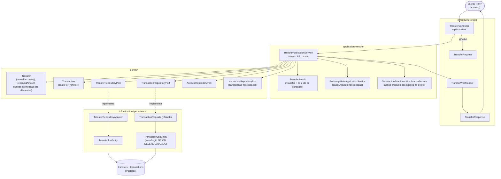
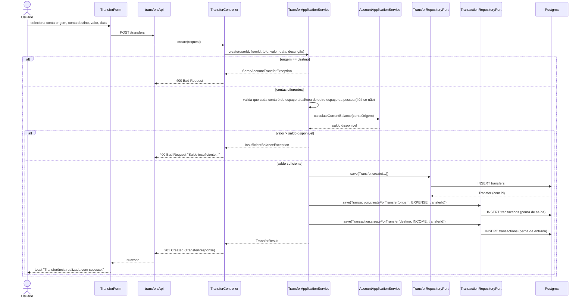
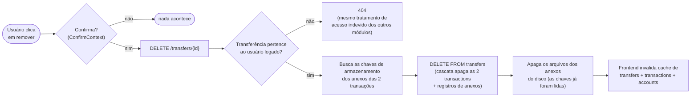
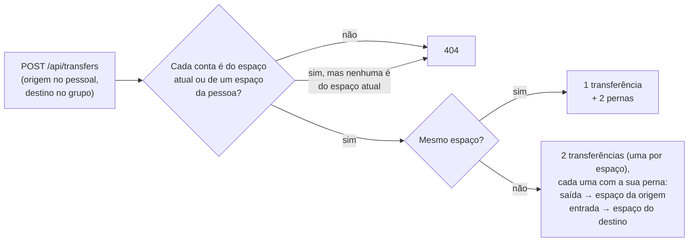
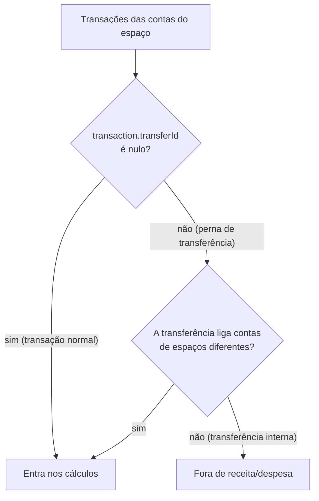

# FinPro — Fluxo de Transferências entre Contas

*Documentação técnica do módulo de transferências (ver roadmap em [`../plano.md`](../plano.md#12-roadmap-sugerido-atualizado)). Diagramas em [Mermaid](https://mermaid.js.org/) — renderizam nativamente no GitHub.*

## 1. Visão geral

Transferência é a movimentação de dinheiro entre duas contas da mesma pessoa (ex: da Conta Corrente pra Poupança) — do mesmo espaço ou, desde 07/10/2026, entre o espaço pessoal e um grupo compartilhado (seção 5.1). Ela não é uma entidade isolada no fluxo de caixa: toda transferência criada gera **duas transações reais** — uma `EXPENSE` na conta de origem, uma `INCOME` na conta de destino — ligadas pelo mesmo `transferId`. Isso é o que faz o saldo de cada conta (calculado como `saldo inicial + soma das transações`) refletir a movimentação sem precisar de um campo de saldo mutável.

Por serem transações "espelhadas" (uma saída = uma entrada, sem gerar receita ou despesa real), as transferências **entre contas do mesmo espaço** são excluídas dos cálculos de receita/despesa do Dashboard e dos relatórios; as que cruzam para outro espaço contam como receita (entrada) ou despesa (saída) — ver seção 6.

## 2. Tela

- **Rota:** `/transferencias` (`TransfersPage`)
- **Elementos principais:**
  - Botão "Nova transferência" (ícone `+`) abre um `Modal` com o `TransferForm`
  - `TransferList`: lista de transferências já feitas, com filtros recolhíveis (`CollapsibleFilters`) por conta e por intervalo de datas
  - Cada item (`TransferCard`) mostra "Conta origem → Conta destino", valor, data e descrição; em telas pequenas o card é expansível (mostra só o essencial, um toque revela os detalhes)
- **Estados:** "Carregando transferências...", vazio ("Nenhuma transferência registrada ainda." / "Nenhuma transferência encontrada com os filtros aplicados."), ou lista populada
- **Ações do usuário:** criar transferência, remover transferência (com confirmação via `ConfirmContext`, mostra toast de sucesso/erro)
- **Regra de formulário (client-side):** o `TransferForm` só aparece funcional se o usuário já tiver ao menos duas contas cadastradas — senão mostra um aviso pra cadastrar contas primeiro. O schema Zod (`transferSchema`) já bloqueia no cliente selecionar a mesma conta como origem e destino, mas o backend também valida isso (nunca confia só na validação do formulário).
- **Contas de outros espaços:** além das contas do espaço em exibição, o `TransferForm` lista, em grupos por nome do espaço (`<optgroup>`), as contas dos outros espaços de que a pessoa participa (`GET /api/transfers/linkable-accounts`, `useLinkableAccounts`). Estando no espaço pessoal, a conta conjunta de um grupo aparece como destino; estando no grupo, a conta pessoal aparece como destino ou origem. Pelo menos uma das duas contas precisa ser do espaço em exibição (o formulário avisa antes de enviar; o backend também valida).
- **Entre contas de moedas diferentes**: o campo "Valor" mostra a moeda de origem e um segundo campo "Valor recebido" aparece, pré-preenchido pela cotação PTAX do dia (editável, pra registrar o câmbio efetivo com spread/taxas da remessa) — ver seção 4.1.

## 3. Arquitetura (hexagonal)

```mermaid
flowchart TD
    Client(["Cliente HTTP\n(frontend)"]) --> Controller

    subgraph web["infrastructure/web"]
        Controller["TransferController\n/api/transfers"]
        ReqDTO["TransferRequest"]
        RespDTO["TransferResponse"]
        WebMapper["TransferWebMapper"]
    end

    subgraph application["application/transfer"]
        Service["TransferApplicationService\ncreate · list · delete"]
        Result["TransferResult\n(Transfer + os 2 ids de transação)"]
        ExRate["ExchangeRateApplicationService\n(baseAmount entre moedas)"]
        AttSvc["TransactionAttachmentApplicationService\n(apaga arquivos dos anexos no delete)"]
    end

    subgraph domain["domain"]
        Model["Transfer\n(record + create(); receivedAmount\nquando as moedas são diferentes)"]
        Tx["Transaction\ncreateForTransfer()"]
        PortT["TransferRepositoryPort"]
        PortTx["TransactionRepositoryPort"]
        PortAcc["AccountRepositoryPort"]
        PortH["HouseholdRepositoryPort\n(participação nos espaços)"]
    end

    subgraph infra["infrastructure/persistence"]
        AdapterT["TransferRepositoryAdapter"]
        AdapterTx["TransactionRepositoryAdapter"]
        EntityT["TransferJpaEntity"]
        EntityTx["TransactionJpaEntity\n(transfer_id FK, ON DELETE CASCADE)"]
    end

    DB[("transfers + transactions\n(Postgres)")]

    Controller -- "@Valid" --> ReqDTO
    Controller --> Service
    Service --> Model
    Service --> Tx
    Service --> PortT
    Service --> PortTx
    Service --> PortAcc
    Service --> PortH
    Service --> ExRate
    Service --> AttSvc
    Service --> Result
    PortT -.->|implementa| AdapterT
    PortTx -.->|implementa| AdapterTx
    AdapterT --> EntityT
    AdapterTx --> EntityTx
    EntityT --> DB
    EntityTx --> DB
    Service --> WebMapper
    WebMapper --> RespDTO
    RespDTO --> Client
```

**Por que essa separação importa aqui:** `TransferApplicationService` orquestra três ports diferentes (`TransferRepositoryPort`, `TransactionRepositoryPort`, `AccountRepositoryPort`) porque criar uma transferência é, na prática, uma transação de negócio que toca duas entidades distintas (`Transfer` e duas `Transaction`) — mas a validação de saldo é delegada a `AccountApplicationService.calculateCurrentBalance`, reaproveitando exatamente a mesma regra que calcula o saldo exibido na tela de Contas, então não existem dois lugares diferentes calculando "quanto tem na conta".

## 4. Fluxo de criação de uma transferência

```mermaid
sequenceDiagram
    actor U as Usuário
    participant Form as TransferForm
    participant API as transfersApi
    participant Ctrl as TransferController
    participant Svc as TransferApplicationService
    participant AccSvc as AccountApplicationService
    participant Repo as TransferRepositoryPort
    participant TxRepo as TransactionRepositoryPort
    participant DB as Postgres

    U->>Form: seleciona conta origem, conta destino, valor, data
    Form->>API: POST /transfers
    API->>Ctrl: create(request)
    Ctrl->>Svc: create(userId, fromId, toId, valor, data, descrição)

    alt origem == destino
        Svc-->>Ctrl: SameAccountTransferException
        Ctrl-->>API: 400 Bad Request
    else contas diferentes
        Svc->>Svc: valida que cada conta é do espaço atual\nou de outro espaço da pessoa (404 se não)
        Svc->>AccSvc: calculateCurrentBalance(contaOrigem)
        AccSvc-->>Svc: saldo disponível

        alt valor > saldo disponível
            Svc-->>Ctrl: InsufficientBalanceException
            Ctrl-->>API: 400 Bad Request "Saldo insuficiente..."
        else saldo suficiente
            Svc->>Repo: save(Transfer.create(...))
            Repo->>DB: INSERT transfers
            DB-->>Repo: Transfer (com id)

            Svc->>TxRepo: save(Transaction.createForTransfer(origem, EXPENSE, transferId))
            TxRepo->>DB: INSERT transactions (perna de saída)
            Svc->>TxRepo: save(Transaction.createForTransfer(destino, INCOME, transferId))
            TxRepo->>DB: INSERT transactions (perna de entrada)

            Svc-->>Ctrl: TransferResult
            Ctrl-->>API: 201 Created (TransferResponse)
            API-->>Form: sucesso
            Form-->>U: toast "Transferência realizada com sucesso."
        end
    end
```

**Descrição das pernas:** se o usuário não informar uma descrição customizada, o backend gera uma padrão — `"Transferência para <conta destino>"` na perna de saída e `"Transferência de <conta origem>"` na perna de entrada. Se o usuário informar uma descrição, ela é usada nas duas pernas.

### 4.1 Transferência entre moedas diferentes

Quando a conta de origem e a de destino têm moedas diferentes, `amount` (validado contra o saldo da origem) é o valor que sai, na moeda dela, e o request precisa informar também `receivedAmount` — o valor que entra no destino, na moeda dele; sem ele, `TransferApplicationService.create` recusa com `IllegalArgumentException` (400). As duas pernas recebem o **mesmo** `baseAmount` (o valor em reais, convertido pela PTAX do dia via `ExchangeRateApplicationService` quando nenhuma das duas contas é em reais, ou o próprio valor na moeda quando uma delas é BRL), pra continuarem se anulando no saldo consolidado do Dashboard. O frontend sugere `receivedAmount` pela PTAX do dia (editável, é o câmbio efetivo com spread/taxas da remessa) — ver `useConversion` em `TransferForm.tsx`.

## 5. Exclusão de uma transferência

Excluir a transferência remove as duas transações junto — não existe fluxo pra excluir só uma perna. As duas `Transaction` saem em cascata no banco (`transactions.transfer_id` com `ON DELETE CASCADE` pra `transfers.id`, junto com os registros de anexos vinculados a elas), mas os **arquivos** dos anexos não — `TransferApplicationService.delete()` busca as chaves de armazenamento das duas pernas (`TransactionAttachmentApplicationService.storageKeysOf`) *antes* de apagar a transferência, e só depois do `deleteById` apaga os arquivos do disco (`deleteStoredFiles`) — ver [`fluxo-anexos.md`](fluxo-anexos.md).

```mermaid
flowchart LR
    U(["Usuário clica\nem remover"]) --> Confirm{"Confirma?\n(ConfirmContext)"}
    Confirm -- não --> Fim(["nada acontece"])
    Confirm -- sim --> Del["DELETE /transfers/{id}"]
    Del --> Check{"Transferência pertence\nao usuário logado?"}
    Check -- não --> NotFound["404\n(mesmo tratamento de\nacesso indevido dos outros módulos)"]
    Check -- sim --> Keys["Busca as chaves de armazenamento\ndos anexos das 2 transações"]
    Keys --> Cascade["DELETE FROM transfers\n(cascata apaga as 2 transactions\n+ registros de anexos)"]
    Cascade --> Files["Apaga os arquivos dos anexos\ndo disco (as chaves já foram lidas)"]
    Files --> Invalidate["Frontend invalida cache de\ntransfers + transactions + accounts"]
```

Do lado da tela de **Transações**, uma perna individual de transferência (`transaction.transferId != null`) não pode ser editada nem excluída isoladamente — a UI/API bloqueia essa ação e direciona o usuário a excluir a transferência inteira aqui (ver [`fluxo-transacoes.md`](fluxo-transacoes.md)).

## 5.1 Transferência entre espaços (grupos)

Uma transferência pertence a um espaço só, mas desde 07/10/2026 dá para criar uma entre o espaço pessoal e um grupo compartilhado, nos dois sentidos (da conta pessoal para a conjunta e da conjunta para a pessoal). O modelo é o mesmo que o compartilhamento de conta já produz ao dividir uma transferência (ver [`fluxo-grupos.md`](fluxo-grupos.md), seção 5): **cada espaço fica com a sua perna, ligada a uma transferência própria**.

```mermaid
flowchart LR
    Req["POST /api/transfers\n(origem no pessoal,\ndestino no grupo)"] --> Reach{"Cada conta é do espaço\natual ou de um espaço\nda pessoa?"}
    Reach -- "não" --> NF["404"]
    Reach -- "sim, mas nenhuma é\ndo espaço atual" --> NF
    Reach -- "sim" --> Same{"Mesmo espaço?"}
    Same -- "sim" --> One["1 transferência\n+ 2 pernas"]
    Same -- "não" --> Two["2 transferências (uma por espaço),\ncada uma com a sua perna:\nsaída → espaço da origem\nentrada → espaço do destino"]
```

- **Quem pode:** a pessoa precisa participar do espaço da outra conta (`HouseholdRepositoryPort.findMembership`); qualquer outra conta responde `404`, sem revelar que existe. O saldo da origem é validado como sempre.
- **Contas vinculáveis:** `GET /api/transfers/linkable-accounts` (`TransferApplicationService.linkableAccounts`) devolve as contas dos **outros** espaços de que a pessoa participa — só id, nome, tipo, moeda e o nome do espaço (`LinkableAccountResponse`), nenhum saldo ou lançamento.
- **Autoria:** as duas transferências e as duas pernas gravam quem criou; numa conta compartilhada só essa pessoa pode excluí-la.
- **Listas:** cada espaço lista a sua transferência, com o **nome** da conta do outro lado (`fromAccountName`/`toAccountName`); na tela de Transações a pessoa que participa das duas contas vê as duas pernas (ver [`fluxo-transacoes.md`](fluxo-transacoes.md)).
- **Exclusão:** é por espaço — apagar a transferência no grupo não apaga a metade que está no espaço pessoal, e vice-versa.
- **Quando as duas contas passam a ser do mesmo espaço** (por exemplo, a pessoal é compartilhada depois), as duas metades se juntam de novo numa transferência só (`AccountSharingJdbcAdapter`).

## 6. Quando uma transferência conta como receita ou despesa

**Entre contas do mesmo espaço, não conta.** Sem esse filtro, mover R$ 1.000 da Conta Corrente pra Poupança apareceria simultaneamente como R$ 1.000 de despesa (na origem) e R$ 1.000 de receita (no destino) nos gráficos do Dashboard — inflando artificialmente tanto a receita quanto a despesa do mês, mesmo sem nenhum dinheiro novo entrando ou saindo.

**Entre espaços (pessoal ↔ grupo), conta.** Cada espaço fecha as suas próprias contas: o dinheiro que a pessoa manda do pessoal para a conta conjunta *entrou* no grupo (**receita** do mês do grupo) e *saiu* do espaço pessoal (**despesa** do mês pessoal). Sem isso, as transferências que os membros fazem para a conta conjunta nunca apareceriam como receita no grupo.

```mermaid
flowchart TD
    All["Transações das contas do espaço"] --> Filter{"transaction.transferId\né nulo?"}
    Filter -- "sim (transação normal)" --> Dash["Entra nos cálculos"]
    Filter -- "não (perna de transferência)" --> Cross{"A transferência liga contas\nde espaços diferentes?"}
    Cross -- "sim" --> Dash
    Cross -- "não (transferência interna)" --> Skip["Fora de receita/despesa"]
```

A decisão fica em `TransferFlow.withoutInternalTransfers` (`application/support`), que consulta `TransferRepositoryPort.findCrossSpaceIds` (as transferências cujas duas contas têm `household_id` diferente) e mantém só as pernas das transferências que cruzam espaços. É usado pelo `DashboardApplicationService` (receita e despesa do mês, fluxo mensal, projeção e breakdowns) e pelos relatórios de **resultado do período** e de **despesas por categoria**. **Continuam ignorando todas as transferências:** orçamentos, estimativa de imposto (`suggested-revenue`), pró-labore, metas, clientes e alertas — assim uma transferência nunca vira faturamento tributável. A exportação CSV de transações traz o extrato bruto, incluindo todas as transferências.

O **saldo** consolidado das contas, por outro lado, sempre inclui as pernas de transferência: elas realmente movem dinheiro entre contas.

## 7. Onde cada peça vive no repositório

| Camada | Arquivo |
|---|---|
| Domínio | `domain/model/Transfer.java` (usa `Transaction.createForTransfer()` de `domain/model/Transaction.java`) |
| Port/Adapter | `domain/port/out/TransferRepositoryPort.java` (`findCrossSpaceIds`) + `infrastructure/persistence/adapter/TransferRepositoryAdapter.java`; `HouseholdRepositoryPort` (participação nos espaços) |
| Aplicação | `application/transfer/{TransferApplicationService,TransferResult,LinkableAccount}.java` (+ `ExchangeRateApplicationService`, `TransactionAttachmentApplicationService`), `application/support/TransferFlow.java` (receita/despesa entre espaços) |
| API | `infrastructure/web/controller/TransferController.java` (`/api/transfers` e `/api/transfers/linkable-accounts`), DTOs em `infrastructure/web/dto/transfer/` (`TransferRequest`/`TransferResponse` com `receivedAmount`, `LinkableAccountResponse`), `infrastructure/web/mapper/TransferWebMapper.java` |
| Exceções de domínio | `domain/exception/{SameAccountTransferException,InsufficientBalanceException}.java` |
| Frontend | `frontend/src/features/transfers/**` (`TransfersPage`, `TransferForm`, `TransferList`, `TransferCard`, hooks, `transfersApi`, `schemas.ts`, `types.ts`) |
| Filtro no Dashboard e relatórios | `application/dashboard/DashboardApplicationService.java` (`withoutInternalTransfers`), `application/report/{IncomeStatementDataFactory,CategoryExpenseDataFactory}.java` |
| Testes | `backend/src/test/java/.../integration/transfer/TransferIntegrationTest.java`, `backend/src/test/java/.../application/transfer/TransferApplicationServiceTest.java`, `.../integration/household/AccountSharingIntegrationTest.java` (transferência entre espaços e receita/despesa), `.../application/dashboard/DashboardApplicationServiceTest.java`, `../../frontend/src/features/transfers/schemas.test.ts` |
