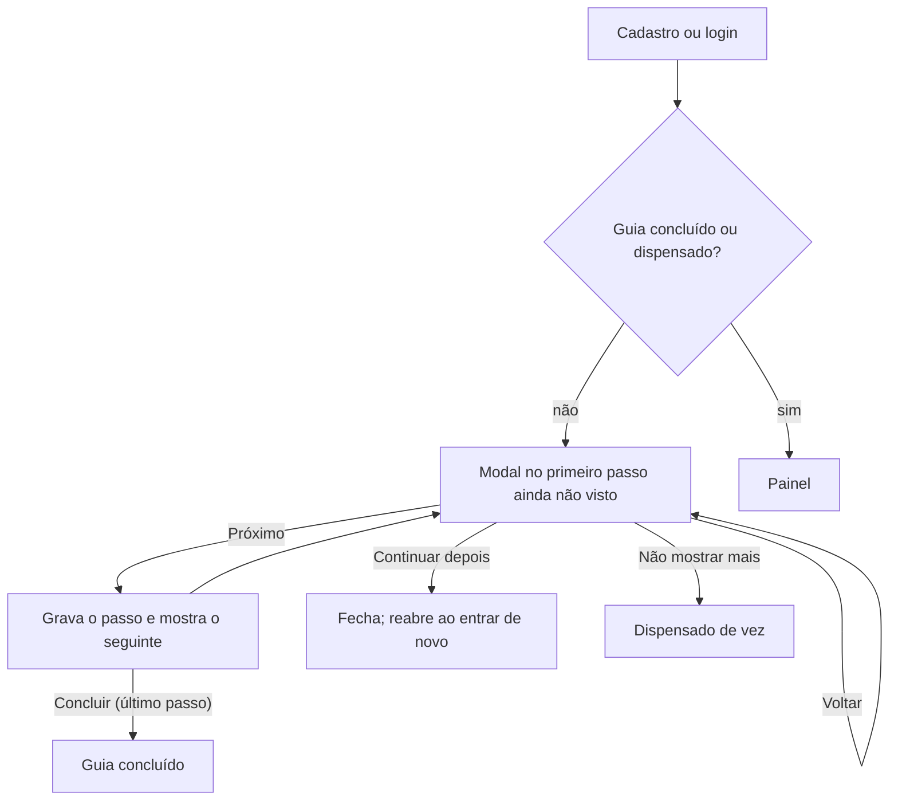

# Onboarding e prova de valor

Objetivo: quem se cadastra deve ver valor em poucos minutos. O caminho é **conta → extrato importado →
resultado na tela**, com um guia que acompanha e e-mails que puxam de volta quem parou no meio.

## 1. Fluxo

O guia **só mostra como fazer**: onde clicar, o que preencher e onde salvar. Nada é criado por ele. A pessoa
avança em "Próximo", e cada passo visto fica gravado no servidor; se não terminar, retoma do último ponto.



- **Modal** (`features/onboarding/components/OnboardingModal.tsx`): sobreposto a qualquer tela, com barra de
  progresso, "Passo N de 7", Voltar e Próximo. Cada passo traz uma réplica sem função da tela
  (`TourPreview`) com o ponto a usar em destaque: o botão de adicionar, os campos com valores de exemplo, o
  botão de salvar. O texto dos passos fica em `steps.ts` (`TOUR_STEPS`).
- **Abertura automática**: abre sozinho enquanto o guia não foi concluído nem dispensado; "Continuar depois"
  fecha só enquanto a tela está aberta (reabre ao entrar ou recarregar), "Não mostrar mais" dispensa de vez.
  `?primeiros-passos=1` também abre (cadastro) e permite rever o guia concluído; `/primeiros-passos`, usado
  nos e-mails, redireciona para ele.
- **Resultado da importação** (`ImportResultSummary`): aparece na tela de importações depois de um envio
  real. Os números vêm do servidor em `GET /api/import-batches/{id}/summary` (`ImportSummary`).

## 2. Progresso

Por **usuário**, em qualquer grupo. Cada passo visto vira uma linha em `onboarding_steps_done` (usuário,
passo, data), gravada por `POST /api/onboarding/steps/{step}` (idempotente; passo desconhecido dá 400).
`GET /api/onboarding` devolve os 14 passos com `done`; o guia está concluído quando todos foram vistos.

| Grupo | Passos (`StepId`) |
|-------|-------------------|
| Criar uma conta | `ACCOUNT_OPEN`, `ACCOUNT_FILL`, `ACCOUNT_SAVE` |
| Lançar uma transação | `TRANSACTION_FILL`, `TRANSACTION_SAVE` |
| Importar o extrato | `IMPORT_PICK`, `IMPORT_RESULT` |
| Definir um orçamento | `BUDGET_FILL`, `BUDGET_SAVE` |
| Automatizar com recorrências | `RECURRING_FILL`, `RECURRING_SAVE` |
| Acompanhar o mês | `CALENDAR_VIEW`, `DASHBOARD_VIEW`, `REPORTS_VIEW` |

Gravado por usuário também (`onboarding_state`): se dispensou o guia e se aceita os e-mails de ativação
(`POST /api/onboarding/dismiss`, `PUT /api/onboarding/activation-emails`).

## 3. E-mails de ativação

Job `ActivationScheduler` a cada 15 minutos (`finpro.activation.cron`), com trava do ShedLock. Quem decide
o que sai é `ActivationEmailPolicy`; cada tipo sai **uma vez por usuário** (`activation_emails_sent`) e só é
registrado depois do envio.

| E-mail | Quando | Condição |
|--------|--------|----------|
| `WELCOME` | até 1 dia após o cadastro | sempre |
| `FIRST_IMPORT_REMINDER` | de 1 a 3 dias | ainda sem lançamentos |
| `WEEK_ONE_CHECK_IN` | de 7 a 10 dias | ainda sem lançamentos |

- Lembretes só entre 8h e 20h (fuso de São Paulo) e param quando surge o primeiro lançamento ou quando a pessoa dispensa o guia ("Não mostrar mais"). Todos os e-mails levam ao guia (`/primeiros-passos`).
- As janelas impedem que uma implantação ou atraso dispare e-mails velhos de uma vez: quem se cadastrou
  antes da funcionalidade não recebe boas-vindas atrasadas.
- Máximo de um e-mail por usuário por execução.
- Quem desativa em **Configurações > Notificações** não recebe nenhum. Todo e-mail traz o link para isso.
- Sem SMTP (`spring.mail.host`) o envio vira só uma linha de log, sem dado pessoal (`LoggingActivationMailer`).
- Falha de envio não registra o e-mail como enviado: tenta de novo na execução seguinte, enquanto a janela
  estiver aberta.

## 4. LGPD

`onboarding_state`, `onboarding_steps_done` e `activation_emails_sent` são dados do titular: entram na exportação
(`primeirosPassos` no `dados.json`) e saem junto com a conta (`ON DELETE CASCADE`).

## 5. Como medir se funciona

O funil já é consultável direto no banco, sem ferramenta nova:

```sql
-- cadastros dos últimos 30 dias que chegaram a ter algum lançamento
SELECT count(*) AS cadastros,
       count(*) FILTER (WHERE EXISTS (
           SELECT 1 FROM household_members hm
           JOIN accounts a ON a.household_id = hm.household_id
           JOIN transactions t ON t.account_id = a.id
           WHERE hm.user_id = u.id)) AS com_lancamentos
FROM users u WHERE u.created_at >= now() - interval '30 days';
```

## 6. Limites conhecidos

- A taxa de ativação (cadastro → primeiro lançamento) ainda não tem painel; a consulta acima é manual.
- Passos novos entram em `StepId` (servidor, com migration no CHECK de `onboarding_steps_done`) e em
  `features/onboarding/steps.ts` (texto).
- O texto dos e-mails é simples (texto puro), como os demais e-mails do sistema.
